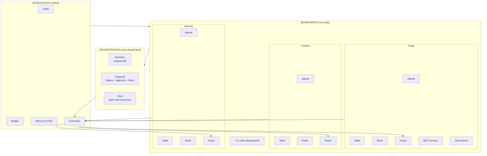
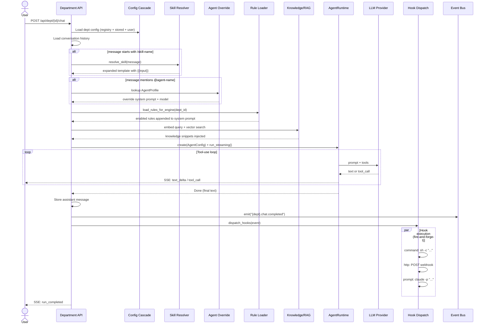
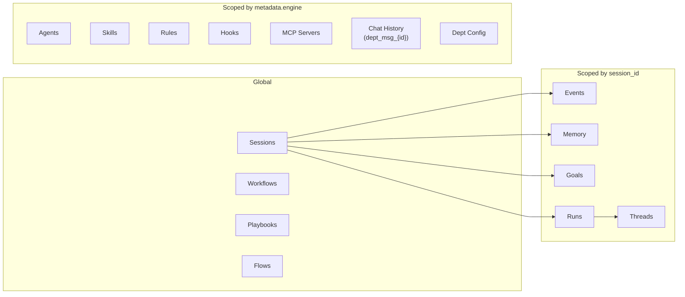
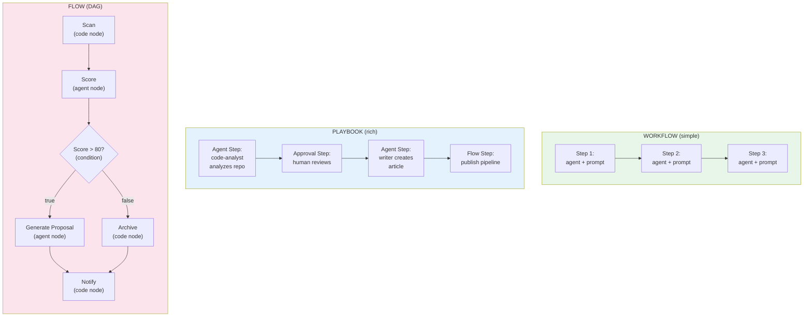
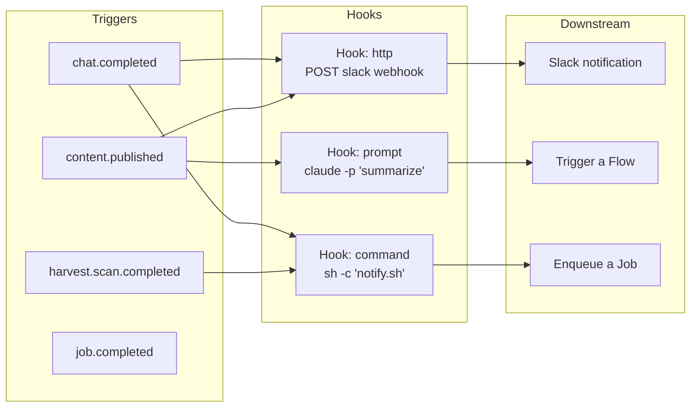

# RUSVEL Domain Concepts — How Everything Fits Together

## The Mental Model

Everything in RUSVEL is scoped to a **Department**. Each department owns its agents, skills, rules, hooks, and MCP servers. When a user chats with a department, all these pieces compose into a single agent execution. **Session** is the work boundary that tracks cost, memory, goals, and events across departments. **Events** are the glue — hooks react to events, enabling cross-department automation without coupling.

---

## The Hierarchy

```
Session                          ← your work context (project, lead, campaign)
 ├── has Goals                   ← what you're trying to achieve
 ├── has Budget                  ← spending limit across all departments
 ├── scopes Events              ← everything that happens is tagged to session
 ├── scopes Memory              ← what the system remembers, per session
 │
 └── talks to Departments ──────← the 14 organizational units
      │
      ├── owns Agents            ← personas (@security-reviewer)
      ├── owns Skills            ← prompt shortcuts (/research topic)
      ├── owns Rules             ← "always do X" injected into every chat
      ├── owns Hooks             ← "when X happens, do Y"
      ├── owns MCP Servers       ← external tool providers
      ├── owns Config            ← model, temperature, per-dept settings
      ├── owns Chat History      ← conversation per department
      │
      └── can trigger:
           ├── Workflow          ← simple: step1 → step2 → step3
           ├── Playbook          ← rich: Agent → Approval → Flow
           └── Flow              ← DAG: parallel branches, conditions
```

---

## JSON Manifest Shape

```json
{
  "session": {
    "id": "uuid",
    "kind": "project",
    "goals": ["Launch MVP by April"],
    "budget_limit_usd": 50.0,
    "departments": {
      "forge": {
        "agents": [
          { "name": "strategist", "role": "Plan daily missions", "model": "opus" }
        ],
        "skills": [
          { "name": "daily-brief", "template": "Generate executive brief for {{input}}" }
        ],
        "rules": [
          { "name": "concise", "content": "Keep responses under 200 words", "enabled": true }
        ],
        "hooks": [
          { "event": "forge.chat.completed", "type": "http", "action": "https://slack.com/webhook" }
        ],
        "mcp_servers": [
          { "name": "github", "type": "stdio", "command": "mcp-github" }
        ],
        "chat_history": "dept_msg_forge",
        "config": { "default_model": "sonnet", "temperature": 0.7 }
      },
      "content": { "...same shape..." },
      "harvest": { "...same shape..." }
    },
    "workflows": [
      { "name": "publish-pipeline", "steps": ["draft", "review", "publish"] }
    ],
    "playbooks": [
      {
        "name": "content-from-code",
        "steps": [
          { "action": "Agent", "persona": "code-analyst", "prompt": "Analyze {{input}}" },
          { "action": "Approval", "message": "Proceed with draft?" },
          { "action": "Agent", "persona": "writer", "prompt": "Write article from {{last_output}}" }
        ]
      }
    ],
    "flows": [
      {
        "name": "opportunity-pipeline",
        "nodes": ["scan", "score", "decide", "propose"],
        "connections": [
          { "scan": "score" },
          { "score": "decide" },
          { "decide[true]": "propose" },
          { "decide[false]": "archive" }
        ]
      }
    ]
  }
}
```

---

## Visual Diagrams

### System Overview



### Chat Request Flow



### Entity Scoping



### Three Orchestration Levels



### Event-Driven Automation



---

## Storage Map

| Entity | ObjectStore Kind | Scope | Filtered By |
|--------|-----------------|-------|-------------|
| Agent | `agents` | per-dept | `metadata.engine` |
| Skill | `skills` | per-dept | `metadata.engine` |
| Rule | `rules` | per-dept | `metadata.engine` |
| Hook | `hooks` | per-dept | `metadata.engine` |
| MCP Server | `mcp_servers` | per-dept | `metadata.engine` |
| Workflow | `workflows` | global | — |
| Playbook | in-memory + store | global | — |
| Flow | flow-engine storage | global | — |
| Chat History | `dept_msg_{dept}` | per-dept | key prefix |
| Dept Config | `dept_config` | per-dept | key |
| Session | `SessionStore` | global | — |
| Run | `SessionStore` | per-session | `session_id` |
| Thread | `SessionStore` | per-run | `run_id` |
| Event | `EventStore` | per-session | `session_id` |
| Memory | `MemoryPort` (FTS5) | per-session | `session_id` |
| Goal | `ObjectStore` | per-session | `session_id` |
| Metric | `MetricStore` | per-dept | `department` tag |

---

## When To Use What

| Need | Use | Example |
|------|-----|---------|
| Reusable prompt shortcut | **Skill** | `/research {{input}}` expands to full research prompt |
| Persistent behavior rule | **Rule** | "Always cite sources" injected into every chat |
| Specialized persona | **Agent** | `@security-reviewer` with infosec instructions |
| React to events | **Hook** | on `content.published` → POST to Slack |
| Simple ordered steps | **Workflow** | draft → review → publish |
| Mixed actions with approval | **Playbook** | AI analyzes → human approves → AI executes |
| Complex branching logic | **Flow** | DAG with conditions, parallel branches |
| External tool provider | **MCP Server** | GitHub, Jira, or custom tools via stdio/http |
| Track work context | **Session** | Project with goals, budget, memory |
| Organize capabilities | **Department** | 14 units, each with own agents/skills/rules |

---

## The Key Insights

1. **Department is the scoping boundary.** Agents, skills, rules, hooks, MCP servers, and chat are all scoped by `metadata.engine` matching the department ID. Creating an agent in Content means it only appears in Content chat.

2. **Session is the work boundary.** Events, memory, goals, and budget are scoped to a session. You talk to any department within a session, but the session tracks total cost and context.

3. **Events are the glue.** Hooks react to events. Departments emit events. Jobs emit events. This is how automation chains together without departments knowing about each other.

4. **Three orchestration levels exist for a reason:**
   - **Workflow** — when you know the exact steps and just need sequential execution
   - **Playbook** — when you need human-in-the-loop approval or mixed AI/Flow steps
   - **Flow** — when you need conditional logic, parallel branches, or complex DAGs

5. **Everything composes in the chat handler.** A single chat request resolves skills, loads agents, injects rules, searches knowledge, runs the LLM, and dispatches hooks — all in one request/response cycle.
