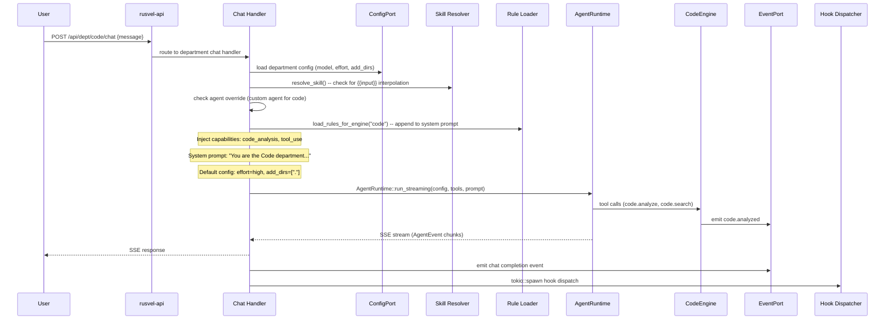

# Code Department

> Code intelligence, implementation, debugging, testing, refactoring

## Overview

The Code Department provides AI-powered code intelligence for RUSVEL. It parses Rust source files, builds a symbol dependency graph, computes project metrics (file counts, symbol counts, largest function), and exposes BM25-ranked symbol search. It is the department a developer uses to understand a codebase before making changes, and it produces `code.analyzed` events that the Content department consumes to auto-generate technical blog posts from code snapshots.

## Engine (`code-engine`)

- Crate: `crates/code-engine/src/lib.rs`
- Lines: 307 (lib.rs) + submodules (parser, graph, metrics, search, error)
- Status: **Wired** (real business logic)

### Public API

| Method | Signature | Description |
|--------|-----------|-------------|
| `new` | `fn new(storage: Arc<dyn StoragePort>, event_port: Arc<dyn EventPort>) -> Self` | Construct with storage and event port |
| `analyze` | `async fn analyze(&self, repo_path: &Path) -> Result<CodeAnalysis>` | Parse directory, build symbol graph, compute metrics, build search index, persist to ObjectStore, emit `code.analyzed` event |
| `search` | `fn search(&self, query: &str, limit: usize) -> Result<Vec<SearchResult>>` | BM25-ranked search over previously indexed symbols; returns error if `analyze()` not yet called |

### Internal Structure

- **`parser`** (`parser.rs`) -- Rust source file parser that extracts `Symbol` structs (functions, structs, enums, traits, impls) with name, kind, file path, line number, and body text.
- **`graph`** (`graph.rs`) -- `SymbolGraph` built from parsed symbols representing call/dependency relationships.
- **`metrics`** (`metrics.rs`) -- `count_lines()` per file and `compute_project_metrics()` aggregate: total files, total symbols, largest function.
- **`search`** (`search.rs`) -- `SearchIndex` with BM25 ranking. Built from `(name, file_path, body, line)` tuples.
- **`error`** (`error.rs`) -- Engine-specific error types.

### Data Types

```rust
pub struct CodeAnalysis {
    pub snapshot: CodeSnapshotRef,   // ID + repo path + analyzed_at timestamp
    pub symbols: Vec<Symbol>,        // All parsed symbols
    pub graph: SymbolGraph,          // Dependency graph
    pub metrics: ProjectMetrics,     // Aggregate metrics
}
```

`CodeAnalysis::summary()` produces a `CodeAnalysisSummary` (snapshot_id, repo_path, total_files, total_symbols, top 10 function names, largest function) that the Content engine uses for code-to-content generation.

## Department Wrapper (`dept-code`)

- Crate: `crates/dept-code/src/lib.rs`
- Lines: 154
- Manifest: `crates/dept-code/src/manifest.rs`

The wrapper creates a `CodeEngine` during registration with `StoragePort` and `EventPort`, then registers 2 agent tools. No event handlers or job handlers are registered.

## Manifest Declaration

### System Prompt

> You are the Code department of RUSVEL.
>
> You have full access to Claude Code tools:
> - Read, Write, Edit files across all project directories
> - Run shell commands (build, test, git, pnpm, cargo, etc.)
> - Search codebases with grep and glob
> - Fetch web content and search the web
> - Spawn sub-agents for parallel work
> - Manage background tasks
>
> Focus: code intelligence, implementation, debugging, testing, refactoring.
> When writing code, follow existing patterns. Be thorough.

### Capabilities

- `code_analysis`
- `tool_use`

### Quick Actions

| Label | Prompt |
|-------|--------|
| Analyze codebase | Analyze the codebase structure, dependencies, and code quality. |
| Run tests | Run `cargo test` and report results. If any fail, show the errors. |
| Find TODOs | Find all TODO, FIXME, and HACK comments across the codebase. |
| Self-improve | Read docs/status/current-state.md and docs/status/gap-analysis.md. Identify the highest-impact fix you can make right now. Implement it, run tests, and verify. |
| Fix build warnings | Run `cargo build` and fix any warnings. Then run `cargo test` to verify nothing broke. |

### Registered Tools

| Tool Name | Parameters | Description |
|-----------|------------|-------------|
| `code.analyze` | `path: string` (required) | Analyze a codebase directory for symbols, metrics, and dependencies |
| `code.search` | `query: string` (required), `limit: integer` (default: 10) | Search previously indexed code symbols |

### Personas

| Name | Role | Default Model | Allowed Tools | Purpose |
|------|------|---------------|---------------|---------|
| code-engineer | Senior software engineer with code intelligence | sonnet | code.analyze, code.search, file_read, file_write, shell | Full-stack code work with engine tools |

### Skills

| Name | Description | Template |
|------|-------------|----------|
| Code Review | Analyze code quality and suggest improvements | Analyze the code at: {{path}}. Focus on: code quality, patterns, potential bugs, and improvements. |

### Rules

No rules are declared for the Code department.

### Jobs

| Job Kind | Description | Requires Approval |
|----------|-------------|-------------------|
| `code.analyze` | Run code analysis on a directory | No |

## Events

### Produced

| Event Kind | When Emitted |
|------------|--------------|
| `code.analyzed` | `analyze()` completes successfully. Payload includes `snapshot_id`, `total_symbols`, `total_files`. |
| `code.searched` | A symbol search is executed (declared in manifest). |

### Consumed

The Code department does not consume events from other departments.

## API Routes

| Method | Path | Description |
|--------|------|-------------|
| POST | `/api/dept/code/analyze` | Analyze a codebase directory. Body: `{"path": "..."}`. Returns full `CodeAnalysis` JSON. |
| GET | `/api/dept/code/search` | Search indexed symbols. Query params: `query`, `limit`. Returns ranked search results. |

## CLI Commands

```
rusvel code analyze [path]   # Analyze a codebase (default: current directory)
rusvel code search <query>   # Search indexed symbols
```

## Entity Auto-Discovery

Agents, skills, rules, hooks, and MCP servers scoped to the Code department are stored with `metadata.engine = "code"`. The shared CRUD API routes filter by this key so each department sees only its own entities.

## Chat Flow



## Extending This Department

### 1. Add a new tool

Register the tool in `crates/dept-code/src/lib.rs` inside the `register()` method using `ctx.tools.add("code", "code.new_tool", ...)`. Add a matching `ToolContribution` entry in `crates/dept-code/src/manifest.rs` in the `tools` vec.

### 2. Add a new event kind

Add a new `pub const` in the `events` module inside `crates/code-engine/src/lib.rs`. Emit it from the engine method. Add the event kind string to `events_produced` in `crates/dept-code/src/manifest.rs`.

### 3. Add a new persona

Add a `PersonaContribution` entry in the `personas` vec in `crates/dept-code/src/manifest.rs`.

### 4. Add a new skill

Add a `SkillContribution` entry in the `skills` vec in `crates/dept-code/src/manifest.rs`. Use `{{variable}}` placeholders for runtime interpolation.

### 5. Add a new API route

Add a `RouteContribution` entry in the `routes` vec in `crates/dept-code/src/manifest.rs`. Implement the handler in `crates/rusvel-api/src/engine_routes.rs` and wire the route in `crates/rusvel-api/src/lib.rs`.

## Port Dependencies

| Port | Required | Purpose |
|------|----------|---------|
| StoragePort | Yes | Persist code analysis results via ObjectStore |
| EventPort | Yes | Emit `code.analyzed` and `code.searched` events |

## Default Configuration

The Code department ships with a non-default `LayeredConfig`:

- `effort`: `"high"` -- maximizes analysis thoroughness
- `permission_mode`: `"default"`
- `add_dirs`: `["."]` -- adds the current directory to the agent's working set

## Object Store Kinds

| Kind | Schema | Used By |
|------|--------|---------|
| `code_analysis` | `CodeAnalysis { snapshot, symbols, graph, metrics }` | `analyze()` persists, Content department reads for code-to-content |

## Cross-Department Integration

The Code department is a producer in the code-to-content pipeline:

1. **Code -> Content**: When `analyze()` completes, it emits `code.analyzed` with `snapshot_id`, `total_symbols`, and `total_files` in the payload. The Content department's event handler receives this and calls `draft_blog_from_code_snapshot()` to generate a technical blog post.

2. **Code -> Forge**: The Forge department can use the CodeWriter persona to analyze code during executive brief generation for the code department section.

This is achieved entirely through the event system -- the Code engine never imports the Content engine.

## Parser Details

The `parser` module handles Rust source file parsing:

- Scans `.rs` files in the given directory (recursive)
- Extracts symbols: functions (`fn`), structs, enums, traits, impl blocks
- Each `Symbol` includes: name, `SymbolKind`, file_path, line number, body text
- Used by `SymbolGraph::build()` to construct a dependency graph
- Used by `SearchIndex::build()` to create BM25-searchable index

### Symbol Kinds

`Function`, `Struct`, `Enum`, `Trait`, `Impl`

## Search Index

The BM25 search index is built from tuples of `(name, file_path, body, line)`:

- **Index**: Built once per `analyze()` call, stored in-memory behind a `Mutex`
- **Query**: `search(query, limit)` returns ranked `SearchResult` entries
- **Error**: Returns `RusvelError::Internal` if called before `analyze()`

```rust
pub struct SearchResult {
    pub symbol_name: String,
    pub file_path: String,
    pub line: usize,
    pub score: f64,
}
```

## Metrics

The `metrics` module computes:

- **Per-file**: `count_lines()` returns `FileMetrics` (total lines, code lines, comment lines, blank lines)
- **Project-wide**: `compute_project_metrics()` aggregates across all files:

```rust
pub struct ProjectMetrics {
    pub total_files: usize,
    pub total_symbols: usize,
    pub largest_function: Option<String>,
    // ... additional fields
}
```

## UI Integration

The manifest declares a dashboard card and 10 tabs:

- **Dashboard card**: "Code Intelligence" (medium) -- Symbol index, metrics, and search
- **Tabs**: actions, engine, agents, workflows, skills, rules, mcp, hooks, dirs, events
- **has_settings**: true (supports department-level settings)

## Testing

```bash
cargo test -p code-engine    # Tests in lib.rs
```

Key test scenarios:
- Analyze a temp directory with Rust files, verify symbol count
- Search after analysis, verify results
- Health returns healthy (with and without index)
- Event emission on analyze

```bash
cargo test -p dept-code      # Department wrapper tests
```

Key test scenarios:
- Department creates with correct manifest ID
- Manifest declares 2 routes, 2 tools, 2 events
- Manifest requires StoragePort and EventPort
- Manifest serializes to valid JSON
