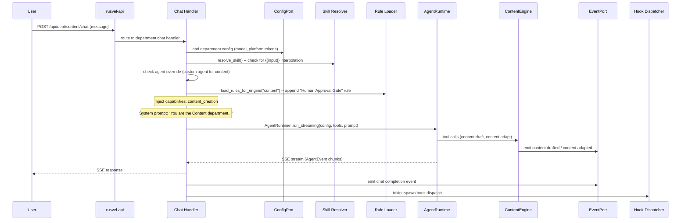
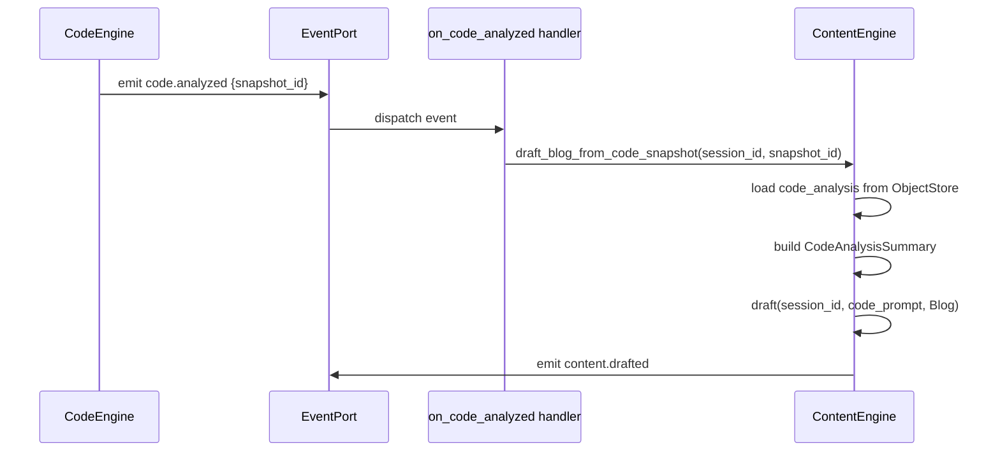
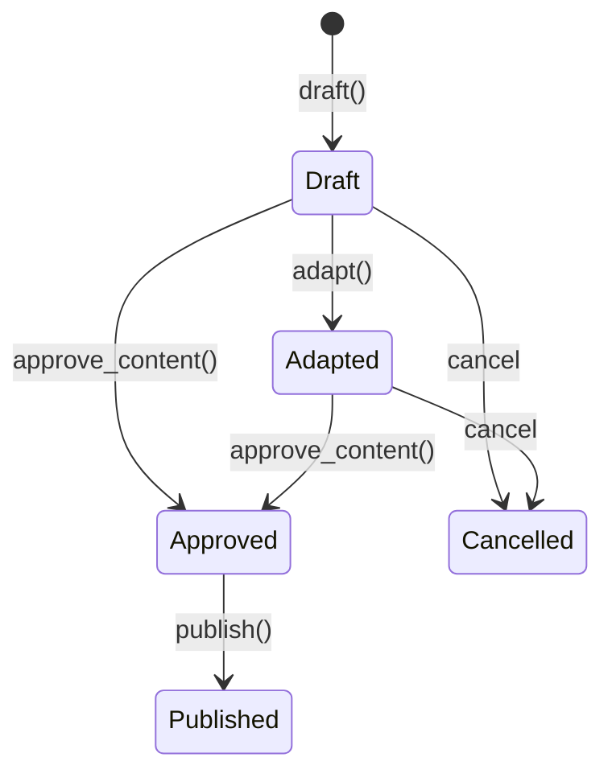

# Content Department

> Content creation, platform adaptation, publishing strategy

## Overview

The Content Department handles the full content lifecycle for RUSVEL: AI-powered drafting, multi-platform adaptation (LinkedIn, Twitter/X, DEV.to, Substack), calendar scheduling, human-approved publishing, and engagement analytics. It consumes `code.analyzed` events from the Code department to automatically generate technical blog posts from code snapshots, creating a seamless code-to-content pipeline. Every piece of content must pass a human approval gate (ADR-008) before it can be published.

## Engine (`content-engine`)

- Crate: `crates/content-engine/src/lib.rs`
- Lines: 424 (lib.rs) + submodules (writer, calendar, analytics, adapters, platform, code_bridge)
- Status: **Wired** (real business logic)

### Public API

| Method | Signature | Description |
|--------|-----------|-------------|
| `new` | `fn new(storage, event_bus, agent, jobs) -> Self` | Construct with 4 port dependencies |
| `register_platform` | `fn register_platform(&self, adapter: Arc<dyn PlatformAdapter>)` | Register a platform adapter for publishing |
| `draft` | `async fn draft(&self, session_id, topic, kind: ContentKind) -> Result<ContentItem>` | Draft new content via AI agent |
| `adapt` | `async fn adapt(&self, session_id, content_id, platform: Platform) -> Result<ContentItem>` | Adapt existing content for a target platform |
| `publish` | `async fn publish(&self, session_id, content_id, platform) -> Result<PublishResult>` | Publish approved content to a platform (requires Approved status) |
| `schedule` | `async fn schedule(&self, session_id, content_id, platform, at: DateTime) -> Result<()>` | Schedule content for future publication |
| `schedule_draft` | `async fn schedule_draft(&self, session_id, draft_id, platform, publish_at) -> Result<()>` | Alias for schedule (matches product spec wording) |
| `approve_content` | `async fn approve_content(&self, content_id) -> Result<ContentItem>` | Mark content as human-approved (ADR-008 gate) |
| `draft_blog_from_code_snapshot` | `async fn draft_blog_from_code_snapshot(&self, session_id, snapshot_id) -> Result<ContentItem>` | Draft a blog post from a stored code_analysis snapshot |
| `execute_content_publish_job` | `async fn execute_content_publish_job(&self, job: Job) -> Result<Value>` | Execute a queued ContentPublish job (payload: content_id, platform) |
| `list_content` | `async fn list_content(&self, session_id, status_filter: Option<ContentStatus>) -> Result<Vec<ContentItem>>` | List content items, optionally filtered by status |
| `list_scheduled` | `async fn list_scheduled(&self, session_id) -> Result<Vec<ScheduledPost>>` | List all scheduled posts (content calendar) |
| `list_scheduled_in_range` | `async fn list_scheduled_in_range(&self, session_id, from, to) -> Result<Vec<ScheduledPost>>` | List scheduled posts within a date range |
| `get_metrics` | `async fn get_metrics(&self, content_id) -> Result<Vec<(Platform, PostMetrics)>>` | Get engagement metrics for a content item |

### Internal Structure

- **`ContentWriter`** (`writer.rs`) -- AI-powered drafting and adaptation. Uses `AgentPort` to generate content. `build_code_prompt()` builds prompts from `CodeAnalysisSummary` for code-to-content.
- **`ContentCalendar`** (`calendar.rs`) -- Scheduling engine. Uses `StoragePort` for persistence and `JobPort` for scheduling future publish jobs.
- **`ContentAnalytics`** (`analytics.rs`) -- Engagement metrics tracking per content item per platform.
- **`PlatformAdapter` trait** (`platform.rs`) -- Interface for platform-specific publishing. Returns `PublishResult` with URL and timestamp. Has `max_length()` for character-limited platforms.
- **Platform adapters** (`adapters/`) -- Real implementations for LinkedIn, Twitter, and DEV.to. Each reads API credentials from `ConfigPort`.
- **`code_bridge`** (`code_bridge.rs`) -- Converts stored `code_analysis` JSON to `CodeAnalysisSummary` for the writer.

### Content Kinds

`LongForm`, `Tweet`, `Thread`, `LinkedInPost`, `Blog`, `VideoScript`, `Email`, `Proposal`

### Content Statuses

`Draft`, `Adapted`, `Approved`, `Published`, `Cancelled`

### Supported Platforms

Twitter, LinkedIn, DevTo, Medium, YouTube, Substack, Email, Custom(String)

## Department Wrapper (`dept-content`)

- Crate: `crates/dept-content/src/lib.rs`
- Lines: 131
- Manifest: `crates/dept-content/src/manifest.rs`

The wrapper creates a `ContentEngine`, registers 3 real platform adapters (LinkedIn, Twitter, DEV.to), registers 2 agent tools, wires an event handler for `code.analyzed`, and registers a job handler for `content.publish`.

### Registration Details

```
- Platform adapters: LinkedInAdapter, TwitterAdapter, DevToAdapter (all from content_engine::adapters)
- Tools: content.draft, content.adapt (via tools::register_tools)
- Event handler: "code.analyzed" -> triggers code-to-content pipeline
- Job handler: "content.publish" -> executes content_engine.execute_content_publish_job
```

## Manifest Declaration

### System Prompt

> You are the Content department of RUSVEL.
>
> Focus: content creation, platform adaptation, publishing strategy.
> Draft in Markdown. Adapt for LinkedIn, Twitter/X, DEV.to, Substack.

### Capabilities

- `content_creation`

### Quick Actions

| Label | Prompt |
|-------|--------|
| Draft blog post | Draft a blog post. Ask me for the topic, audience, and key points. |
| Adapt for Twitter | Adapt the latest content piece into a Twitter/X thread. |
| Content calendar | Show the content calendar for this week with scheduled and draft posts. |

### Registered Tools

| Tool Name | Parameters | Description |
|-----------|------------|-------------|
| `content.draft` | `session_id: string` (required), `topic: string` (required), `kind: string` (enum: LongForm, Tweet, Thread, LinkedInPost, Blog, VideoScript, Email, Proposal) | Draft a blog post or article on a given topic |
| `content.adapt` | `session_id: string` (required), `content_id: string` (required), `platform: string` (enum: twitter, linkedin, devto, medium, youtube, substack, email) | Adapt existing content for a specific platform |

### Personas

| Name | Role | Default Model | Allowed Tools | Purpose |
|------|------|---------------|---------------|---------|
| content-strategist | Content strategist and writer | sonnet | content.draft, content.adapt, web_search | Content planning and execution |

### Skills

| Name | Description | Template |
|------|-------------|----------|
| Blog Draft | Draft a blog post from topic and key points | Write a blog post about: {{topic}}. Key points: {{points}}. Audience: {{audience}} |

### Rules

| Name | Content | Enabled |
|------|---------|---------|
| Human Approval Gate | All content must be approved before publishing. Never auto-publish. | Yes |

### Jobs

| Job Kind | Description | Requires Approval |
|----------|-------------|-------------------|
| `content.publish` | Publish approved content to target platforms | Yes |

## Events

### Produced

| Event Kind | When Emitted |
|------------|--------------|
| `content.drafted` | `draft()` creates a new content item |
| `content.adapted` | `adapt()` creates a platform-adapted version |
| `content.scheduled` | `schedule()` schedules content for future publication. Payload includes platform and publish_at. |
| `content.published` | `publish()` successfully publishes to a platform |
| `content.reviewed` | Content is reviewed (feedback cycle) |
| `content.cancelled` | Content is cancelled |
| `content.metrics_recorded` | Engagement metrics are recorded for a content item |

### Consumed

| Event Kind | Source | Action |
|------------|--------|--------|
| `code.analyzed` | Code department | Triggers `draft_blog_from_code_snapshot()` to auto-generate a blog post from the code analysis |

## API Routes

| Method | Path | Description |
|--------|------|-------------|
| POST | `/api/dept/content/draft` | Draft content from a topic |
| POST | `/api/dept/content/from-code` | Generate content from a code analysis snapshot |
| PATCH | `/api/dept/content/{id}/approve` | Approve content for publishing (ADR-008 gate) |
| POST | `/api/dept/content/publish` | Publish approved content to a platform |
| GET | `/api/dept/content/list` | List all content items |

## CLI Commands

```
rusvel content draft <topic>    # Draft content from a topic
rusvel content from-code        # Generate content from code analysis
```

## Entity Auto-Discovery

Agents, skills, rules, hooks, and MCP servers scoped to the Content department are stored with `metadata.engine = "content"`. The shared CRUD API routes filter by this key so each department sees only its own entities.

## Chat Flow



### Code-to-Content Pipeline



## Extending This Department

### 1. Add a new tool

Register the tool in `crates/dept-content/src/tools.rs` inside `register_tools()`. Add a matching `ToolContribution` entry in `crates/dept-content/src/manifest.rs`.

### 2. Add a new event kind

Add a new `pub const` in the `events` module inside `crates/content-engine/src/lib.rs`. Emit it from the engine method. Add the event kind string to `events_produced` in `crates/dept-content/src/manifest.rs`.

### 3. Add a new persona

Add a `PersonaContribution` entry in the `personas` vec in `crates/dept-content/src/manifest.rs`.

### 4. Add a new skill

Add a `SkillContribution` entry in the `skills` vec in `crates/dept-content/src/manifest.rs`.

### 5. Add a new API route

Add a `RouteContribution` entry in the `routes` vec in `crates/dept-content/src/manifest.rs`. Implement the handler in `crates/rusvel-api/src/engine_routes.rs` and wire the route in `crates/rusvel-api/src/lib.rs`.

### 6. Add a new platform adapter

Implement the `PlatformAdapter` trait in a new file under `crates/content-engine/src/adapters/`. Register it in `crates/dept-content/src/lib.rs` inside `register()` with `engine.register_platform(Arc::new(NewAdapter::new(ctx.config.clone())))`.

## Port Dependencies

| Port | Required | Purpose |
|------|----------|---------|
| AgentPort | Yes | AI-powered content drafting and adaptation via ContentWriter |
| EventPort | Yes | Emit content.* events and receive code.analyzed |
| StoragePort | Yes | Persist content items, scheduled posts, analytics via ObjectStore |
| JobPort | Yes | Enqueue and schedule content.publish jobs |
| ConfigPort | No (optional) | Platform API credentials (devto_api_key, twitter_bearer_token, linkedin_bearer_token) |

## Object Store Kinds

| Kind | Schema | Used By |
|------|--------|---------|
| `content` | `ContentItem { id, session_id, title, body_markdown, status, approval, platform_targets, published_at, metadata }` | `draft()`, `adapt()`, `publish()`, `approve_content()`, `list_content()` |
| `scheduled_post` | `ScheduledPost { content_id, platform, publish_at, session_id }` | `schedule()`, `list_scheduled()` |
| `content_metrics` | Platform engagement metrics per content item | `get_metrics()` |

## Platform Adapter Details

### PlatformAdapter Trait

```rust
pub trait PlatformAdapter: Send + Sync + Debug {
    fn platform(&self) -> Platform;
    fn max_length(&self) -> Option<usize>;
    async fn publish(&self, item: &ContentItem) -> Result<PublishResult>;
}
```

### Registered Adapters

| Platform | Adapter | Config Keys | Max Length |
|----------|---------|-------------|-----------|
| LinkedIn | `LinkedInAdapter` | `linkedin_bearer_token` | None |
| Twitter/X | `TwitterAdapter` | `twitter_bearer_token` | 280 chars |
| DEV.to | `DevToAdapter` | `devto_api_key` | None |

### PublishResult

```rust
pub struct PublishResult {
    pub url: Option<String>,
    pub published_at: DateTime<Utc>,
    pub metadata: Value,
}
```

## Content Approval Flow (ADR-008)

Content must be explicitly approved before it can be published:



Attempting to call `publish()` on content that is not `Approved` or `AutoApproved` returns `RusvelError::Validation`.

## Content Calendar

The `ContentCalendar` manages future publication scheduling:

- `schedule()` creates a `ScheduledPost` and enqueues a `content.publish` job with a scheduled time
- `list_scheduled()` returns all scheduled posts for a session
- `list_scheduled_in_range()` filters by date range (inclusive)
- Jobs are processed by the job worker, which calls `execute_content_publish_job()`

## ContentWriter AI Integration

The `ContentWriter` uses `AgentPort` for two operations:

1. **Draft**: Given a topic and content kind, generates markdown content via an AI agent
2. **Adapt**: Given existing content and a target platform, rewrites to fit the platform's format and length constraints

For code-to-content, `build_code_prompt()` constructs a rich prompt from `CodeAnalysisSummary` including repository path, symbol counts, top functions, and the largest function name.

## UI Integration

The manifest declares a dashboard card and 6 tabs:

- **Dashboard card**: "Content Pipeline" (medium) -- Drafts, scheduled, and published content
- **Tabs**: actions, engine, agents, skills, rules, events
- **has_settings**: true (supports platform credential configuration)

## Configuration Schema

```json
{
  "devto_api_key": "string",
  "twitter_bearer_token": "string",
  "linkedin_bearer_token": "string",
  "default_format": "markdown | html"
}
```

## Testing

```bash
cargo test -p content-engine    # 7 tests
```

Key test scenarios:
- Draft creates content item and emits event
- Adapt creates platform-adapted version
- Publish requires approval status
- Calendar scheduling
- Code-to-content pipeline integration

```bash
cargo test -p dept-content      # Department wrapper tests
```

Key test scenarios:
- Department creates with correct manifest ID
- Manifest declares 5 routes, 2 tools, 7 events
- Manifest requires AgentPort (non-optional)
- Manifest serializes to valid JSON
