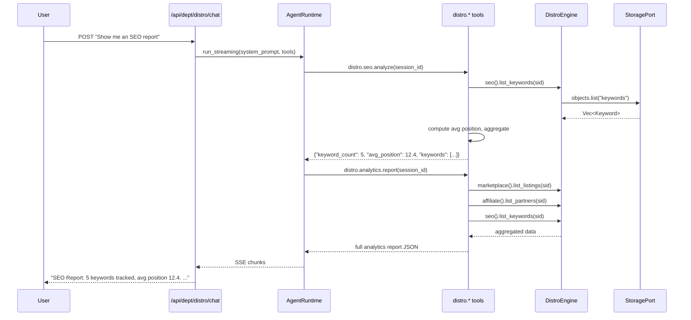

# Distribution Department

> Marketplace listings, SEO optimization, affiliate programs, partnerships.

| Field | Value |
|---|---|
| **ID** | `distro` |
| **Icon** | `!` |
| **Color** | `teal` |
| **Engine crate** | `distro-engine` (~390 lines) |
| **Dept crate** | `dept-distro` |
| **Status** | Skeleton -- manager structures with CRUD, minimal business logic |

---

## Overview

The Distribution department manages distribution channels for a solo SaaS business: marketplace listings across platforms, SEO keyword tracking with position monitoring, and affiliate partner management with commission tracking. The engine provides three manager subsystems backed by `ObjectStore`.

---

## Current Status: Skeleton

The distro engine has manager structures but minimal business logic (~390 lines total across `lib.rs` and three manager modules). The managers provide CRUD operations:

- **MarketplaceManager** -- `add_listing(sid, platform, name, url)`, `list_listings(sid)`, `publish_listing(sid, listing_id)`. Creates listings with `ListingStatus` (Draft/Published/Archived) and tracks revenue per listing.
- **SeoManager** -- `add_keyword(sid, keyword, position, volume)`, `list_keywords(sid)`, `track_ranking(sid, keyword_id, new_position)`. Tracks keyword positions and search volume.
- **AffiliateManager** -- `add_partner(sid, name, commission_rate)`, `list_partners(sid)`, `track_commission(sid, partner_id, amount)`. Manages affiliate partners with commission rates.

The department is fully registered and bootable -- it appears in the department registry, responds to chat, and has 4 agent tools wired. However, it needs the following to be production-ready:

- Automated marketplace listing sync with real platforms
- SEO position history and trend analysis
- Affiliate link generation and click tracking
- Revenue attribution across channels
- Automated SEO audit recommendations via AgentPort
- Scheduled ranking checks via job queue

---

## Engine Details

**Crate:** `distro-engine` (~390 lines)

**Struct:** `DistroEngine`

**Constructor:**
```rust
DistroEngine::new(
    storage: Arc<dyn StoragePort>,
    events: Arc<dyn EventPort>,
    agent: Arc<dyn AgentPort>,
    jobs: Arc<dyn JobPort>,
)
```

**Managers:**

| Manager | Methods | Description |
|---|---|---|
| `MarketplaceManager` | `add_listing()`, `list_listings()`, `publish_listing()` | Marketplace listing management |
| `SeoManager` | `add_keyword()`, `list_keywords()`, `track_ranking()` | SEO keyword position tracking |
| `AffiliateManager` | `add_partner()`, `list_partners()`, `track_commission()` | Affiliate partner and commission management |

**Implements:** `rusvel_core::engine::Engine` trait (kind: `"distro"`, name: `"Distribution Engine"`)

---

## Manifest

Declared in `dept-distro/src/manifest.rs`:

```
id:            "distro"
name:          "Distribution Department"
description:   "Marketplace listings, SEO optimization, affiliate programs, partnerships, API distribution channels"
icon:          "!"
color:         "teal"
capabilities:  ["marketplace", "seo", "affiliate"]
```

### System Prompt

```
You are the Distribution department of RUSVEL.

Focus: marketplace listings, SEO optimization, affiliate programs, partnerships, API distribution channels.
```

---

## Tools

Tools registered at runtime via `dept-distro/src/tools.rs` (4 tools):

| Tool | Parameters | Description |
|---|---|---|
| `distro.seo.analyze` | `session_id` | Summarize tracked SEO keywords (positions, volume, average position) |
| `distro.marketplace.list` | `session_id` | List all marketplace listings |
| `distro.affiliate.create_link` | `session_id`, `name`, `commission_rate` (0-1) | Register an affiliate partner |
| `distro.analytics.report` | `session_id` | Aggregate listings, affiliates, and SEO keywords into one JSON report |

---

## Personas

None declared in the manifest.

---

## Skills

None declared in the manifest.

---

## Rules

None declared in the manifest.

---

## Jobs

None declared in the manifest. Future candidates:
- Scheduled SEO position checks
- Marketplace listing status sync
- Affiliate commission payouts

---

## Events

### Defined Constants (engine)

| Constant | Value |
|---|---|
| `LISTING_PUBLISHED` | `distro.listing.published` |
| `SEO_RANKED` | `distro.seo.ranked` |
| `AFFILIATE_JOINED` | `distro.affiliate.joined` |
| `PARTNERSHIP_CREATED` | `distro.partnership.created` |

These constants are defined in the engine but are not yet emitted automatically by the manager methods. They are not listed in the manifest's `events_produced`.

### Consumed

None.

---

## API Routes

None declared in the manifest. The department is accessible via the standard parameterized routes:
- `GET /api/dept/distro/status` -- department status
- `POST /api/dept/distro/chat` -- SSE chat

---

## CLI Commands

Standard department CLI:
```
rusvel distro status    # One-shot status (alias: "distribution")
rusvel distro list      # List items
rusvel distro events    # Show events
```

---

## Entity Auto-Discovery

The standard CRUD subsystems are available at `/api/dept/distro/*`:
- Agents, Skills, Rules, Hooks, Workflows, MCP Servers

---

## Chat Flow



---

## Extending the Department

### Adding automated SEO audits

1. Add an `audit(sid)` method to `SeoManager` that calls `AgentPort` with keyword data for AI-powered recommendations
2. Register a `distro.seo.audit` tool in `dept-distro/src/tools.rs`
3. Add a scheduled job kind for periodic audits
4. Emit `distro.seo.ranked` events when position changes are detected

### Adding marketplace sync

1. Implement platform-specific adapters (similar to content-engine's LinkedIn/Twitter adapters)
2. Add a `sync_listing(sid, listing_id)` method that fetches live data from the platform
3. Wire a job kind for periodic sync

### Adding revenue attribution

1. Extend `MarketplaceManager` to track revenue per listing over time
2. Extend `AffiliateManager` to compute total commissions earned per partner
3. Add a `distro.revenue.attribution` tool that breaks down revenue by channel
4. Wire the data into the analytics report tool

---

## Port Dependencies

| Port | Required | Usage |
|---|---|---|
| `StoragePort` | Yes | Listings, keywords, partners (via `ObjectStore`) |
| `EventPort` | Yes | Domain event emission (constants defined, not yet auto-emitted) |
| `AgentPort` | Yes | LLM-powered distribution analysis via chat, future SEO audits |
| `JobPort` | Yes | Future: scheduled ranking checks and sync |
