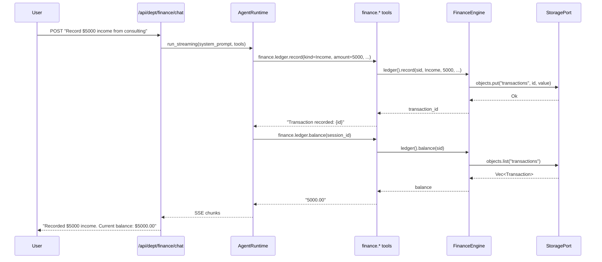

# Finance Department

> Revenue tracking, expense management, tax optimization, runway forecasting.

| Field | Value |
|---|---|
| **ID** | `finance` |
| **Icon** | `%` |
| **Color** | `green` |
| **Engine crate** | `finance-engine` (~400 lines) |
| **Dept crate** | `dept-finance` |
| **Status** | Skeleton -- manager structures with CRUD, minimal business logic |

---

## Overview

The Finance department handles financial operations for a solo SaaS business: ledger transactions (income/expenses), tax estimation, and runway forecasting. The engine provides three manager subsystems, each backed by `ObjectStore` for persistence.

---

## Current Status: Skeleton

The finance engine has manager structures but minimal business logic (~400 lines total across `lib.rs` and three manager modules). The managers provide CRUD operations:

- **LedgerManager** -- `record()`, `balance()`, `list_transactions()`. Records income and expense transactions, computes net balance.
- **TaxManager** -- `add_estimate()`, `total_liability()`, `list_estimates()`. Stores per-category tax estimates and sums liability (estimates minus deductions).
- **RunwayManager** -- `calculate()`, `list_snapshots()`. Computes runway from cash and burn rate, persists snapshots.

The department is fully registered and bootable -- it appears in the department registry, responds to chat, and has 4 agent tools wired. However, it needs the following to be production-ready:

- P&L report generation (aggregate by category/period)
- Recurring transaction support
- Multi-currency handling
- Budget alerts and threshold notifications
- Integration with real accounting data sources
- Scheduled runway recalculation via job queue

---

## Engine Details

**Crate:** `finance-engine` (~400 lines)

**Struct:** `FinanceEngine`

**Constructor:**
```rust
FinanceEngine::new(
    storage: Arc<dyn StoragePort>,
    events: Arc<dyn EventPort>,
    agent: Arc<dyn AgentPort>,
    jobs: Arc<dyn JobPort>,
)
```

**Managers:**

| Manager | Methods | Description |
|---|---|---|
| `LedgerManager` | `record(sid, kind, amount, description, category)`, `balance(sid)`, `list_transactions(sid)` | Income/expense tracking |
| `TaxManager` | `add_estimate(sid, category, amount, period)`, `total_liability(sid)`, `list_estimates(sid)` | Tax estimation by category |
| `RunwayManager` | `calculate(sid, cash, burn_rate)`, `list_snapshots(sid)` | Runway forecasting |

**Implements:** `rusvel_core::engine::Engine` trait (kind: `"finance"`, name: `"Finance Engine"`)

---

## Manifest

Declared in `dept-finance/src/manifest.rs`:

```
id:            "finance"
name:          "Finance Department"
description:   "Revenue tracking, expense management, tax optimization, runway forecasting, P&L reports, unit economics"
icon:          "%"
color:         "green"
capabilities:  ["ledger", "tax", "runway"]
```

### System Prompt

```
You are the Finance department of RUSVEL.

Focus: revenue tracking, expense management, tax optimization, runway forecasting, P&L reports, unit economics.
```

---

## Tools

Tools registered at runtime via `dept-finance/src/lib.rs` (4 tools):

| Tool | Parameters | Description |
|---|---|---|
| `finance.ledger.record` | `session_id`, `kind` (Income/Expense), `amount`, `description`, `category` | Record a transaction |
| `finance.ledger.balance` | `session_id` | Get current balance (income minus expenses) |
| `finance.tax.add_estimate` | `session_id`, `category` (Income/SelfEmployment/Sales/Deduction), `amount`, `period` | Add a tax estimate |
| `finance.tax.total_liability` | `session_id` | Calculate total tax liability |

---

## Personas

None declared in the manifest. The department uses the default system prompt for chat interactions.

---

## Skills

None declared in the manifest.

---

## Rules

None declared in the manifest.

---

## Jobs

None declared in the manifest. Future candidates:
- Scheduled runway recalculation
- Periodic P&L report generation
- Tax deadline reminders

---

## Events

### Defined Constants (engine)

| Constant | Value |
|---|---|
| `INCOME_RECORDED` | `finance.income.recorded` |
| `EXPENSE_RECORDED` | `finance.expense.recorded` |
| `RUNWAY_CALCULATED` | `finance.runway.calculated` |
| `TAX_ESTIMATED` | `finance.tax.estimated` |

These constants are defined in the engine but are not yet emitted automatically by the manager methods (emitting requires calling `engine.emit_event()` explicitly). They are also not listed in the manifest's `events_produced`.

### Consumed

None.

---

## API Routes

None declared in the manifest. The department is accessible via the standard parameterized routes:
- `GET /api/dept/finance/status` -- department status
- `POST /api/dept/finance/chat` -- SSE chat

---

## CLI Commands

Standard department CLI:
```
rusvel finance status    # One-shot status
rusvel finance list      # List items
rusvel finance events    # Show events
```

---

## Entity Auto-Discovery

The standard CRUD subsystems are available at `/api/dept/finance/*`:
- Agents, Skills, Rules, Hooks, Workflows, MCP Servers

---

## Chat Flow



---

## Extending the Department

### Adding P&L reports

1. Add a `PnlManager` to `finance-engine` with `generate_report(sid, period)` method
2. Register a `finance.pnl.report` tool in `dept-finance/src/lib.rs`
3. Add a quick action to the manifest for "P&L report"
4. Optionally add a scheduled job kind for periodic report generation

### Adding event emission

The event constants are already defined. To wire them:
1. Call `self.emit_event(events::INCOME_RECORDED, payload)` inside `LedgerManager::record()` when the transaction kind is `Income`
2. Add the event kinds to the manifest's `events_produced` vector
3. Other departments can then subscribe via `events_consumed`

### Adding API routes

1. Add route contributions to the manifest in `dept-finance/src/manifest.rs`
2. Implement handler functions in `rusvel-api/src/engine_routes.rs`
3. Wire the routes in `rusvel-api/src/lib.rs`

---

## Port Dependencies

| Port | Required | Usage |
|---|---|---|
| `StoragePort` | Yes | Transactions, tax estimates, runway snapshots (via `ObjectStore`) |
| `EventPort` | Yes | Domain event emission (constants defined, not yet auto-emitted) |
| `AgentPort` | Yes | LLM-powered financial analysis via chat |
| `JobPort` | Yes | Future: scheduled reports and calculations |
