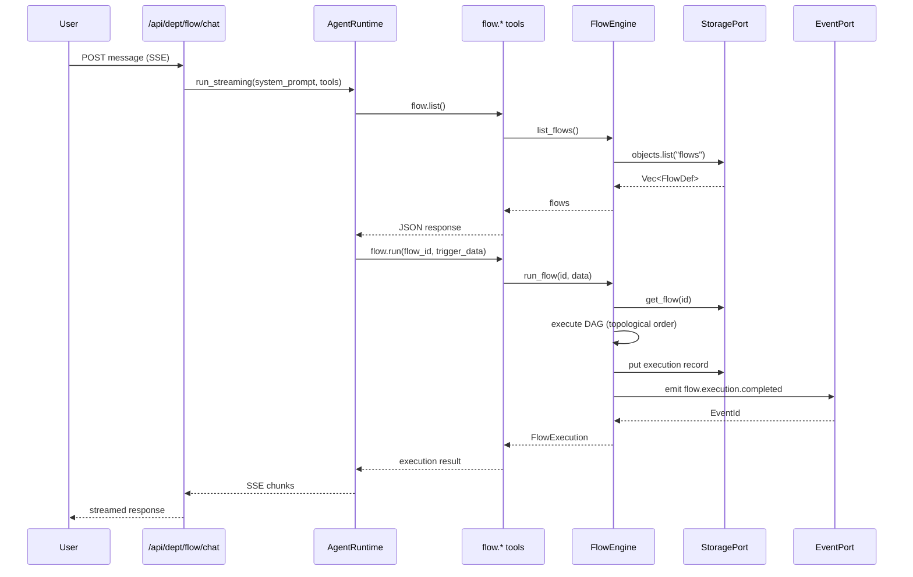

# Flow Department

> DAG-based workflow automation -- create, execute, and monitor directed acyclic graph workflows.

| Field | Value |
|---|---|
| **ID** | `flow` |
| **Icon** | `~` |
| **Color** | `sky` |
| **Engine crate** | `flow-engine` (~600 lines) |
| **Dept crate** | `dept-flow` |
| **Status** | Wired -- full business logic with DAG execution, checkpointing, and resume |

---

## Overview

The Flow department provides a general-purpose DAG workflow engine built on `petgraph`. Workflows are defined as directed acyclic graphs of typed nodes (code, condition, agent, browser, parallel) connected by edges. The engine supports:

- Topological execution with parallel branch support
- Condition-based branching (true/false output ports)
- Agent nodes that delegate to `AgentPort` for LLM-driven steps
- Browser trigger and action nodes (CDP integration)
- Parallel evaluate nodes for multi-agent comparison
- Checkpoint persistence for resume after failure
- Single-node retry from checkpoint state

---

## Engine Details

**Crate:** `flow-engine` (~600 lines in `lib.rs`, plus submodules for executor, expression, nodes, templates)

**Struct:** `FlowEngine`

**Constructor:**
```rust
FlowEngine::new(
    storage: Arc<dyn StoragePort>,
    events: Arc<dyn EventPort>,
    agent: Arc<dyn AgentPort>,
    terminal: Option<Arc<dyn TerminalPort>>,
    browser: Option<Arc<dyn BrowserPort>>,
)
```

**Public methods:**

| Method | Description |
|---|---|
| `node_types()` | List registered node type names |
| `save_flow(flow)` | Persist a `FlowDef` to storage |
| `get_flow(id)` | Retrieve a flow definition by ID |
| `list_flows()` | List all saved flow definitions |
| `delete_flow(id)` | Remove a flow definition |
| `run_flow(id, trigger_data)` | Execute a flow, return `FlowExecution` |
| `resume_flow(execution_id)` | Resume from checkpoint (same execution ID) |
| `retry_node(execution_id, node_id)` | Re-run a single node using checkpoint state |
| `get_checkpoint(execution_id)` | Load the current checkpoint for an execution |
| `get_execution(id)` | Get an execution record by ID |
| `list_executions(flow_id)` | List all executions for a flow |

**Storage keys:** `flows`, `flow_executions`, `flow_checkpoints`

### Node Types

| Type | Module | Description |
|---|---|---|
| `code` | `nodes::code` | Returns a literal value from parameters |
| `condition` | `nodes::condition` | Branches on a boolean result (true/false output ports) |
| `agent` | `nodes::agent` | Delegates to `AgentPort` for LLM execution |
| `browser_trigger` | `nodes::browser` | Triggers browser automation via CDP |
| `browser_action` | `nodes::browser` | Executes browser actions via `BrowserPort` |
| `parallel_evaluate` | `nodes::parallel` | Multi-agent parallel evaluation (gated by `RUSVEL_FLOW_PARALLEL_EVALUATE=1`) |

---

## Manifest

Declared in `dept-flow/src/manifest.rs`:

```
id:            "flow"
name:          "Flow Department"
description:   "DAG workflow automation -- create, execute, and monitor workflows"
icon:          "~"
color:         "sky"
capabilities:  ["workflow_automation"]
```

### System Prompt

```
You are the Flow department of RUSVEL.

Focus: DAG-based workflow automation.
Create, execute, and monitor directed acyclic graph workflows
with code, condition, and agent nodes.
```

---

## Tools

Tools registered at runtime via `dept-flow/src/tools.rs` (7 tools):

| Tool | Parameters | Description |
|---|---|---|
| `flow.save` | `flow` (FlowDef JSON) | Save a flow definition |
| `flow.get` | `flow_id` | Load a flow definition by ID |
| `flow.list` | (none) | List all saved flow definitions |
| `flow.run` | `flow_id`, `trigger_data` | Run a flow with trigger payload |
| `flow.resume` | `execution_id` | Resume a flow from checkpoint |
| `flow.get_execution` | `execution_id` | Get an execution record by ID |
| `flow.list_executions` | `flow_id` | List executions for a flow |

Manifest also declares 3 tool contributions for discovery:
- `flow.create` -- Create a new DAG workflow definition
- `flow.execute` -- Execute a saved workflow by ID
- `flow.list` -- List all saved workflows

---

## Personas

| Name | Role | Default Model | Allowed Tools |
|---|---|---|---|
| `workflow-architect` | DAG workflow designer and automation expert | `sonnet` | `flow.create`, `flow.execute`, `flow.list` |

---

## Skills

| Name | Description | Template |
|---|---|---|
| Workflow Design | Design a DAG workflow from requirements | `Design a workflow for: {{goal}}\n\nBreak it into discrete steps with conditions and dependencies.` |

---

## Rules

None declared in the manifest.

---

## Jobs

| Kind | Description | Requires Approval |
|---|---|---|
| `flow.execute` | Execute a DAG workflow | No |

---

## Events

### Produced (manifest)

- `flow.started`
- `flow.completed`
- `flow.failed`

### Emitted (engine runtime)

- `flow.execution.completed` -- emitted after `run_flow()` and `resume_flow()` with payload `{ flow_id, execution_id, status }`

### Consumed

None.

---

## API Routes

Declared in manifest (7 routes):

| Method | Path | Description |
|---|---|---|
| `GET` | `/api/flows` | List all flow definitions |
| `POST` | `/api/flows` | Create a new flow definition |
| `GET` | `/api/flows/{id}` | Get a flow definition by ID |
| `PUT` | `/api/flows/{id}` | Update a flow definition |
| `DELETE` | `/api/flows/{id}` | Delete a flow definition |
| `POST` | `/api/flows/{id}/execute` | Execute a flow |
| `GET` | `/api/flows/{id}/executions` | List executions for a flow |

Additional route in `rusvel-api` (not in manifest):
- `GET /api/flows/node-types` -- returns available node types (filters `parallel_evaluate` unless `RUSVEL_FLOW_PARALLEL_EVALUATE=1`)

---

## CLI Commands

Manifest declares one command:

| Command | Args | Description |
|---|---|---|
| `execute` | `flow_id` (required) | Execute a flow by ID |

---

## Entity Auto-Discovery

The standard CRUD subsystems are available for the Flow department at the parameterized `/api/dept/flow/*` routes:

- Agents, Skills, Rules, Hooks, Workflows, MCP Servers

These are auto-discovered from the department registry. No additional engine-specific entities.

---

## Chat Flow



---

## Extending the Department

### Adding a new node type

1. Create a new module under `flow-engine/src/nodes/` implementing the `FlowNode` trait
2. Register it in `FlowEngine::new()` via `registry.register(Arc::new(YourNode))`
3. The node becomes available in `node_types()` and usable in flow definitions

### Adding new tools

Add tool registrations in `dept-flow/src/tools.rs` inside the `register()` function. Follow the existing pattern of cloning the engine Arc and using `ctx.tools.add()`.

### Adding events

Define event kind constants in the engine and emit them via `self.events.emit(Event { ... })`. Add the event kind strings to the manifest's `events_produced` vector.

---

## Port Dependencies

| Port | Required | Usage |
|---|---|---|
| `StoragePort` | Yes | Flow definitions, executions, checkpoints (via `ObjectStore`) |
| `EventPort` | Yes | Emit `flow.execution.completed` events |
| `AgentPort` | Yes | Agent node execution within flows |
| `JobPort` | Yes | Background flow execution via job queue |

Optional ports (not in manifest `requires_ports` but accepted by engine constructor):
- `TerminalPort` -- PTY management for terminal-based nodes
- `BrowserPort` -- CDP browser automation for browser trigger/action nodes
