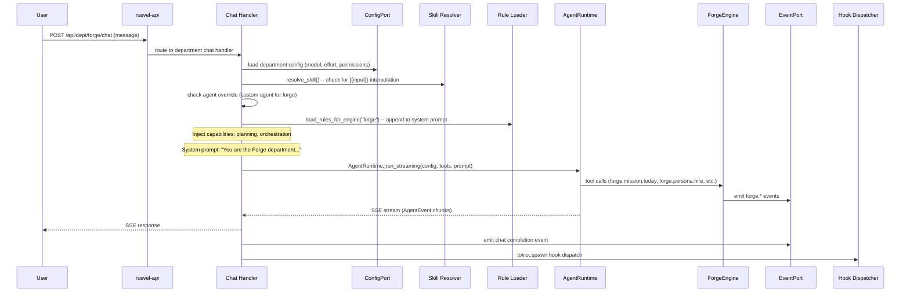

# Forge Department

> Agent orchestration, goal planning, mission management, daily plans, reviews

## Overview

The Forge Department is the meta-engine of RUSVEL. It orchestrates AI agents across all departments, manages strategic goals, generates prioritized daily mission plans, and produces periodic reviews. It also houses a catalog of 10 built-in agent personas that can be "hired" into any session, and a safety guard system (budget caps, concurrency slots, circuit breaker) to protect against runaway LLM spend. Forge is the department a solo builder uses to plan their day, track progress, and coordinate work across the entire virtual agency.

## Engine (`forge-engine`)

- Crate: `crates/forge-engine/src/lib.rs`
- Lines: 483 (lib.rs) + 712 (mission.rs) + 264 (personas.rs) + 23 (events.rs) + submodules
- Status: **Wired** (real business logic)

### Public API

| Method | Signature | Description |
|--------|-----------|-------------|
| `new` | `fn new(agent, events, memory, storage, jobs, session, config) -> Self` | Construct with all 7 injected port dependencies |
| `list_personas` | `fn list_personas(&self) -> &[AgentProfile]` | Return all 10 built-in personas |
| `get_persona` | `fn get_persona(&self, name: &str) -> Option<&AgentProfile>` | Look up a persona by name (case-insensitive) |
| `hire_persona` | `fn hire_persona(&self, name: &str, session_id: &SessionId) -> Result<AgentConfig>` | Build a spawn-ready AgentConfig from a named persona |
| `set_goal` | `async fn set_goal(&self, session_id, title, description, timeframe) -> Result<Goal>` | Create and persist a new goal |
| `list_goals` | `async fn list_goals(&self, session_id: &SessionId) -> Result<Vec<Goal>>` | List all goals for a session |
| `mission_today` | `async fn mission_today(&self, session_id: &SessionId) -> Result<DailyPlan>` | Generate a prioritized daily plan via LLM from goals and recent events |
| `review` | `async fn review(&self, session_id, period: Timeframe) -> Result<Review>` | Generate a periodic review (accomplishments, blockers, next actions) |
| `generate_brief` | `async fn generate_brief(&self, session_id: &SessionId) -> Result<ExecutiveBrief>` | Cross-department daily digest with strategist summary |
| `latest_brief` | `async fn latest_brief(&self, session_id: &SessionId) -> Result<Option<ExecutiveBrief>>` | Retrieve the most recently generated executive brief |
| `run_agent_with_mission_safety` | `async fn run_agent_with_mission_safety(&self, session_id, config, prompt) -> Result<AgentOutput>` | Run an LLM call with circuit breaker, budget check, and concurrency slot |

### Internal Structure

- **`PersonaManager`** (`personas.rs`) -- Manages the catalog of 10 built-in agent personas. Supports lookup by name (case-insensitive), filtering by capability, and runtime additions.
- **`SafetyGuard`** (`safety.rs`) -- Budget enforcement (soft ceiling with 80% warning threshold), concurrency slot limiter, and circuit breaker (opens after repeated failures).
- **Mission module** (`mission.rs`) -- Goals, daily plans, reviews, and executive briefs. All LLM calls go through `run_agent_with_mission_safety`.
- **Pipeline module** (`pipeline.rs`) -- Multi-step pipeline orchestration for forge workflows.
- **Artifacts module** (`artifacts.rs`) -- Persistent artifact records for pipeline outputs.
- **Events module** (`events.rs`) -- String constants for all emitted event kinds.

## Department Wrapper (`dept-forge`)

- Crate: `crates/dept-forge/src/lib.rs`
- Lines: 276
- Manifest: `crates/dept-forge/src/manifest.rs`

The wrapper creates a `ForgeEngine` during registration, wires all 7 ports, and registers 5 agent tools. It is a thin delegation layer with no business logic.

## Manifest Declaration

### System Prompt

> You are the Forge department of RUSVEL.
>
> Focus: agent orchestration, goal planning, mission management, daily plans, reviews.

### Capabilities

- `planning`
- `orchestration`

### Quick Actions

| Label | Prompt |
|-------|--------|
| Daily plan | Generate today's mission plan based on active goals and priorities. |
| Review progress | Review progress on all active goals. Summarize completed, in-progress, and blocked items. |
| Set new goal | Help me define a new strategic goal. Ask me for context and desired outcome. |

### Registered Tools

| Tool Name | Parameters | Description |
|-----------|------------|-------------|
| `forge.mission.today` | `session_id: string` (required) | Generate today's prioritized mission plan from active goals and recent activity |
| `forge.mission.list_goals` | `session_id: string` (required) | List all goals for a session |
| `forge.mission.set_goal` | `session_id: string`, `title: string`, `description: string`, `timeframe: Day/Week/Month/Quarter` (all required) | Create a new goal for a session |
| `forge.mission.review` | `session_id: string`, `period: Day/Week/Month/Quarter` (required) | Generate a periodic review (accomplishments, blockers, next actions) |
| `forge.persona.hire` | `session_id: string`, `persona_name: string` (required) | Build an AgentConfig from a named Forge persona (spawn-ready profile) |

### Personas

| Name | Role | Default Model | Allowed Tools | Purpose |
|------|------|---------------|---------------|---------|
| CodeWriter | code_writer | ollama:llama3.2 | file_write, file_read, shell | Write clean, well-structured code from specifications |
| Reviewer | code_reviewer | ollama:llama3.2 | file_read, search | Examine code for bugs, anti-patterns, performance issues |
| Tester | test_engineer | ollama:llama3.2 | file_write, file_read, shell | Write comprehensive tests, aim for edge cases |
| Debugger | debugger | ollama:llama3.2 | file_read, shell, search | Diagnose failures, trace execution, isolate root causes |
| Architect | architect | ollama:llama3.2 | file_read, search | Design high-level architecture, define module boundaries |
| Documenter | technical_writer | ollama:llama3.2 | file_write, file_read | Produce README files, API docs, architecture guides |
| SecurityAuditor | security_auditor | ollama:llama3.2 | file_read, shell, search | Audit code for vulnerabilities, dependency CVEs |
| Refactorer | refactorer | ollama:llama3.2 | file_write, file_read, shell | Improve code structure without changing behavior |
| ContentWriter | content_writer | ollama:llama3.2 | file_write, web_search | Write blog posts, tweets, documentation, marketing copy |
| Researcher | researcher | ollama:llama3.2 | web_search, file_write | Investigate topics, summarize findings, produce reports |

### Skills

| Name | Description | Template |
|------|-------------|----------|
| Daily Standup | Summarize progress and plan for the day | Based on recent activity, generate a standup summary: what was accomplished yesterday, what is planned for today, any blockers |

### Rules

| Name | Content | Enabled |
|------|---------|---------|
| Forge safety -- budget | Mission and review flows use ForgeEngine safety: enforce aggregate spend against the configured cost limit before starting LLM work. If the budget would be exceeded, stop and surface a clear error. | Yes |
| Forge safety -- concurrency and circuit breaker | Mission LLM runs acquire a concurrency slot and respect the circuit breaker. After repeated failures the circuit opens; no further mission agent runs until reset. When the circuit opens, the engine emits `forge.safety.circuit_open`. | Yes |

### Jobs

No jobs are declared in the Forge manifest. Mission and review work is executed synchronously via `run_agent_with_mission_safety`.

## Events

### Produced

| Event Kind | When Emitted |
|------------|--------------|
| `forge.agent.created` | A new agent run is created |
| `forge.agent.started` | An agent run begins executing |
| `forge.agent.completed` | An agent run finishes successfully |
| `forge.agent.failed` | An agent run fails |
| `forge.mission.plan_generated` | `mission_today()` completes and a DailyPlan is built |
| `forge.mission.goal_created` | `set_goal()` persists a new goal |
| `forge.mission.goal_updated` | A goal's status or progress is updated |
| `forge.mission.review_completed` | `review()` completes and a Review is built |
| `forge.brief.generated` | `generate_brief()` persists an executive brief |
| `forge.persona.hired` | A persona is hired into a session |
| `forge.safety.budget_warning` | Aggregate spend exceeds 80% of the configured cost limit |
| `forge.safety.circuit_open` | Circuit breaker opens after repeated mission agent failures |
| `forge.pipeline.started` | A forge pipeline orchestration begins |
| `forge.pipeline.step_started` | A pipeline step begins executing |
| `forge.pipeline.step_completed` | A pipeline step completes |
| `forge.pipeline.completed` | A full pipeline orchestration completes |
| `forge.pipeline.failed` | A pipeline orchestration fails |

### Consumed

The Forge department does not consume events from other departments. It is triggered by direct API/CLI calls and webhook-dispatched `forge.pipeline.requested` events (processed by the job worker in `rusvel-app`).

## API Routes

| Method | Path | Description |
|--------|------|-------------|
| GET | `/api/sessions/{id}/mission/today` | Generate today's prioritized mission plan for the session |
| GET | `/api/sessions/{id}/mission/goals` | List goals for the session |
| POST | `/api/sessions/{id}/mission/goals` | Create a new goal for the session |
| GET | `/api/sessions/{id}/events` | Query events for the session (includes forge mission and safety events) |
| GET | `/api/brief/latest` | Return the most recently persisted executive brief for a session |

## CLI Commands

```
rusvel forge mission today       # Generate today's daily plan
rusvel forge mission goals       # List goals
rusvel forge mission goal <title> # Create a new goal
rusvel forge mission review      # Generate a periodic review (default: week)
```

## Entity Auto-Discovery

Agents, skills, rules, hooks, and MCP servers scoped to the Forge department are stored in the object store with `metadata.engine = "forge"`. The shared CRUD API routes (`/api/dept/{id}/agents`, `/api/dept/{id}/skills`, etc.) filter by this metadata key, so each department sees only its own entities.

## Chat Flow



## Extending This Department

### 1. Add a new tool

Register the tool in `crates/dept-forge/src/lib.rs` inside the `register()` method using `ctx.tools.add("forge", "forge.new_tool", ...)`. Add a matching `ToolContribution` entry in `forge_engine::mission::mission_tool_contributions_for_manifest()` so the manifest stays consistent.

### 2. Add a new event kind

Add a new `pub const` in `crates/forge-engine/src/events.rs`. Emit it from the engine method using `self.events.emit(...)`. Add the event kind string to the `events_produced` vec in `crates/dept-forge/src/manifest.rs`.

### 3. Add a new persona

Add a new `profile(...)` call in `crates/forge-engine/src/personas.rs` inside `default_personas()`. The persona will automatically appear in the manifest via `persona_contributions_for_manifest()`.

### 4. Add a new skill

Add a `SkillContribution` entry in the `skills` vec in `crates/dept-forge/src/manifest.rs`. Use `{{variable}}` placeholders in the `prompt_template` field for runtime interpolation.

### 5. Add a new API route

Add a `RouteContribution` entry in `forge_engine::mission::forge_route_contributions_for_manifest()`. Implement the handler in `crates/rusvel-api/src/engine_routes.rs` (or a new handler module) and wire the route in `crates/rusvel-api/src/lib.rs`.

## Port Dependencies

| Port | Required | Purpose |
|------|----------|---------|
| AgentPort | Yes | LLM agent execution for mission planning, reviews, briefs |
| EventPort | Yes | Emit forge.* domain events |
| MemoryPort | Yes | FTS5 session-namespaced memory search |
| StoragePort | Yes | Persist goals, tasks, plans, reviews, briefs via ObjectStore |
| JobPort | Yes | Enqueue background work (pipeline orchestration) |
| SessionPort | Yes | Create and load sessions for mission context |
| ConfigPort | Yes | Read department configuration (budget ceiling, etc.) |

## Safety Guard System

The Forge engine includes a `SafetyGuard` that wraps all LLM calls made through `run_agent_with_mission_safety()`:

### Budget Enforcement

- Every mission/review LLM call estimates cost via `config.budget_limit` (default: $0.10 per call).
- Aggregate spend is tracked across the session lifetime.
- When spend crosses 80% of the configured ceiling, the engine emits `forge.safety.budget_warning`.
- When spend would exceed the ceiling, the call is rejected with a clear error before any LLM work begins.

### Concurrency Slots

- A semaphore limits concurrent mission agent runs (prevents parallel LLM calls from overwhelming providers).
- Each call acquires a slot; the slot is released when the call completes or fails.

### Circuit Breaker

- Consecutive failures are tracked. After a threshold of repeated failures, the circuit opens.
- When open, all subsequent mission agent calls are rejected immediately without contacting the LLM.
- The engine emits `forge.safety.circuit_open` when the circuit opens.
- Successful calls reset the failure counter and close the circuit.

## Executive Brief System

The `generate_brief()` method produces a cross-department daily digest:

1. **Department scans**: For each of the 12 departments, the engine selects an appropriate persona (e.g., CodeWriter for code, Researcher for harvest/finance/legal) and runs a brief-section LLM call asking for status (green/yellow/red), highlights, and metrics.
2. **Strategist synthesis**: An Architect persona processes all department sections and produces a 2-3 sentence executive summary plus 3-5 cross-cutting action items.
3. **Persistence**: The brief is saved to ObjectStore as `executive_brief` kind and a `forge.brief.generated` event is emitted.
4. **Retrieval**: `latest_brief()` returns the most recent brief, sorted by `created_at`.

### Department-to-Persona Mapping

| Department(s) | Persona Used |
|---------------|-------------|
| code | CodeWriter |
| content, growth, distro, gtm | ContentWriter |
| harvest, finance, legal | Researcher |
| support | Documenter |
| forge, infra, product | Architect |

## Pipeline Orchestration

The Forge engine supports multi-step pipeline orchestration triggered by webhook events:

- Webhook registration with `event_kind = "forge.pipeline.requested"` enqueues `JobKind::Custom("forge.pipeline")`.
- The job worker in `rusvel-app` calls `ForgeEngine::orchestrate_pipeline()`.
- Pipeline steps emit `forge.pipeline.step_started` and `forge.pipeline.step_completed` events.
- The full pipeline emits `forge.pipeline.started` and `forge.pipeline.completed` (or `forge.pipeline.failed`).

## Object Store Kinds

| Kind | Schema | Used By |
|------|--------|---------|
| `goal` | `Goal { id, session_id, title, description, timeframe, status, progress, metadata }` | `set_goal()`, `list_goals()` |
| `task` | `Task { id, session_id, goal_id, title, status, due_at, priority, metadata }` | `mission_today()` |
| `executive_brief` | `ExecutiveBriefStored { session_id, brief: ExecutiveBrief }` | `generate_brief()`, `latest_brief()` |
| `flow_execution` | Pipeline orchestration state | Pipeline module |

## UI Integration

The manifest declares a dashboard card and 7 tabs:

- **Dashboard card**: "Mission Status" (large) -- Active goals, today's plan, recent reviews
- **Tabs**: actions, engine, agents, workflows, skills, rules, events

## Testing

```bash
cargo test -p forge-engine    # 15 tests (all use mock ports)
```

Key test scenarios:
- Engine metadata (kind, name, capabilities)
- Engine lifecycle (initialize, health, shutdown)
- Set and list goals (persistence + event emission)
- Mission today generates plan (LLM mock returns JSON, plan parsed)
- Default personas (10 built-in, lookup by name)
- Hire persona creates AgentConfig (session binding, tool list)
- Safety guard initialization (budget check, circuit check)
