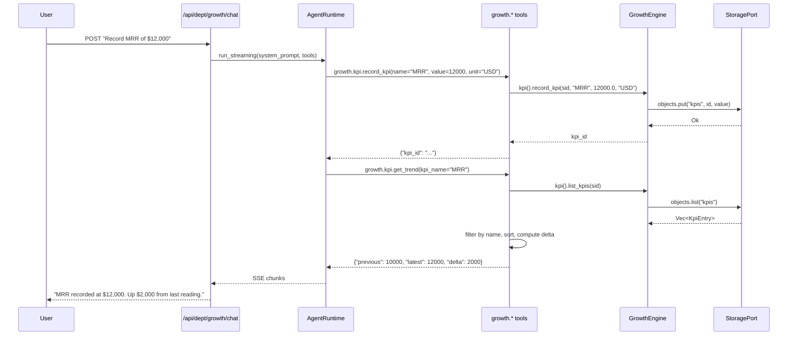

# Growth Department

> Funnel optimization, conversion tracking, cohort analysis, KPI dashboards.

| Field | Value |
|---|---|
| **ID** | `growth` |
| **Icon** | `&` |
| **Color** | `orange` |
| **Engine crate** | `growth-engine` (~375 lines) |
| **Dept crate** | `dept-growth` |
| **Status** | Skeleton -- manager structures with CRUD, minimal business logic |

---

## Overview

The Growth department tracks growth metrics for a solo SaaS business: conversion funnels with ordered stages, user cohorts for retention analysis, and KPI time-series recording. The engine provides three manager subsystems backed by `ObjectStore`.

---

## Current Status: Skeleton

The growth engine has manager structures but minimal business logic (~375 lines total across `lib.rs` and three manager modules). The managers provide CRUD operations:

- **FunnelManager** -- `add_stage(sid, name, order)`, `list_stages(sid)`, `record_conversion(sid, stage_id, count)`. Defines ordered funnel stages and records conversion counts per stage.
- **CohortManager** -- `create_cohort(sid, name, size)`, `list_cohorts(sid)`, `analyze_retention(sid, cohort_id)`. Creates named cohorts with initial size for retention tracking.
- **KpiManager** -- `record_kpi(sid, name, value, unit)`, `list_kpis(sid)`, `get_kpi_trend(sid, name)`. Records time-series KPI measurements and computes simple two-point trend (delta between last two readings).

The department is fully registered and bootable -- it appears in the department registry, responds to chat, and has 4 agent tools wired. However, it needs the following to be production-ready:

- Funnel drop-off rate calculation and visualization data
- Cohort retention matrix computation
- KPI alerting (threshold-based notifications)
- Churn prediction models via AgentPort
- Historical trend analysis beyond two-point comparison
- Dashboard data aggregation endpoints

---

## Engine Details

**Crate:** `growth-engine` (~375 lines)

**Struct:** `GrowthEngine`

**Constructor:**
```rust
GrowthEngine::new(
    storage: Arc<dyn StoragePort>,
    events: Arc<dyn EventPort>,
    agent: Arc<dyn AgentPort>,
    jobs: Arc<dyn JobPort>,
)
```

**Managers:**

| Manager | Methods | Description |
|---|---|---|
| `FunnelManager` | `add_stage()`, `list_stages()`, `record_conversion()` | Conversion funnel tracking |
| `CohortManager` | `create_cohort()`, `list_cohorts()`, `analyze_retention()` | User cohort analysis |
| `KpiManager` | `record_kpi()`, `list_kpis()`, `get_kpi_trend()` | KPI time-series |

**Implements:** `rusvel_core::engine::Engine` trait (kind: `"growth"`, name: `"Growth Engine"`)

---

## Manifest

Declared in `dept-growth/src/manifest.rs`:

```
id:            "growth"
name:          "Growth Department"
description:   "Funnel optimization, conversion tracking, cohort analysis, churn prediction, retention strategies, KPI dashboards"
icon:          "&"
color:         "orange"
capabilities:  ["funnel", "cohort", "kpi"]
```

### System Prompt

```
You are the Growth department of RUSVEL.

Focus: funnel optimization, conversion tracking, cohort analysis, churn prediction, retention strategies, KPI dashboards.
```

---

## Tools

Tools registered at runtime via `dept-growth/src/tools.rs` (4 tools):

| Tool | Parameters | Description |
|---|---|---|
| `growth.funnel.add_stage` | `session_id`, `name`, `order` | Add a funnel stage for conversion tracking |
| `growth.cohort.create_cohort` | `session_id`, `name`, `size` | Create a user cohort for retention analysis |
| `growth.kpi.record_kpi` | `session_id`, `name`, `value`, `unit` | Record a KPI measurement |
| `growth.kpi.get_trend` | `session_id`, `kpi_name` | Compare last two readings for a named metric (simple trend with delta) |

---

## Personas

None declared in the manifest.

---

## Skills

None declared in the manifest.

---

## Rules

None declared in the manifest.

---

## Jobs

None declared in the manifest. Future candidates:
- Scheduled KPI snapshot collection
- Periodic cohort retention analysis
- Churn detection scans

---

## Events

### Defined Constants (engine)

| Constant | Value |
|---|---|
| `FUNNEL_UPDATED` | `growth.funnel.updated` |
| `COHORT_ANALYZED` | `growth.cohort.analyzed` |
| `KPI_RECORDED` | `growth.kpi.recorded` |
| `CHURN_DETECTED` | `growth.churn.detected` |

These constants are defined in the engine but are not yet emitted automatically by the manager methods. They are not listed in the manifest's `events_produced`.

### Consumed

None.

---

## API Routes

None declared in the manifest. The department is accessible via the standard parameterized routes:
- `GET /api/dept/growth/status` -- department status
- `POST /api/dept/growth/chat` -- SSE chat

---

## CLI Commands

Standard department CLI:
```
rusvel growth status    # One-shot status
rusvel growth list      # List items
rusvel growth events    # Show events
```

---

## Entity Auto-Discovery

The standard CRUD subsystems are available at `/api/dept/growth/*`:
- Agents, Skills, Rules, Hooks, Workflows, MCP Servers

---

## Chat Flow



---

## Extending the Department

### Adding funnel drop-off analysis

1. Add a `drop_off_rates(sid)` method to `FunnelManager` that computes conversion percentages between consecutive stages
2. Register a `growth.funnel.analyze` tool in `dept-growth/src/tools.rs`
3. Add a quick action to the manifest

### Adding churn detection

1. Implement a `detect_churn(sid)` method in `CohortManager` that identifies cohorts with declining retention
2. Wire `events::CHURN_DETECTED` emission when thresholds are crossed
3. Optionally use `AgentPort` for AI-powered churn prediction
4. Add to the manifest's `events_produced`

### Adding dashboard data endpoints

1. Add route contributions to the manifest for `/api/dept/growth/dashboard`
2. Implement a handler that aggregates funnel, cohort, and KPI data into a single response
3. Wire the route in `rusvel-api`

---

## Port Dependencies

| Port | Required | Usage |
|---|---|---|
| `StoragePort` | Yes | Funnel stages, cohorts, KPI entries (via `ObjectStore`) |
| `EventPort` | Yes | Domain event emission (constants defined, not yet auto-emitted) |
| `AgentPort` | Yes | LLM-powered growth analysis via chat, future churn prediction |
| `JobPort` | Yes | Future: scheduled KPI collection and analysis |
