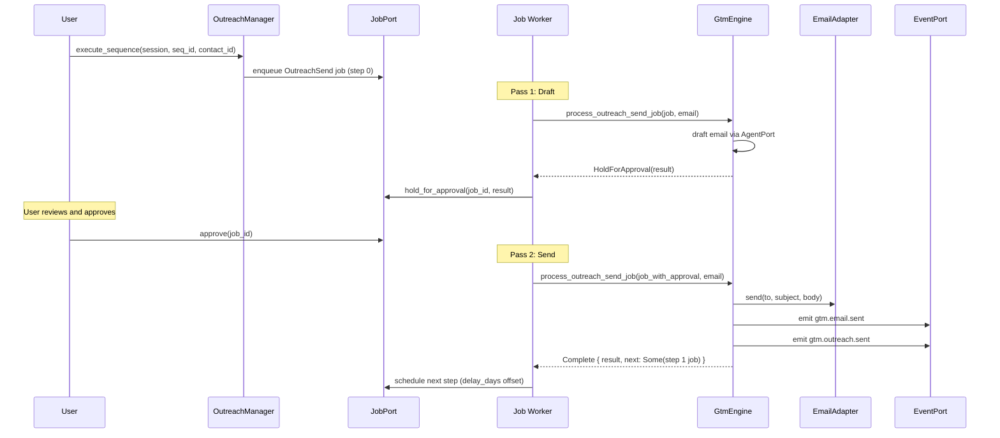
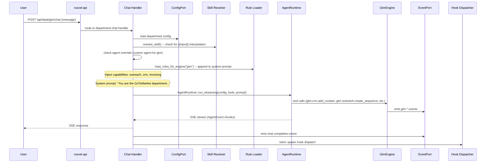

# GoToMarket Department

> CRM, outreach sequences, deal management, invoicing

## Overview

The GoToMarket (GTM) Department handles the full sales pipeline for RUSVEL: contact management (CRM), multi-step outreach sequences with human approval gates, deal tracking through pipeline stages (Lead -> Qualified -> Proposal -> Negotiation -> Won/Lost), and invoicing with line items and payment tracking. Outreach sequences draft emails via the AI agent, hold them for human approval (ADR-008), then send via SMTP and auto-schedule the next step in the sequence. This is the department a solo builder uses to manage client relationships from first contact through paid invoice.

## Engine (`gtm-engine`)

- Crate: `crates/gtm-engine/src/lib.rs`
- Lines: 710 (lib.rs) + submodules (crm, outreach, invoice, email)
- Status: **Wired** (real business logic)

### Public API

| Method | Signature | Description |
|--------|-----------|-------------|
| `new` | `fn new(storage, events, agent, jobs) -> Self` | Construct with 4 port dependencies; creates CRM, Outreach, and Invoice managers |
| `crm` | `fn crm(&self) -> &CrmManager` | Access the CRM sub-manager |
| `outreach` | `fn outreach(&self) -> &OutreachManager` | Access the outreach sub-manager |
| `invoices` | `fn invoices(&self) -> &InvoiceManager` | Access the invoice sub-manager |
| `emit_event` | `async fn emit_event(&self, kind, payload) -> Result<EventId>` | Emit a domain event on the event bus |
| `process_outreach_send_job` | `async fn process_outreach_send_job(&self, job, email: &dyn EmailAdapter) -> Result<OutreachSendDispatch>` | Process one OutreachSend job (draft -> approval -> SMTP send -> schedule next step) |

### CrmManager API

| Method | Signature | Description |
|--------|-----------|-------------|
| `add_contact` | `async fn add_contact(&self, session_id, contact: Contact) -> Result<ContactId>` | Add a new contact to the CRM |
| `get_contact` | `async fn get_contact(&self, id: &ContactId) -> Result<Contact>` | Retrieve a contact by ID |
| `list_contacts` | `async fn list_contacts(&self, session_id: SessionId) -> Result<Vec<Contact>>` | List all contacts for a session |
| `add_deal` | `async fn add_deal(&self, session_id, deal: Deal) -> Result<DealId>` | Add a new deal to the pipeline |
| `list_deals` | `async fn list_deals(&self, session_id, stage: Option<DealStage>) -> Result<Vec<Deal>>` | List deals, optionally filtered by stage |
| `advance_deal` | `async fn advance_deal(&self, deal_id, new_stage: DealStage) -> Result<()>` | Move a deal to a new pipeline stage |

### OutreachManager API

| Method | Signature | Description |
|--------|-----------|-------------|
| `create_sequence` | `async fn create_sequence(&self, session_id, name, steps: Vec<SequenceStep>) -> Result<SequenceId>` | Create a multi-step outreach sequence |
| `list_sequences` | `async fn list_sequences(&self, session_id) -> Result<Vec<OutreachSequence>>` | List all sequences for a session |
| `activate_sequence` | `async fn activate_sequence(&self, seq_id: &SequenceId) -> Result<()>` | Activate a sequence (must be Active to execute) |
| `execute_sequence` | `async fn execute_sequence(&self, session_id, seq_id, contact_id) -> Result<JobId>` | Enqueue the first step of a sequence as an OutreachSend job |
| `process_outreach_send_job` | `async fn process_outreach_send_job(&self, job, events, email) -> Result<OutreachSendDispatch>` | Execute one step: draft email, hold for approval or send + schedule next |

### InvoiceManager API

| Method | Signature | Description |
|--------|-----------|-------------|
| `create_invoice` | `async fn create_invoice(&self, session_id, contact_id, items, due_date) -> Result<InvoiceId>` | Create an invoice with line items |
| `mark_paid` | `async fn mark_paid(&self, invoice_id: &InvoiceId) -> Result<()>` | Mark an invoice as paid |
| `total_revenue` | `async fn total_revenue(&self, session_id) -> Result<f64>` | Sum of all paid invoices for a session |

### Internal Structure

- **`CrmManager`** (`crm.rs`) -- Contact and deal CRUD. Deals have stages: Lead, Qualified, Proposal, Negotiation, Won, Lost.
- **`OutreachManager`** (`outreach.rs`) -- Multi-step sequence management. Steps have delay_days, channel, and template. Sequences must be activated before execution. Execution enqueues `JobKind::OutreachSend` jobs.
- **`InvoiceManager`** (`invoice.rs`) -- Invoice creation with `LineItem` (description, quantity, unit_price). Tracks status: Draft, Sent, Paid, Overdue.
- **`EmailAdapter` trait** (`email.rs`) -- Interface for sending emails. Implementations: `SmtpEmailAdapter` (uses `RUSVEL_SMTP_*` env vars) and `MockEmailAdapter` (for testing).
- **`OutreachSendDispatch`** -- Result enum from processing an outreach job: `HoldForApproval(result)` (first pass, draft held), `Complete { result, next }` (approved, sent, next step scheduled if any).

### Data Types

```rust
pub struct Deal {
    pub id: DealId,
    pub session_id: SessionId,
    pub contact_id: ContactId,
    pub title: String,
    pub value: f64,
    pub stage: DealStage,   // Lead | Qualified | Proposal | Negotiation | Won | Lost
    pub notes: String,
    pub created_at: DateTime<Utc>,
    pub metadata: Value,
}

pub struct OutreachSequence {
    pub id: SequenceId,
    pub session_id: SessionId,
    pub name: String,
    pub steps: Vec<SequenceStep>,
    pub status: SequenceStatus,  // Draft | Active | Paused | Completed
    pub metadata: Value,
}

pub struct SequenceStep {
    pub delay_days: u32,
    pub channel: String,     // "email", "linkedin", etc.
    pub template: String,
}

pub struct Invoice {
    pub id: InvoiceId,
    pub session_id: SessionId,
    pub contact_id: ContactId,
    pub items: Vec<LineItem>,
    pub status: InvoiceStatus,  // Draft | Sent | Paid | Overdue
    pub total: f64,
    pub due_date: DateTime<Utc>,
    pub metadata: Value,
}
```

## Department Wrapper (`dept-gtm`)

- Crate: `crates/dept-gtm/src/lib.rs`
- Lines: 95
- Manifest: `crates/dept-gtm/src/manifest.rs`
- Tools: `crates/dept-gtm/src/tools.rs`

The wrapper creates a `GtmEngine` with all 4 ports during registration and registers 5 agent tools via `tools::register()`.

## Manifest Declaration

### System Prompt

> You are the GoToMarket department of RUSVEL.
>
> Focus: CRM, outreach sequences, deal management, invoicing.

### Capabilities

- `outreach`
- `crm`
- `invoicing`

### Quick Actions

| Label | Prompt |
|-------|--------|
| List contacts | List all contacts in the CRM. Show name, company, status, and last interaction. |
| Draft outreach | Draft a multi-step outreach sequence for a prospect. |
| Deal pipeline | Show the current deal pipeline with stages, values, and next actions. |
| Generate invoice | Generate an invoice. Ask me for client details and line items. |

### Registered Tools

| Tool Name | Parameters | Description |
|-----------|------------|-------------|
| `gtm.crm.add_contact` | `session_id: string`, `name: string`, `email: string` (required); `company: string`, `metadata: object` (optional) | Add a new contact to the CRM |
| `gtm.crm.list_contacts` | `session_id: string` (required) | List all contacts in the CRM for a session |
| `gtm.crm.add_deal` | `session_id: string`, `contact_id: string`, `title: string`, `value: number`, `stage: string` (required) | Add a new deal to the CRM pipeline |
| `gtm.outreach.create_sequence` | `session_id: string`, `name: string`, `steps: array` (required) | Create a multi-step outreach sequence |
| `gtm.invoices.create_invoice` | `session_id: string`, `client_name: string`, `line_items: array`, `due_date: string` (required) | Create an invoice with line items |

### Personas

No personas are declared in the GTM manifest. The department uses the default agent configuration.

### Skills

No skills are declared in the GTM manifest.

### Rules

No rules are declared in the GTM manifest. Outreach approval is enforced at the job processing level (ADR-008 via `OutreachSendDispatch::HoldForApproval`).

### Jobs

No jobs are declared in the GTM manifest. `JobKind::OutreachSend` is processed by the job worker in `rusvel-app` which calls `GtmEngine::process_outreach_send_job()`.

## Events

### Produced

| Event Kind | When Emitted |
|------------|--------------|
| `gtm.outreach.sent` | An outreach email is sent after approval |
| `gtm.email.sent` | An email is sent via the email adapter |
| `gtm.deal.updated` | A deal is advanced to a new stage |
| `gtm.contact.added` | A new contact is added to the CRM |
| `gtm.invoice.created` | A new invoice is created |
| `gtm.invoice.paid` | An invoice is marked as paid |
| `gtm.sequence.created` | A new outreach sequence is created |

### Consumed

The GTM department does not consume events from other departments.

## API Routes

The GTM manifest declares no route contributions. GTM functionality is accessed through:

- **Agent tools**: The 5 registered tools are available during chat sessions
- **Generic department routes**: `/api/dept/gtm/status`, `/api/dept/gtm/list`, `/api/dept/gtm/events`
- **Job worker**: `JobKind::OutreachSend` processed in the `rusvel-app` job worker

## CLI Commands

```
rusvel gtm status       # Department status
rusvel gtm list         # List items
rusvel gtm events       # Show recent events
```

## Outreach Approval Flow

The GTM outreach system enforces human approval (ADR-008) through a two-pass job processing model:



## Entity Auto-Discovery

Agents, skills, rules, hooks, and MCP servers scoped to the GTM department are stored with `metadata.engine = "gtm"`. The shared CRUD API routes filter by this key so each department sees only its own entities.

## Chat Flow



## Extending This Department

### 1. Add a new tool

Register the tool in `crates/dept-gtm/src/tools.rs` inside `register()`. Add the tool ID to the `GTM_TOOL_IDS` constant. No manifest `ToolContribution` is needed since the GTM manifest currently declares an empty tools vec (tools are registered dynamically).

### 2. Add a new event kind

Add a new `pub const` in the `events` module inside `crates/gtm-engine/src/lib.rs`. Emit it from the engine method. Optionally add it to `events_produced` in `crates/dept-gtm/src/manifest.rs`.

### 3. Add a new persona

Add a `PersonaContribution` entry in the `personas` vec in `crates/dept-gtm/src/manifest.rs`.

### 4. Add a new skill

Add a `SkillContribution` entry in the `skills` vec in `crates/dept-gtm/src/manifest.rs`.

### 5. Add a new API route

Add a `RouteContribution` entry in the `routes` vec in `crates/dept-gtm/src/manifest.rs`. Implement the handler in `crates/rusvel-api/src/engine_routes.rs` and wire the route in `crates/rusvel-api/src/lib.rs`.

### 6. Add a new email adapter

Implement the `EmailAdapter` trait in `crates/gtm-engine/src/email.rs`. The trait requires a single `send()` method that takes an `EmailMessage` and returns `Result<()>`.

## Port Dependencies

| Port | Required | Purpose |
|------|----------|---------|
| StoragePort | Yes | Persist contacts, deals, sequences, invoices via ObjectStore |
| EventPort | Yes | Emit gtm.* domain events |
| AgentPort | Yes | AI-powered email drafting in outreach sequences |
| JobPort | Yes | Enqueue and process OutreachSend jobs |

## Environment Variables

| Variable | Purpose |
|----------|---------|
| `RUSVEL_SMTP_HOST` | SMTP server host for outreach emails |
| `RUSVEL_SMTP_PORT` | SMTP server port |
| `RUSVEL_SMTP_USERNAME` | SMTP authentication username |
| `RUSVEL_SMTP_PASSWORD` | SMTP authentication password |
| `RUSVEL_SMTP_FROM` | Sender email address |
