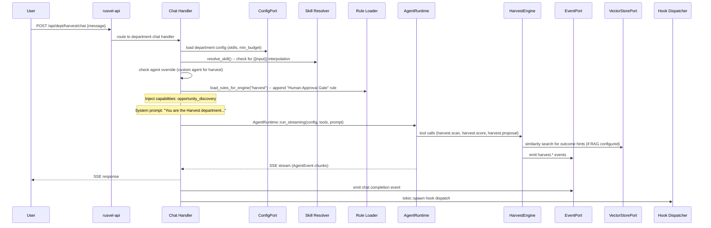

# Harvest Department

> Opportunity discovery, scoring, proposal generation, pipeline management

## Overview

The Harvest Department is RUSVEL's freelance opportunity engine. It scans sources (Upwork, LinkedIn, GitHub, RSS feeds), scores discovered opportunities using keyword matching or LLM-based evaluation, generates tailored proposals via an AI agent, and manages a Kanban pipeline (Cold -> Warm -> Hot -> Won/Lost). It also records deal outcomes (won/lost/withdrawn) that feed back into the scoring model, and supports optional RAG via embedding and vector store for similarity-based scoring hints. Browser-captured data from CDP sessions (Upwork job listings, client profiles) is normalized into opportunities and CRM contacts.

## Engine (`harvest-engine`)

- Crate: `crates/harvest-engine/src/lib.rs`
- Lines: 1013 (lib.rs) + submodules (source, scorer, proposal, pipeline, events, outcomes, cdp_source)
- Status: **Wired** (real business logic)

### Public API

| Method | Signature | Description |
|--------|-----------|-------------|
| `new` | `fn new(storage: Arc<dyn StoragePort>) -> Self` | Construct with storage (minimal; other ports added via builder) |
| `with_browser` | `fn with_browser(self, b: Arc<dyn BrowserPort>) -> Self` | Attach browser port for CDP capture |
| `with_events` | `fn with_events(self, events: Arc<dyn EventPort>) -> Self` | Attach event port |
| `with_agent` | `fn with_agent(self, agent: Arc<dyn AgentPort>) -> Self` | Attach agent port for LLM scoring/proposals |
| `with_config` | `fn with_config(self, config: HarvestConfig) -> Self` | Set skills and min_budget filter |
| `configure_rag` | `fn configure_rag(&self, embedding, vector_store)` | Wire embedding + vector store for outcome-based scoring hints |
| `harvest_skills` | `fn harvest_skills(&self) -> &[String]` | Skills used for scoring and RSS query expansion |
| `scan` | `async fn scan(&self, session_id, source: &dyn HarvestSource) -> Result<Vec<Opportunity>>` | Scan a source, score results, persist, return opportunities |
| `score_opportunity` | `async fn score_opportunity(&self, session_id, opportunity_id) -> Result<OpportunityScoreUpdate>` | Re-score an existing opportunity (keyword or LLM path) |
| `generate_proposal` | `async fn generate_proposal(&self, session_id, opportunity_id, profile) -> Result<Proposal>` | Generate and persist a proposal for a stored opportunity |
| `get_proposals` | `async fn get_proposals(&self, session_id) -> Result<Vec<Proposal>>` | List persisted proposals for a session |
| `pipeline` | `async fn pipeline(&self, session_id) -> Result<PipelineStats>` | Get pipeline statistics (total, by_stage counts) |
| `list_opportunities` | `async fn list_opportunities(&self, session_id, stage: Option<&OpportunityStage>) -> Result<Vec<Opportunity>>` | List opportunities, optionally filtered by stage |
| `advance_opportunity` | `async fn advance_opportunity(&self, opportunity_id, new_stage) -> Result<()>` | Move an opportunity to a new pipeline stage |
| `record_opportunity_outcome` | `async fn record_opportunity_outcome(&self, session_id, opportunity_id, result, notes) -> Result<HarvestOutcomeRecord>` | Record won/lost/withdrawn, feed into scorer hints, index in vector store |
| `list_harvest_outcomes` | `async fn list_harvest_outcomes(&self, session_id, limit) -> Result<Vec<HarvestOutcomeRecord>>` | List recorded outcomes (newest first) |
| `on_data_captured` | `async fn on_data_captured(&self, session_id, event: BrowserEvent) -> Result<()>` | Normalize CDP-captured browser data into opportunities/contacts |

### Internal Structure

- **`HarvestSource` trait** (`source.rs`) -- Interface for scanning opportunity sources. Returns `Vec<RawOpportunity>`. Includes `MockSource` for testing.
- **`CdpSource`** (`cdp_source.rs`) -- CDP/browser-based source for Upwork. Includes default JavaScript extraction script.
- **`OpportunityScorer`** (`scorer.rs`) -- Scores raw opportunities. Two methods: `ScoringMethod::Keyword` (fast, pattern-based) and `ScoringMethod::Llm` (uses AgentPort for AI evaluation). Accepts outcome hints for calibration.
- **`ProposalGenerator`** (`proposal.rs`) -- Generates proposals using AgentPort. Produces `Proposal` with body, estimated value, tone, and metadata.
- **`Pipeline`** (`pipeline.rs`) -- Kanban pipeline management via ObjectStore. `add()`, `list()`, `advance()`, `stats()`.
- **`outcomes`** (`outcomes.rs`) -- Deal outcome recording and retrieval. `record_outcome()`, `list_outcomes()`, `recent_outcome_prompt_lines()` for LLM hints.
- **`events`** (`events.rs`) -- Event kind constants.

### Data Types

```rust
pub struct HarvestConfig {
    pub skills: Vec<String>,      // Skills to match (default: ["rust"])
    pub min_budget: Option<f64>,  // Minimum budget filter
}

pub struct OpportunityScoreUpdate {
    pub score: f64,
    pub reasoning: String,
}

pub enum HarvestDealOutcome { Won, Lost, Withdrawn }

pub struct HarvestOutcomeRecord {
    pub id: String,
    pub session_id: SessionId,
    pub opportunity_snapshot: Value,
    pub result: HarvestDealOutcome,
    pub notes: String,
}
```

### RAG Integration

When `configure_rag()` is called with both an `EmbeddingPort` and `VectorStorePort`:

1. **Scoring hints**: Before scoring, the engine embeds the opportunity title+description, searches the vector store for similar past outcomes, and includes the top 5 matches as prompt hints.
2. **Outcome indexing**: When `record_opportunity_outcome()` is called, the outcome is embedded and upserted into the vector store with `kind: "harvest_outcome"` metadata.

## Department Wrapper (`dept-harvest`)

- Crate: `crates/dept-harvest/src/lib.rs`
- Lines: 99
- Manifest: `crates/dept-harvest/src/manifest.rs`

The wrapper creates a `HarvestEngine` with builder pattern (`with_events`, `with_agent`), calls `configure_rag()` to wire optional embedding and vector store from the registration context, and persists the engine reference.

## Manifest Declaration

### System Prompt

> You are the Harvest department of RUSVEL.
>
> Focus: finding opportunities, scoring gigs, drafting proposals.
> Sources: Upwork, LinkedIn, GitHub.

### Capabilities

- `opportunity_discovery`

### Quick Actions

| Label | Prompt |
|-------|--------|
| Scan opportunities | Scan for new freelance opportunities on Upwork, LinkedIn, and GitHub. |
| Score pipeline | Score all opportunities in the pipeline by fit, budget, and probability. |
| Draft proposal | Draft a proposal for an opportunity. Ask me for the gig details. |

### Registered Tools

| Tool Name | Parameters | Description |
|-----------|------------|-------------|
| `harvest.scan` | `session_id: string` (required), `source: string` (optional) | Scan sources for freelance opportunities |
| `harvest.score` | `session_id: string` (required), `opportunity_id: string` (required) | Re-score an opportunity |
| `harvest.proposal` | `session_id: string` (required), `opportunity_id: string` (required), `profile: string` (optional) | Generate a proposal for an opportunity |

### Personas

| Name | Role | Default Model | Allowed Tools | Purpose |
|------|------|---------------|---------------|---------|
| opportunity-hunter | Freelance opportunity scout and proposal writer | sonnet | harvest.scan, harvest.score, harvest.proposal, web_search | Discovery and proposal generation |

### Skills

| Name | Description | Template |
|------|-------------|----------|
| Proposal Draft | Draft a winning proposal for a freelance opportunity | Draft a proposal for this opportunity: Title: {{title}}. Description: {{description}}. Highlight relevant skills and past experience. |

### Rules

| Name | Content | Enabled |
|------|---------|---------|
| Human Approval Gate | All proposals must be reviewed before submission. Never auto-submit. | Yes |

### Jobs

| Job Kind | Description | Requires Approval |
|----------|-------------|-------------------|
| `harvest.scan` | Scan opportunity sources | No |

## Events

### Produced

| Event Kind | When Emitted |
|------------|--------------|
| `harvest.scan.started` | `scan()` begins scanning a source. Payload: `{source: name}`. |
| `harvest.scan.completed` | `scan()` finishes. Payload: `{count: N}`. |
| `harvest.opportunity.discovered` | Each opportunity found during scan. Payload: `{id, title}`. |
| `harvest.opportunity.scored` | `score_opportunity()` completes re-scoring. Payload: `{id, score, reasoning}`. |
| `harvest.proposal.generated` | `generate_proposal()` produces a proposal. Payload: `{opportunity_id}`. |
| `harvest.proposal.persisted` | Proposal is saved to ObjectStore. Payload: `{key, opportunity_id}`. |
| `harvest.pipeline.advanced` | `advance_opportunity()` moves an opportunity to a new stage. |
| `harvest.outcome.recorded` | `record_opportunity_outcome()` records a deal result. Payload: `{outcome_id, opportunity_id, result}`. |
| `harvest.contact.captured` | `on_data_captured()` ingests a client profile from browser. Payload: `{contact_id, name}`. |

### Consumed

The Harvest department does not consume events from other departments. It is triggered by direct API/CLI calls and browser capture events.

## API Routes

| Method | Path | Description |
|--------|------|-------------|
| POST | `/api/dept/harvest/scan` | Scan sources for new opportunities |
| POST | `/api/dept/harvest/score` | Re-score an existing opportunity |
| POST | `/api/dept/harvest/proposal` | Generate a proposal for an opportunity |
| GET | `/api/dept/harvest/pipeline` | Get pipeline statistics (total, by_stage) |
| GET | `/api/dept/harvest/list` | List opportunities (optional stage filter) |

## CLI Commands

```
rusvel harvest pipeline    # Show pipeline statistics
rusvel harvest status      # Department status
rusvel harvest list        # List items
rusvel harvest events      # Show recent events
```

## Entity Auto-Discovery

Agents, skills, rules, hooks, and MCP servers scoped to the Harvest department are stored with `metadata.engine = "harvest"`. The shared CRUD API routes filter by this key so each department sees only its own entities.

## Chat Flow



## Extending This Department

### 1. Add a new tool

Register the tool in `crates/dept-harvest/src/lib.rs` inside the `register()` method using `ctx.tools.add("harvest", "harvest.new_tool", ...)`. Add a matching `ToolContribution` entry in `crates/dept-harvest/src/manifest.rs`.

### 2. Add a new event kind

Add a new `pub const` in `crates/harvest-engine/src/events.rs`. Emit it from the engine method. Add the event kind string to `events_produced` in `crates/dept-harvest/src/manifest.rs`.

### 3. Add a new persona

Add a `PersonaContribution` entry in the `personas` vec in `crates/dept-harvest/src/manifest.rs`.

### 4. Add a new skill

Add a `SkillContribution` entry in the `skills` vec in `crates/dept-harvest/src/manifest.rs`.

### 5. Add a new API route

Add a `RouteContribution` entry in the `routes` vec in `crates/dept-harvest/src/manifest.rs`. Implement the handler in `crates/rusvel-api/src/engine_routes.rs` and wire the route in `crates/rusvel-api/src/lib.rs`.

### 6. Add a new harvest source

Implement the `HarvestSource` trait in a new file under `crates/harvest-engine/src/`. Return `Vec<RawOpportunity>` from `scan()`. The engine's `scan()` method will automatically score and persist results.

## Port Dependencies

| Port | Required | Purpose |
|------|----------|---------|
| StoragePort | Yes | Persist opportunities, proposals, outcomes, contacts via ObjectStore |
| EventPort | Yes | Emit harvest.* domain events |
| AgentPort | Yes | LLM-based scoring and proposal generation |
| ConfigPort | No (optional) | Skills list, min_budget, source configuration |
| BrowserPort | No (optional) | CDP-captured browser data ingestion (Upwork) |
| EmbeddingPort | No (optional) | Text embedding for RAG-based outcome hints |
| VectorStorePort | No (optional) | Vector search for similar past outcomes |

## Configuration

```json
{
  "skills": ["rust", "axum", "tokio"],
  "min_budget": 1000.0
}
```

- `skills` -- Skills to match when scoring opportunities and expanding RSS queries. Default: `["rust"]`.
- `min_budget` -- Minimum budget filter. Opportunities below this are scored lower.

## Object Store Kinds

| Kind | Schema | Used By |
|------|--------|---------|
| `opportunity` | `Opportunity { id, session_id, source, title, url, description, score, stage, value_estimate, metadata }` | `scan()`, `score_opportunity()`, `list_opportunities()`, `advance_opportunity()` |
| `proposal` | `StoredProposalRecord { session_id, opportunity_id, proposal }` | `generate_proposal()`, `get_proposals()` |
| `harvest_outcome` | `HarvestOutcomeRecord { id, session_id, opportunity_snapshot, result, notes }` | `record_opportunity_outcome()`, `list_harvest_outcomes()` |
| `contact` | `Contact { id, session_id, name, emails, links, company, ... }` | `on_data_captured()` (Upwork client profiles) |

## Scoring System

The `OpportunityScorer` supports two scoring methods:

### Keyword Scoring (`ScoringMethod::Keyword`)

Fast, pattern-based scoring used when no `AgentPort` is configured:

- Matches opportunity title and description against configured skills
- Applies budget multiplier based on `min_budget` threshold
- Returns a normalized score (0.0 to 1.0)

### LLM Scoring (`ScoringMethod::Llm`)

AI-powered scoring used when `AgentPort` is available:

- Sends opportunity details plus configured skills to the agent
- Includes outcome hints (recent outcomes + vector similarity matches) for calibration
- Agent returns a score and reasoning

### Outcome-Based Calibration

When RAG is configured, scoring includes:

1. **Recent outcomes**: The last 12 `HarvestOutcomeRecord` entries for the session, formatted as prompt lines
2. **Vector similarity**: The opportunity title+description is embedded and searched against indexed outcomes; top 5 matches with similarity scores are included

This creates a feedback loop: won/lost outcomes improve future scoring accuracy.

## Pipeline Stages

Opportunities flow through a Kanban pipeline:

```
Cold -> Warm -> Hot -> Won
                   -> Lost
                   -> Withdrawn
```

- `Cold`: Newly discovered, not yet evaluated
- `Warm`: Scored positively, under consideration
- `Hot`: Actively pursuing, proposal sent
- `Won`: Deal closed successfully
- `Lost`: Opportunity not won
- `Withdrawn`: Withdrawn from consideration

`advance_opportunity()` moves an opportunity to any valid stage and emits `harvest.pipeline.advanced`.

## Browser Data Capture (CDP)

The `on_data_captured()` method handles `BrowserEvent::DataCaptured` payloads from CDP sessions:

### Upwork Job Listings (`kind: "job_listing"`)

- Accepts single job or `{jobs: [...]}` array
- Extracts: title, description, url, budget, skills, posted_at
- Runs through the scorer
- Creates `Opportunity` in Cold stage
- Emits `harvest.opportunity.discovered`

### Upwork Client Profiles (`kind: "client_profile"`)

- Extracts: name, profile_url, company
- Creates `Contact` in ObjectStore
- Emits `harvest.contact.captured`

### CDP Extract JavaScript

`DEFAULT_CDP_EXTRACT_JS` provides a default JavaScript snippet for extracting job listing cards from Upwork pages via Chrome DevTools Protocol.

## UI Integration

The manifest declares a dashboard card and 6 tabs:

- **Dashboard card**: "Opportunity Pipeline" (medium) -- Cold, warm, and hot opportunities
- **Tabs**: actions, engine, agents, skills, rules, events
- **has_settings**: true (supports skills and budget configuration)

## Testing

```bash
cargo test -p harvest-engine    # 12 tests
```

Key test scenarios:
- Scan with mock source returns 3 opportunities
- Pipeline stores and lists correctly
- Pipeline stats match (all Cold after scan)
- Health returns healthy
- Proposals respect session filter
- Outcome recording and retrieval

```bash
cargo test -p dept-harvest      # Department wrapper tests
```

Key test scenarios:
- Department creates with correct manifest ID
- Manifest declares 5 routes, 3 tools, 3 events
- Manifest requires StoragePort, EventPort, AgentPort (non-optional) + ConfigPort (optional)
- Manifest serializes to valid JSON
