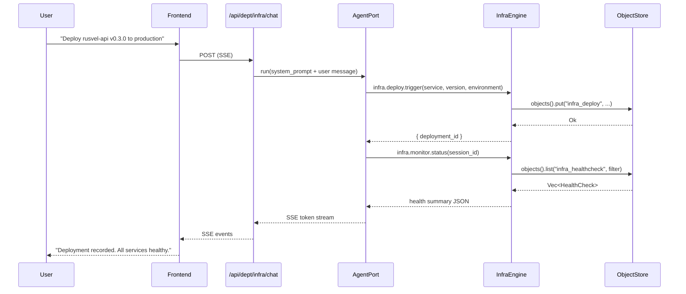

# Infra Department

> CI/CD pipelines, deployments, monitoring, incident response, performance, cost analysis.

| Field | Value |
|---|---|
| ID | `infra` |
| Icon | `>` |
| Color | `red` |
| Engine crate | `infra-engine` (~390 lines) |
| Wrapper crate | `dept-infra` |
| Status | **Skeleton** |

## Overview

The Infra department manages infrastructure operations: deployment tracking, health monitoring, and incident management. It wraps `infra-engine` via the ADR-014 `DepartmentApp` pattern and provides tools for recording deployments, running health checks, and managing incidents with severity levels.

## System Prompt

```
You are the Infrastructure department of RUSVEL.

Focus: CI/CD pipelines, deployments, monitoring, incident response, performance, cost analysis.
```

## Capabilities

| Capability | Description |
|---|---|
| `deploy` | Record and track deployments across services and environments |
| `monitor` | Manage health checks with status tracking (Up, Down, Degraded) |
| `incident` | Open, track, and resolve incidents with severity levels (P1-P4) |

## Quick Actions

| Label | Prompt |
|---|---|
| Deploy status | "Show current deployment status across all services and environments." |
| Health check | "Run health checks on all monitored services." |
| Incident report | "Show open incidents with severity, timeline, and resolution status." |

## Architecture

### Engine: `infra-engine`

Three manager structs compose the engine, each backed by `ObjectStore` via `StoragePort`:

| Manager | Domain Type | Object Kind | Methods |
|---|---|---|---|
| `DeployManager` | `Deployment` | `infra_deploy` | `record_deployment`, `list_deployments` |
| `MonitorManager` | `HealthCheck` | `infra_healthcheck` | `add_check`, `list_checks` |
| `IncidentManager` | `Incident` | `infra_incident` | `open_incident`, `list_incidents` |

### Domain Types

**Deployment** -- `DeploymentId` (UUIDv7), `DeployStatus` enum (`Pending`, `InProgress`, `Deployed`, `Failed`, `RolledBack`), fields: `service`, `version`, `environment`, `deployed_at`, `created_at`, `metadata`.

**HealthCheck** -- `HealthCheckId` (UUIDv7), `CheckStatus` enum (`Up`, `Down`, `Degraded`), fields: `service`, `endpoint`, `status`, `last_checked`, `response_ms`, `metadata`.

**Incident** -- `IncidentId` (UUIDv7), `IncidentStatus` enum (`Open`, `Investigating`, `Mitigated`, `Resolved`), `Severity` enum (`P1`, `P2`, `P3`, `P4`), fields: `title`, `description`, `severity`, `status`, `opened_at`, `resolved_at`, `metadata`.

### Wrapper: `dept-infra`

- `InfraDepartment` struct with `OnceLock<Arc<InfraEngine>>` for lazy initialization
- `register()` creates the engine, stores it, and registers agent tools
- `shutdown()` delegates to engine
- 2 unit tests (department creation, manifest purity)

## Registered Tools

| Tool Name | Description | Parameters |
|---|---|---|
| `infra.deploy.trigger` | Record a deployment (starts as Pending) | `session_id`, `service`, `version`, `environment` |
| `infra.monitor.status` | List health checks with status summary | `session_id` |
| `infra.incidents.create` | Open an incident | `session_id`, `title`, `description`, `severity` |
| `infra.incidents.list` | List incidents for a session | `session_id` |

## Events

| Event Kind | Constant | Description |
|---|---|---|
| `infra.deploy.completed` | `DEPLOY_COMPLETED` | A deployment was completed |
| `infra.alert.fired` | `ALERT_FIRED` | A monitoring alert was triggered |
| `infra.incident.opened` | `INCIDENT_OPENED` | A new incident was opened |
| `infra.incident.resolved` | `INCIDENT_RESOLVED` | An incident was resolved |

Note: event constants are defined in `infra_engine::events` but emission is not yet wired into manager methods (skeleton status).

## Required Ports

| Port | Optional |
|---|---|
| `StoragePort` | No |
| `EventPort` | No |
| `AgentPort` | No |
| `JobPort` | No |

## UI Contribution

Tabs: `actions`, `agents`, `rules`, `events`

No dashboard cards, settings panel, or custom components.

## Chat Flow



## CLI Usage

```bash
rusvel infra status           # Show department status
rusvel infra list              # List all infra items
rusvel infra list --kind deploy  # List deployments only
rusvel infra events            # Show recent infra events
```

## Testing

```bash
cargo test -p infra-engine     # Engine tests (deployment CRUD, health check)
cargo test -p dept-infra       # Wrapper tests (manifest, department creation)
```

## Current Status: Skeleton

The Infra department is fully registered and bootable within the RUSVEL department registry, but its business logic is minimal. Here is what exists and what remains to be built:

**What exists:**
- Manager structures with basic CRUD operations (create + list for each domain)
- Domain types with full serialization (Deployment, HealthCheck, Incident)
- Health check status summary tool (counts down/degraded services)
- 4 agent tools registered in the scoped tool registry
- Event kind constants defined (but not yet emitted from manager methods)
- Engine implements the `Engine` trait with health check
- Unit tests for engine and wrapper

**What needs to be built for production readiness:**
- Wire `emit_event()` calls into manager methods so domain events actually fire
- Add `mark_deployed`, `rollback` operations to DeployManager
- Add `run_health_check` (actual HTTP probe) to MonitorManager
- Add `resolve_incident`, status transition logic to IncidentManager
- Implement deployment pipeline orchestration via AgentPort + JobPort
- Add job kinds for async infra workflows (e.g., `JobKind::Custom("infra.deploy")`, `JobKind::Custom("infra.health_scan")`)
- Build real monitoring: periodic health check scheduling via job queue
- Integrate with `rusvel-deploy` crate for actual deployment execution
- Add incident timeline tracking (status change history)
- Add engine-specific API routes (e.g., `/api/dept/infra/deploys`, `/api/dept/infra/incidents`)
- Add engine-specific CLI commands (e.g., `rusvel infra deploy`, `rusvel infra health`)
- Add personas for infra agent specialization (SRE agent, incident commander)
- Add skills and rules for incident response runbooks
- Build cost analysis and performance metrics aggregation

## Source Files

| File | Lines | Purpose |
|---|---|---|
| `crates/infra-engine/src/lib.rs` | 390 | Engine struct, capabilities, tests |
| `crates/infra-engine/src/deploy.rs` | -- | Deployment domain type + DeployManager |
| `crates/infra-engine/src/monitor.rs` | -- | HealthCheck domain type + MonitorManager |
| `crates/infra-engine/src/incident.rs` | -- | Incident domain type + IncidentManager |
| `crates/dept-infra/src/lib.rs` | 89 | DepartmentApp implementation |
| `crates/dept-infra/src/manifest.rs` | 96 | Static manifest definition |
| `crates/dept-infra/src/tools.rs` | 178 | Agent tool registration |
