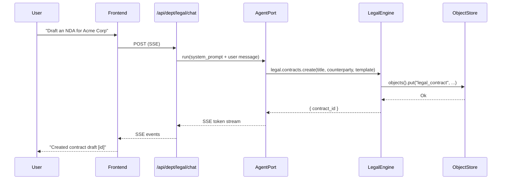

# Legal Department

> Contracts, IP protection, terms of service, GDPR compliance, licensing, privacy policies.

| Field | Value |
|---|---|
| ID | `legal` |
| Icon | `§` |
| Color | `slate` |
| Engine crate | `legal-engine` (~390 lines) |
| Wrapper crate | `dept-legal` |
| Status | **Skeleton** |

## Overview

The Legal department manages the full contract lifecycle, compliance audits, and intellectual property tracking. It wraps `legal-engine` via the ADR-014 `DepartmentApp` pattern and is registered in the composition root alongside the other skeleton departments.

## System Prompt

```
You are the Legal department of RUSVEL.

Focus: contracts, IP protection, terms of service, GDPR compliance, licensing, privacy policies.
```

## Capabilities

| Capability | Description |
|---|---|
| `contract` | Create, list, review, and sign contracts |
| `compliance` | Record and track compliance checks (GDPR, Privacy, Licensing, Tax) |
| `ip` | File and manage intellectual property assets (Patent, Trademark, Copyright, TradeSecret) |

## Quick Actions

| Label | Prompt |
|---|---|
| Draft contract | "Draft a contract. Ask me for type, parties, and terms." |
| Compliance check | "Run a compliance check for GDPR and privacy policy." |
| IP review | "Review intellectual property assets." |

## Architecture

### Engine: `legal-engine`

Three manager structs compose the engine, each backed by `ObjectStore` via `StoragePort`:

| Manager | Domain Type | Object Kind | Methods |
|---|---|---|---|
| `ContractManager` | `Contract` | `legal_contract` | `create_contract`, `list_contracts` |
| `ComplianceManager` | `ComplianceCheck` | `legal_compliance` | `add_check`, `list_checks` |
| `IpManager` | `IpAsset` | `legal_ip` | `file_asset`, `list_assets` |

### Domain Types

**Contract** -- `ContractId` (UUIDv7), `ContractStatus` enum (`Draft`, `Sent`, `Signed`, `Expired`, `Cancelled`), fields: `title`, `counterparty`, `template`, `signed_at`, `expires_at`, `created_at`, `metadata`.

**ComplianceCheck** -- `ComplianceCheckId` (UUIDv7), `ComplianceArea` enum (`GDPR`, `Privacy`, `Licensing`, `Tax`), fields: `description`, `passed`, `checked_at`, `notes`, `metadata`.

**IpAsset** -- `IpAssetId` (UUIDv7), `IpKind` enum (`Patent`, `Trademark`, `Copyright`, `TradeSecret`), fields: `name`, `description`, `filed_at`, `status`, `metadata`.

### Wrapper: `dept-legal`

- `LegalDepartment` struct with `OnceLock<Arc<LegalEngine>>` for lazy initialization
- `register()` creates the engine, stores it, and registers agent tools
- `shutdown()` delegates to engine
- 2 unit tests (department creation, manifest purity)

## Registered Tools

| Tool Name | Description | Parameters |
|---|---|---|
| `legal.contracts.create` | Create a new contract draft | `session_id`, `title`, `counterparty`, `template` |
| `legal.contracts.list` | List contracts for a session | `session_id` |
| `legal.compliance.check` | Record a compliance check outcome | `session_id`, `area`, `description`, `passed`, `notes` |
| `legal.ip.register` | File an intellectual property asset | `session_id`, `kind`, `name`, `description` |

## Events

| Event Kind | Constant | Description |
|---|---|---|
| `legal.contract.created` | `CONTRACT_CREATED` | A new contract draft was created |
| `legal.compliance.checked` | `COMPLIANCE_CHECKED` | A compliance check was recorded |
| `legal.ip.filed` | `IP_FILED` | An IP asset was filed |
| `legal.review.completed` | `REVIEW_COMPLETED` | A legal review was completed |

Note: event constants are defined in `legal_engine::events` but emission is not yet wired into manager methods (skeleton status).

## Required Ports

| Port | Optional |
|---|---|
| `StoragePort` | No |
| `EventPort` | No |
| `AgentPort` | No |
| `JobPort` | No |

## UI Contribution

Tabs: `actions`, `agents`, `rules`, `events`

No dashboard cards, settings panel, or custom components.

## Chat Flow



## CLI Usage

```bash
rusvel legal status          # Show department status
rusvel legal list             # List all legal items
rusvel legal list --kind contract  # List contracts only
rusvel legal events           # Show recent legal events
```

## Testing

```bash
cargo test -p legal-engine    # Engine tests (contract CRUD, health check)
cargo test -p dept-legal      # Wrapper tests (manifest, department creation)
```

## Current Status: Skeleton

The Legal department is fully registered and bootable within the RUSVEL department registry, but its business logic is minimal. Here is what exists and what remains to be built:

**What exists:**
- Manager structures with basic CRUD operations (create + list for each domain)
- Domain types with full serialization (Contract, ComplianceCheck, IpAsset)
- 4 agent tools registered in the scoped tool registry
- Event kind constants defined (but not yet emitted from manager methods)
- Engine implements the `Engine` trait with health check
- Unit tests for engine and wrapper

**What needs to be built for production readiness:**
- Wire `emit_event()` calls into manager methods so domain events actually fire
- Add `review_contract`, `sign_contract` operations to ContractManager
- Add `mark_passed` operation to ComplianceManager
- Add `file_ip` (full filing workflow with status transitions) to IpManager
- Implement AI-assisted contract drafting via AgentPort (template expansion)
- Add job kinds for async legal review workflows (e.g., `JobKind::Custom("legal.review")`)
- Build compliance report generation (aggregate check results into a report)
- Add engine-specific API routes (e.g., `/api/dept/legal/contracts`, `/api/dept/legal/compliance`)
- Add engine-specific CLI commands (e.g., `rusvel legal draft`, `rusvel legal audit`)
- Add personas for legal agent specialization
- Add skills and rules for legal workflows

## Source Files

| File | Lines | Purpose |
|---|---|---|
| `crates/legal-engine/src/lib.rs` | 390 | Engine struct, capabilities, tests |
| `crates/legal-engine/src/contract.rs` | 112 | Contract domain type + ContractManager |
| `crates/legal-engine/src/compliance.rs` | 108 | ComplianceCheck domain type + ComplianceManager |
| `crates/legal-engine/src/ip.rs` | 107 | IpAsset domain type + IpManager |
| `crates/dept-legal/src/lib.rs` | 89 | DepartmentApp implementation |
| `crates/dept-legal/src/manifest.rs` | 96 | Static manifest definition |
| `crates/dept-legal/src/tools.rs` | 184 | Agent tool registration |
