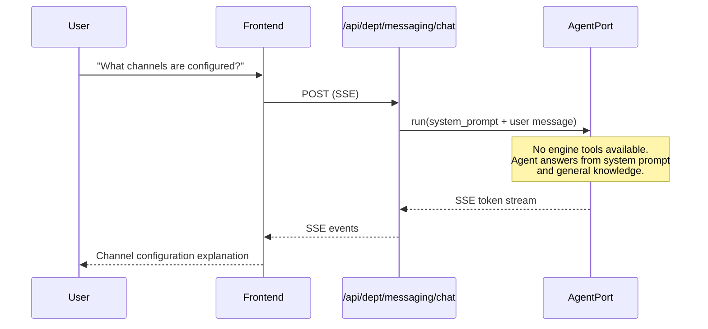
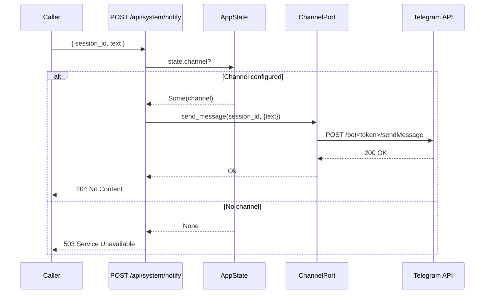

# Messaging Department

> Outbound notifications and channel adapters (e.g. Telegram) when configured.

| Field | Value |
|---|---|
| ID | `messaging` |
| Icon | `@` |
| Color | `violet` |
| Engine crate | **None** (wrapper-only) |
| Wrapper crate | `dept-messaging` (~52 lines) |
| Status | **Wrapper-only** |

## Overview

The Messaging department is a lightweight department shell with no dedicated engine crate. It exists to represent outbound notification capabilities in the department registry and provide a namespace for future multi-channel routing. Channel composition (Telegram, future Slack/Discord/email) is handled at the `rusvel-app` composition root, not inside an engine.

## System Prompt

```
You are the Messaging department of RUSVEL.

Focus: outbound notifications, channel configuration, delivery status, and integration with external chat platforms when available.
```

## Capabilities

| Capability | Description |
|---|---|
| `notify` | Send outbound notifications via configured channels |
| `channel` | Configure and manage messaging channel adapters |

## Quick Actions

| Label | Prompt |
|---|---|
| Notify status | "Summarize configured outbound channels and recent notification delivery health." |
| Channel setup | "Explain how to configure outbound messaging (e.g. Telegram) via environment and config." |

## Why There Is No Engine

Unlike other departments that wrap a dedicated `*-engine` crate, Messaging has no `messaging-engine`. This is an intentional architectural choice:

1. **Channel composition belongs at the app level.** The `ChannelPort` trait is defined in `rusvel-core` and implemented by adapter crates (e.g., `rusvel-channel`). The composition root (`rusvel-app/src/main.rs`) wires the channel adapter into `AppState` based on environment variables. This follows the hexagonal pattern: the port lives in core, the adapter lives in its own crate, and wiring happens at the composition root.

2. **No domain logic yet.** Sending a notification is a single `send_message()` call on `ChannelPort`. There is no complex domain state (no entities to CRUD, no workflows to orchestrate) that would justify an engine crate.

3. **Registered last.** `dept-messaging` is the last entry in `installed_departments()` in `rusvel-app/src/boot.rs`, ensuring all domain departments are registered before the channel shell.

## ChannelPort and rusvel-channel

### The Port (rusvel-core)

```rust
// crates/rusvel-core/src/ports.rs
#[async_trait]
pub trait ChannelPort: Send + Sync {
    fn channel_kind(&self) -> &'static str;
    async fn send_message(&self, session_id: &SessionId, payload: serde_json::Value) -> Result<()>;
}
```

`ChannelPort` is one of the 21 port traits in `rusvel-core`. It defines a minimal interface: identify the channel kind (e.g., `"telegram"`) and send a message with a JSON payload scoped to a session.

### The Adapter: TelegramChannel (rusvel-channel)

`rusvel-channel` provides `TelegramChannel`, the first `ChannelPort` implementation. It sends messages via the Telegram Bot API (`sendMessage` endpoint).

**Configuration (environment variables):**

| Variable | Required | Description |
|---|---|---|
| `RUSVEL_TELEGRAM_BOT_TOKEN` | Yes | Telegram Bot API token (from @BotFather) |
| `RUSVEL_TELEGRAM_CHAT_ID` | No | Default destination chat ID; can be overridden per-message in payload |

**Initialization:** `TelegramChannel::from_env()` returns `Option<Arc<TelegramChannel>>`. It returns `None` when `RUSVEL_TELEGRAM_BOT_TOKEN` is unset or empty, so the app gracefully degrades when Telegram is not configured.

**Payload format:**

```json
{
  "text": "Message body (required; 'message' is also accepted as alias)",
  "chat_id": "Optional override for default chat ID"
}
```

**Message format sent to Telegram:** `[session <session_id>] <text>`

### Wiring in the Composition Root

In `rusvel-app/src/main.rs`, the channel is wired into `AppState`:

```rust
let channel: Option<Arc<dyn ChannelPort>> = TelegramChannel::from_env()
    .map(|t| t as Arc<dyn ChannelPort>);
```

The `AppState.channel` field is `Option<Arc<dyn ChannelPort>>`, making it available to API handlers.

## The Notify API Endpoint

```
POST /api/system/notify
```

**Request body:**
```json
{
  "session_id": "uuid",
  "text": "Notification message"
}
```

**Behavior:**
- If `state.channel` is `Some`, wraps `text` into `{"text": text}` and calls `channel.send_message()`
- If `state.channel` is `None`, returns `503 Service Unavailable` with `"notify channel not configured"`
- On Telegram API failure, returns `502 Bad Gateway` with the error message
- On success, returns `204 No Content`

**Example:**
```bash
curl -X POST http://localhost:3000/api/system/notify \
  -H "Content-Type: application/json" \
  -d '{"session_id": "...", "text": "Build completed successfully"}'
```

## Required Ports

| Port | Optional |
|---|---|
| `StoragePort` | No |
| `EventPort` | No |
| `AgentPort` | No |
| `JobPort` | No |

These ports are inherited defaults from the `DepartmentManifest` structure. The messaging department does not currently use any of them directly -- it has no `register()` logic beyond logging.

## UI Contribution

Tabs: `actions`, `agents`, `rules`, `events`

No dashboard cards, settings panel, or custom components.

## Chat Flow



Note: since no engine tools are registered, the messaging agent operates purely through its system prompt and general knowledge. It cannot currently inspect actual channel configuration at runtime.

## Notify Flow (System Endpoint)



## Boot Order

```
installed_departments() order:
  1. forge       (core)
  2. code        (core)
  3. content     (cross-dept events)
  4. harvest     (cross-dept events)
  5. flow        (cross-dept events)
  6. gtm         (progressive enhancement)
  7. finance     (progressive enhancement)
  8. product     (progressive enhancement)
  9. growth      (progressive enhancement)
 10. distro      (progressive enhancement)
 11. legal       (skeleton)
 12. support     (skeleton)
 13. infra       (skeleton)
 14. messaging   <-- registered last
```

## CLI Usage

```bash
rusvel messaging status       # Show department status (via generic dept handler)
rusvel messaging list          # List items (empty -- no domain objects)
rusvel messaging events        # Show recent messaging events (none emitted currently)
```

## Testing

```bash
cargo test -p dept-messaging   # Wrapper test (manifest ID check, port requirements)
```

No engine tests since there is no engine crate.

## Future: Multi-Channel Routing

This is where multi-channel routing would live as the department matures:

- **Slack adapter** -- Implement `ChannelPort` for Slack Webhook/API, register in `rusvel-channel`
- **Discord adapter** -- Implement `ChannelPort` for Discord Webhook
- **Email adapter** -- Implement `ChannelPort` for SMTP (complement to the `RUSVEL_SMTP_*` config already used by GTM outreach)
- **Channel router** -- A `MultiChannelRouter` that wraps multiple `ChannelPort` implementations and routes based on message type, urgency, or user preference
- **Messaging engine** -- Once routing logic becomes complex enough, extract a `messaging-engine` crate with delivery queuing, retry policies, and delivery status tracking
- **Delivery events** -- Emit `messaging.sent`, `messaging.failed`, `messaging.delivered` events for observability
- **Department tools** -- Register tools like `messaging.send`, `messaging.channels.list`, `messaging.delivery.status`

## Source Files

| File | Lines | Purpose |
|---|---|---|
| `crates/dept-messaging/src/lib.rs` | 52 | DepartmentApp implementation (wrapper-only) |
| `crates/dept-messaging/src/manifest.rs` | 101 | Static manifest definition |
| `crates/rusvel-channel/src/lib.rs` | 7 | ChannelPort re-export + module declaration |
| `crates/rusvel-channel/src/telegram.rs` | 107 | TelegramChannel adapter implementation |
| `crates/rusvel-core/src/ports.rs` | (line 542) | ChannelPort trait definition |
| `crates/rusvel-api/src/system.rs` | (line 66) | POST /api/system/notify handler |
