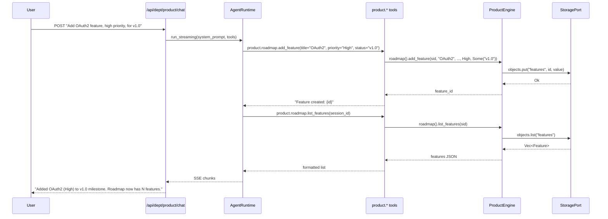

# Product Department

> Product roadmaps, feature prioritization, pricing strategy, user feedback analysis.

| Field | Value |
|---|---|
| **ID** | `product` |
| **Icon** | `@` |
| **Color** | `rose` |
| **Engine crate** | `product-engine` (~388 lines) |
| **Dept crate** | `dept-product` |
| **Status** | Skeleton -- manager structures with CRUD, minimal business logic |

---

## Overview

The Product department manages the product lifecycle: roadmap features with priorities and milestones, pricing tier definitions, and user feedback collection. The engine provides three manager subsystems backed by `ObjectStore`.

---

## Current Status: Skeleton

The product engine has manager structures but minimal business logic (~388 lines total across `lib.rs` and three manager modules). The managers provide CRUD operations:

- **RoadmapManager** -- `add_feature(sid, title, description, priority, milestone)`, `list_features(sid)`, `mark_feature_done(sid, feature_id)`. Tracks features with `Priority` (Critical/High/Medium/Low) and `FeatureStatus` (Planned/InProgress/Done/Cancelled).
- **PricingManager** -- `create_tier(sid, name, price, annual_price, features)`, `list_tiers(sid)`, `update_tier(sid, tier_id, updates)`. Manages pricing tiers with monthly/annual pricing and feature lists.
- **FeedbackManager** -- `add_feedback(sid, source, kind, content)`, `list_feedback(sid)`, `analyze_feedback(sid)`. Collects feedback categorized by `FeedbackKind` (FeatureRequest/Bug/Praise/Complaint).

The department is fully registered and bootable -- it appears in the department registry, responds to chat, and has 4 agent tools wired. However, it needs the following to be production-ready:

- Feature dependency tracking and critical path analysis
- Milestone timeline visualization data
- Pricing A/B test support
- Feedback sentiment analysis via AgentPort
- Feature voting and prioritization scoring
- Integration with issue trackers (GitHub, Linear)

---

## Engine Details

**Crate:** `product-engine` (~388 lines)

**Struct:** `ProductEngine`

**Constructor:**
```rust
ProductEngine::new(
    storage: Arc<dyn StoragePort>,
    events: Arc<dyn EventPort>,
    agent: Arc<dyn AgentPort>,
    jobs: Arc<dyn JobPort>,
)
```

**Managers:**

| Manager | Methods | Description |
|---|---|---|
| `RoadmapManager` | `add_feature()`, `list_features()`, `mark_feature_done()` | Feature tracking with priority and status |
| `PricingManager` | `create_tier()`, `list_tiers()`, `update_tier()` | Pricing tier management |
| `FeedbackManager` | `add_feedback()`, `list_feedback()`, `analyze_feedback()` | User feedback collection |

**Implements:** `rusvel_core::engine::Engine` trait (kind: `"product"`, name: `"Product Engine"`)

---

## Manifest

Declared in `dept-product/src/manifest.rs`:

```
id:            "product"
name:          "Product Department"
description:   "Product roadmaps, feature prioritization, pricing strategy, user feedback analysis, A/B testing"
icon:          "@"
color:         "rose"
capabilities:  ["roadmap", "pricing", "feedback"]
```

### System Prompt

```
You are the Product department of RUSVEL.

Focus: product roadmaps, feature prioritization, pricing strategy, user feedback analysis, A/B testing.
```

---

## Tools

Tools registered at runtime via `dept-product/src/lib.rs` (4 tools):

| Tool | Parameters | Description |
|---|---|---|
| `product.roadmap.add_feature` | `session_id`, `title`, `description`, `priority` (Critical/High/Medium/Low), `status` (optional milestone) | Add a feature to the roadmap |
| `product.roadmap.list_features` | `session_id`, `status` (optional filter: Planned/InProgress/Done/Cancelled) | List roadmap features |
| `product.pricing.create_tier` | `session_id`, `name`, `price`, `features` (array) | Create a pricing tier |
| `product.feedback.record` | `session_id`, `source`, `sentiment` (FeatureRequest/Bug/Praise/Complaint), `content` | Record user feedback |

---

## Personas

None declared in the manifest.

---

## Skills

None declared in the manifest.

---

## Rules

None declared in the manifest.

---

## Jobs

None declared in the manifest. Future candidates:
- Periodic feedback analysis aggregation
- Roadmap progress reports
- Pricing optimization suggestions

---

## Events

### Defined Constants (engine)

| Constant | Value |
|---|---|
| `FEATURE_CREATED` | `product.feature.created` |
| `MILESTONE_REACHED` | `product.milestone.reached` |
| `PRICING_UPDATED` | `product.pricing.updated` |
| `FEEDBACK_RECEIVED` | `product.feedback.received` |

These constants are defined in the engine but are not yet emitted automatically by the manager methods. They are not listed in the manifest's `events_produced`.

### Consumed

None.

---

## API Routes

None declared in the manifest. The department is accessible via the standard parameterized routes:
- `GET /api/dept/product/status` -- department status
- `POST /api/dept/product/chat` -- SSE chat

---

## CLI Commands

Standard department CLI:
```
rusvel product status    # One-shot status
rusvel product list      # List items
rusvel product events    # Show events
```

---

## Entity Auto-Discovery

The standard CRUD subsystems are available at `/api/dept/product/*`:
- Agents, Skills, Rules, Hooks, Workflows, MCP Servers

---

## Chat Flow



---

## Extending the Department

### Adding feature dependency tracking

1. Add a `dependencies: Vec<FeatureId>` field to the `Feature` struct in `product-engine/src/roadmap.rs`
2. Add a `critical_path(sid)` method to `RoadmapManager` that computes the longest dependency chain
3. Register a `product.roadmap.critical_path` tool in `dept-product/src/lib.rs`

### Adding AI-powered feedback analysis

1. Implement `analyze_feedback(sid)` in `FeedbackManager` to call `AgentPort` with all feedback items
2. The agent can categorize, extract themes, and suggest feature priorities
3. Register a `product.feedback.analyze` tool

### Adding event emission

Wire the defined constants by calling `self.emit_event()` in the relevant manager methods. Add the event kinds to the manifest's `events_produced` vector.

---

## Port Dependencies

| Port | Required | Usage |
|---|---|---|
| `StoragePort` | Yes | Features, pricing tiers, feedback items (via `ObjectStore`) |
| `EventPort` | Yes | Domain event emission (constants defined, not yet auto-emitted) |
| `AgentPort` | Yes | LLM-powered product analysis via chat, future feedback analysis |
| `JobPort` | Yes | Future: scheduled reports and analysis |
