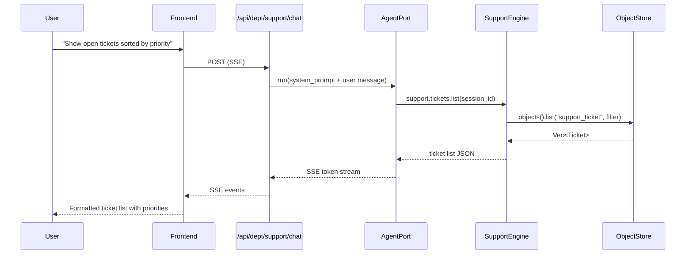

# Support Department

> Customer support tickets, knowledge base, NPS tracking, auto-triage, customer success.

| Field | Value |
|---|---|
| ID | `support` |
| Icon | `?` |
| Color | `yellow` |
| Engine crate | `support-engine` (~391 lines) |
| Wrapper crate | `dept-support` |
| Status | **Skeleton** |

## Overview

The Support department handles customer-facing operations: ticket management with priority-based triage, a knowledge base for self-service articles, and Net Promoter Score (NPS) tracking for customer satisfaction measurement. It wraps `support-engine` via the ADR-014 `DepartmentApp` pattern.

## System Prompt

```
You are the Support department of RUSVEL.

Focus: customer support tickets, knowledge base, NPS tracking, auto-triage, customer success.
```

## Capabilities

| Capability | Description |
|---|---|
| `ticket` | Create, list, resolve, and assign support tickets with priority levels |
| `knowledge` | Manage knowledge base articles (add, list, search) |
| `nps` | Track NPS survey responses and calculate scores |

## Quick Actions

| Label | Prompt |
|---|---|
| Open tickets | "Show all open support tickets prioritized by urgency." |
| Write KB article | "Write a knowledge base article. Ask me for the topic." |
| NPS survey | "Analyze recent NPS survey results with score breakdown and themes." |

## Architecture

### Engine: `support-engine`

Three manager structs compose the engine, each backed by `ObjectStore` via `StoragePort`:

| Manager | Domain Type | Object Kind | Methods |
|---|---|---|---|
| `TicketManager` | `Ticket` | `support_ticket` | `create_ticket`, `list_tickets` |
| `KnowledgeManager` | `Article` | `support_article` | `add_article`, `list_articles` |
| `NpsManager` | `NpsResponse` | `support_nps` | `add_response`, `list_responses`, `calculate_nps` |

### Domain Types

**Ticket** -- `TicketId` (UUIDv7), `TicketStatus` enum (`Open`, `InProgress`, `Resolved`, `Closed`), `TicketPriority` enum (`Low`, `Medium`, `High`, `Urgent`), fields: `subject`, `description`, `requester_email`, `assignee`, `created_at`, `resolved_at`, `metadata`.

**Article** -- `ArticleId` (UUIDv7), fields: `title`, `content`, `tags`, `published`, `created_at`, `metadata`.

**NpsResponse** -- `NpsResponseId` (UUIDv7), fields: `score` (0-10), `feedback`, `respondent`, `created_at`, `metadata`.

### Wrapper: `dept-support`

- `SupportDepartment` struct with `OnceLock<Arc<SupportEngine>>` for lazy initialization
- `register()` creates the engine, stores it, and registers agent tools
- `shutdown()` delegates to engine
- 2 unit tests (department creation, manifest purity)

## Registered Tools

| Tool Name | Description | Parameters |
|---|---|---|
| `support.tickets.create` | Create a support ticket | `session_id`, `subject`, `description`, `priority`, `requester_email` |
| `support.tickets.list` | List support tickets for a session | `session_id` |
| `support.knowledge.search` | Search knowledge base articles by keyword | `session_id`, `query` |
| `support.nps.calculate_score` | Calculate Net Promoter Score | `session_id` |

## Events

| Event Kind | Constant | Description |
|---|---|---|
| `support.ticket.created` | `TICKET_CREATED` | A new support ticket was opened |
| `support.ticket.resolved` | `TICKET_RESOLVED` | A ticket was resolved |
| `support.article.published` | `ARTICLE_PUBLISHED` | A knowledge base article was published |
| `support.nps.recorded` | `NPS_RECORDED` | An NPS response was recorded |

Note: event constants are defined in `support_engine::events` but emission is not yet wired into manager methods (skeleton status).

## Required Ports

| Port | Optional |
|---|---|
| `StoragePort` | No |
| `EventPort` | No |
| `AgentPort` | No |
| `JobPort` | No |

## UI Contribution

Tabs: `actions`, `agents`, `skills`, `rules`, `events`

No dashboard cards, settings panel, or custom components.

## Chat Flow



## CLI Usage

```bash
rusvel support status         # Show department status
rusvel support list            # List all support items
rusvel support list --kind ticket  # List tickets only
rusvel support events          # Show recent support events
```

## Testing

```bash
cargo test -p support-engine   # Engine tests (ticket CRUD, health check)
cargo test -p dept-support     # Wrapper tests (manifest, department creation)
```

## Current Status: Skeleton

The Support department is fully registered and bootable within the RUSVEL department registry, but its business logic is minimal. Here is what exists and what remains to be built:

**What exists:**
- Manager structures with basic CRUD operations (create + list for tickets, articles, NPS)
- Domain types with full serialization (Ticket, Article, NpsResponse)
- NPS score calculation logic (promoters minus detractors percentage)
- 4 agent tools registered in the scoped tool registry
- Knowledge base search with keyword filtering (in-memory, case-insensitive)
- Event kind constants defined (but not yet emitted from manager methods)
- Engine implements the `Engine` trait with health check
- Unit tests for engine and wrapper

**What needs to be built for production readiness:**
- Wire `emit_event()` calls into manager methods so domain events actually fire
- Add `resolve_ticket`, `assign_ticket` operations to TicketManager
- Implement auto-triage: use AgentPort to classify incoming tickets by priority/category
- Add `search_articles` with proper full-text search (currently keyword match only)
- Build customer success metrics aggregation (ticket resolution time, first-response time)
- Add job kinds for async support workflows (e.g., `JobKind::Custom("support.auto_triage")`)
- Implement AI-assisted KB article generation via AgentPort
- Add engine-specific API routes (e.g., `/api/dept/support/tickets`, `/api/dept/support/nps`)
- Add engine-specific CLI commands (e.g., `rusvel support triage`, `rusvel support kb`)
- Add personas for support agent specialization (triage agent, KB writer)
- Add skills and rules for support workflows
- Build NPS trend analysis and reporting

## Source Files

| File | Lines | Purpose |
|---|---|---|
| `crates/support-engine/src/lib.rs` | 391 | Engine struct, capabilities, tests |
| `crates/support-engine/src/ticket.rs` | -- | Ticket domain type + TicketManager |
| `crates/support-engine/src/knowledge.rs` | -- | Article domain type + KnowledgeManager |
| `crates/support-engine/src/nps.rs` | -- | NpsResponse domain type + NpsManager |
| `crates/dept-support/src/lib.rs` | 89 | DepartmentApp implementation |
| `crates/dept-support/src/manifest.rs` | 97 | Static manifest definition |
| `crates/dept-support/src/tools.rs` | 163 | Agent tool registration |
