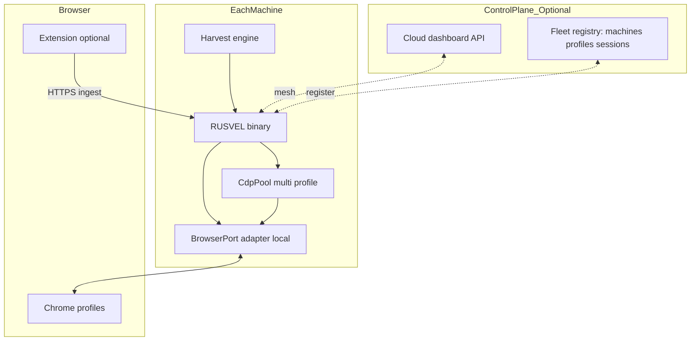

# Browser Fleet, Authenticated Capture, and Multi-Machine Control — Architecture Proposal

> **Status:** Proposal (2026-03-30)  
> **Audience:** Solo-builder RUSVEL — single Rust binary, hexagonal ports, departments, god agent  
> **Replaces (as direction):** Any design that treats `smart-standalone-harvestor` as a **runtime dependency** (second process, second DB, Python/Node on every host). That conflicts with the **one binary** product story. The harvestor remains a **reference implementation** for payloads and scoring ideas, not something we shell out to in production.

---

## 1. What we are actually building

**Critical product capability:** RUSVEL must credibly support **opportunity capture from the open web** in the same way a serious solo operator works: **logged-in browsers**, real accounts, passive observation of what the platform already sent to *your* session, and — where allowed — **assisted actions** (navigate, fill forms) behind **human approval**.

This is **not** “headless scrape anonymous HTML.” It **is**:

- **Authenticated session observation** — CDP and/or extension see `__NUXT__`, GraphQL responses, REST payloads, and DOM state the platform rendered for *you*.
- **Continuous capture** — network listeners + periodic/normalized snapshots feeding the harvest pipeline, not only on-demand “run scan now.”
- **Multi-account, multi-profile** — your `~/.chrome_profiles/*` (and remote equivalents) map to **isolated Chrome instances** with their own CDP endpoints and trust boundaries.
- **Multi-machine** — machines running RUSVEL (or a **compatible worker**) participate in a **fleet**: a control plane can **request** “ensure Chrome profile X is up and attached,” **stream captures**, and **enqueue** harvest jobs — without collapsing into a second monolithic stack (Python harvestor + Postgres).

**Optional later:** Extension-hosted MCP for two-way tool calls. That is **not** required for v1 if HTTP ingest + CDP + `BrowserPort` cover read paths; it is a **transport choice**, not the core domain.

---

## 2. Design principles (non-negotiable)

1. **Single binary** — Production RUSVEL is one Rust artifact + embedded UI. External pieces are **thin**: browser, OS, optional extension, mesh VPN — not a second application server stack.
2. **Hexagonal boundaries** — Engines depend on **ports** in `rusvel-core`; adapters (`rusvel-cdp`, future `rusvel-browser-worker`, extension POST) implement them.
3. **Domain-first** — Rich `Opportunity` / capture records, `content_hash`, dedup, platform normalization (see [autonomous-freelance-agency.md](./autonomous-freelance-agency.md) A0/A1b intent).
4. **Write path is gated** — Submit proposal, send message, etc. go through **approval** and explicit policy (ADR-008 alignment).
5. **Observability and audit** — Every capture cites `machine_id`, `profile_id`, `source` (`cdp_network` | `extension` | `ingest_api`), and raw payload references in `metadata` where size/policy allows.

---

## 3. Current codebase anchor points

| Layer | Today | Role in this proposal |
|-------|--------|------------------------|
| [`BrowserPort`](../../crates/rusvel-core/src/ports.rs) | `connect`, `tabs`, `observe`, `evaluate_js`, `navigate` | **Local** CDP session abstraction; keep as the **low-level** port. |
| [`BrowserEvent`](../../crates/rusvel-core/src/domain.rs) | `DataCaptured { platform, kind, data, tab_id }`, navigation events | Normalized **ingestion envelope** for harvest and DNA-style capture. |
| [`rusvel-cdp`](../../crates/rusvel-cdp) | `CdpClient` implements `BrowserPort`; network path evolving | **Local adapter**; grows pool + reconnect + richer `observe`. |
| Harvest | `HarvestEngine`, `HarvestSource`, `CdpSource`, RSS | Consumes **normalized** `RawOpportunity` / extended domain after mapping layer. |
| Jobs / Cron | Central queue, `ScheduledCron` → events | Triggers **scan/capture** policies per session. |
| API | `/api/dept/harvest/*` | **Ingest** from extension or remote nodes; future **fleet** registration. |

---

## 4. Layered architecture (high standard, minimal new concepts)

### 4.1 Domain concepts (proposed additions / clarifications)

Keep **stable IDs** in `rusvel-core` (names indicative; exact naming in implementation):

- **`MachineId`** — UUID or stable string from env/config (e.g. `RUSVEL_MACHINE_ID`), so dedup and audit work across fleet.
- **`BrowserProfileId`** — Maps to your filesystem convention (e.g. `baneshi`, `zixlancer`) and to CDP port / user-data-dir config.
- **`CaptureSource`** — `CdpNetwork`, `CdpDom`, `Extension`, `RemoteIngest`, `Manual`.
- **`NormalizedJob`** (or extend **`RawOpportunity`**) — Platform-agnostic fields after A1b mapping; **`content_hash`** for change detection; **`platform_job_key`** for dedup.

### 4.2 Port strategy — evolve rather than explode

**Phase A (local-first, single binary):**

- Strengthen **`BrowserPort`** usage via **`CdpPool`**: multiple `(profile_id → endpoint)` entries, health/reconnect, and routing `observe`/`evaluate_js` to the right instance.
- **Harvest** gains **`POST /api/dept/harvest/ingest`** (required in product plan) for extension and webhooks — same normalization pipeline as CDP-derived data.

**Phase B (multi-machine, Tailscale-style mesh):**

Introduce a **narrow** port — name TBD, e.g. **`BrowserFleetPort`** or **`RemoteCapturePort`** — that is **not** a second `BrowserPort`, but an **orchestration** API:

- `register_machine(metadata)` / heartbeat
- `list_profiles()` / `ensure_session(profile_id)` (may be no-op if local-only)
- `stream_captures()` or pull-based `fetch_pending_captures()` for coordinator

**Implementation options** (pick per deployment):

1. **Full RUSVEL on each box** — same binary, `RUSVEL_ROLE=worker`, connects outbound to coordinator over mesh TLS; coordinator is another RUSVEL or slim service (if you ever split, keep shared `rusvel-core` protocol crate).
2. **Thin worker crate** (still Rust, still one artifact variant) — only CDP + ingest forwarder + minimal auth; larger binary stays on “main” machine. Only if binary size or attack surface demands it.

Engines **never** import adapter crates; they call **`BrowserPort`** (local) and/or **`BrowserFleetPort`** (when present) through injected traits.

### 4.3 Chrome extension

- **v1:** Extension **POSTs** structured JSON to RUSVEL ingest (authenticated). No Python, no separate harvestor.
- **v2:** Optional **MCP over extension** for agent-driven two-way tools — still **one logical product** if MCP is stdio/WS from extension to local RUSVEL; document that this adds a **child process** boundary for tooling only, not a second domain database.

---

## 5. Passive vs active, security, “human behaviour”

| Concern | Approach |
|---------|----------|
| **Terms of service** | Product docs + prompts emphasize user-owned sessions and compliance; automation features default **off** or **approval-gated**. |
| **Credentials** | No central storage of platform passwords in RUSVEL DB; use OS profile / Chrome already logged-in; optional vault port later. |
| **Writes** | Proposal submit / messages → **approval queue** + session policy. |
| **Rate / fingerprint** | Policy engine: jitter delays, max actions per hour, optional “human pace” presets; never promise undetectability — reduce reckless automation. |
| **Mesh** | Prefer **Tailscale (or WireGuard)** for coordinator ↔ worker RPC; mutual TLS + machine identity. |

---

## 6. Mapping harvestor knowledge without importing harvestor

| Harvestor idea | RUSVEL destination |
|----------------|-------------------|
| `__NUXT__` / ngrx extraction | `rusvel-cdp` extractors + normalization in harvest mapping layer |
| 5-component score | `harvest-engine` weighted scorer + LLM; harvestor docs as **spec** |
| 4-agent proposal | Playbook / dept-harvest personas (existing agent stack) |
| 58-column model | A0 `Opportunity` extension + typed fields |
| Multi-CDP | `CdpPool` + profile config |
| Artifacts | `harvest-engine` artifact templates (markdown) |
| DNA / network intercept | `BrowserEvent::DataCaptured` + persistence rules |

---

## 7. Phased delivery (aligned with autonomous agency doc, corrected stack)

1. **A0 / A1b** — Domain + mapping + dedup + `content_hash` + always re-score with `metadata.harvestor_score`-style upstream score if present.
2. **Ingest API** — Extension + remote push; unify with CDP path in one pipeline.
3. **Local `CdpPool`** — Profiles from config, reconnect, health, wire `CdpSource` + continuous observe where feasible.
4. **Extractors** — Upwork / Freelancer normalization (authenticated payloads).
5. **Weighted scorer + multi-step proposal** — Rust-native.
6. **Fleet port + dashboard** — Registry, heartbeats, remote ingest from workers over mesh; cloud UI reads same SQLite or replicated events (event sync is a separate hard problem — start with **pull ingest** from workers).

---

## 8. Research and external input (Perplexity / web)

Use these as **non-binding** prompts when validating design against the outside world:

1. “Chrome DevTools Protocol 2025–2026 limitations for multi-tab network interception and performance.”
2. “Agentic browser automation products: architecture patterns (local vs cloud browser, extension vs CDP-only).”
3. “Tailscale or WireGuard patterns for RPC between homelab workers and a central API.”
4. “Platform ToS summary for Upwork/Freelancer automation and logged-in session tools (high level, not legal advice).”
5. “Content-addressed deduplication for job listings (hashing strategies for changing descriptions).”

---

## 9. Related documents

- [autonomous-freelance-agency.md](./autonomous-freelance-agency.md) — product pipeline and phases (update its “bridge” section to match **no external harvestor process**; port ideas into Rust).
- [architecture-v2.md](../design/architecture-v2.md) — hexagonal layout.
- Cursor implementation plan: `autonomous_agency_phase_1` — should be revised to **drop MCP-to-harvestor** and emphasize **ingest + CDP pool + domain**.

---

## 10. Open decisions (to resolve in implementation planning)

1. **Coordinator binary** — Same `rusvel-app` with feature flags vs separate `rusvel-coordinator` crate in workspace (still one release train).
2. **Event sync** — Single-writer SQLite vs future Postgres/CRDT for multi-machine (defer until fleet MVP works with HTTP ingest).
3. **Extension distribution** — Chrome Web Store vs unpacked dev (solo builder default: unpacked + docs).

---

*This file is the architectural answer to: single binary, serious web capture, multi-profile and multi-machine, ports/domain first, extension and CDP as complementary surfaces, no Python harvestor dependency.*
