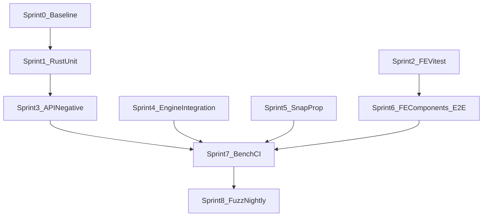

# Comprehensive Testing Plan for RUSVEL

> Industry-standard testing strategy for incremental execution (Cursor, CI, and humans).
> Current state: ~350 Rust tests, ~42% workspace line coverage (CI floor), zero frontend unit tests.
> Target state: ~1200+ tests, staged coverage toward ~55–65% workspace (see [docs/testing/coverage-strategy.md](../testing/coverage-strategy.md)), full-stack confidence.

---

## Document control

| Field | Value |
|-------|--------|
| **Version** | 1.1 |
| **Last updated** | 2026-03-28 |
| **Owner** | TBD (assign maintainer) |
| **Canonical coverage policy** | [docs/testing/coverage-strategy.md](../testing/coverage-strategy.md) |
| **Architecture / ADRs** | [docs/design/architecture-v2.md](../design/architecture-v2.md), [docs/design/decisions.md](../design/decisions.md) |
| **Current CI** | [.github/workflows/ci.yml](../../.github/workflows/ci.yml) |

**Scope:** Automated tests (Rust, API integration, frontend unit/component, Playwright), coverage gates, CI jobs, Criterion benchmarks, optional fuzz and mutation-testing backlog.

**Non-scope (v1 of this plan):** Full penetration testing, production load/soak testing at scale, formal verification, certification audits. These may be separate programs.

---

## Table of contents

1. [Executive summary](#1-executive-summary)
2. [Glossary](#2-glossary)
3. [Current state assessment](#3-current-state-assessment)
4. [Testing pyramid and engineering practices](#4-testing-pyramid-and-engineering-practices)
5. [Sprint implementation plan](#5-sprint-implementation-plan)
6. [CI roadmap: current vs target](#6-ci-roadmap-current-vs-target)
7. [Risk register](#7-risk-register)
8. [Definition of Done](#8-definition-of-done)
9. [Flakiness and test data policy](#9-flakiness-and-test-data-policy)
10. [Workstream: Rust unit tests (Sprint 1)](#10-workstream-rust-unit-tests-sprint-1)
11. [Workstream: Frontend unit tests — Vitest (Sprint 2)](#11-workstream-frontend-unit-tests--vitest-sprint-2)
12. [Workstream: API contract and negative paths (Sprint 3)](#12-workstream-api-contract-and-negative-paths-sprint-3)
13. [Workstream: Rust integration — engines and app (Sprint 4)](#13-workstream-rust-integration--engines-and-app-sprint-4)
14. [Workstream: Snapshot and property-based tests (Sprint 5)](#14-workstream-snapshot-and-property-based-tests-sprint-5)
15. [Workstream: Frontend components and E2E (Sprint 6)](#15-workstream-frontend-components-and-e2e-sprint-6)
16. [Workstream: Benchmarks and CI hardening (Sprint 7)](#16-workstream-benchmarks-and-ci-hardening-sprint-7)
17. [Workstream: Fuzz testing — nightly (Sprint 8)](#17-workstream-fuzz-testing--nightly-sprint-8)
18. [Appendix A — Test utilities to build](#appendix-a--test-utilities-to-build)
19. [Appendix B — API route coverage matrix (template)](#appendix-b--api-route-coverage-matrix-template)
20. [Appendix C — Legacy phase index (superseded numbering)](#appendix-c--legacy-phase-index-superseded-numbering)
21. [Success metrics](#success-metrics)

---

## 1. Executive summary

RUSVEL is a hexagonal Rust monorepo plus a SvelteKit UI. Quality is driven by a **test pyramid**: dense unit and property tests on pure domain and parsers; focused **Router + temp DB** tests in `rusvel-api`; **Playwright** for critical journeys and visual regression. Workspace-wide line coverage is a **regression signal**, not a completeness score — per-layer targets in [docs/testing/coverage-strategy.md](../testing/coverage-strategy.md) take precedence.

This document merges **workstreams** (what to test, with detailed checklists) and **sprints** (when to do it, exit criteria, dependencies). Execution order follows **§5** (Sprints 0–8), not the old “Phase 1–11” numbering; **Appendix C** maps legacy phase labels to sprints.

**Contracts without OpenAPI:** Until or unless OpenAPI (or similar) is generated from Axum handlers, prefer **JSON snapshots (`insta`)** plus **minimal JSON Schema** for a few stable DTOs (health, system status, department manifest, error envelope). Assert the **actual** error JSON shape produced by the code; if it diverges from the ideal `{ "error", "code" }` shape, document and snapshot the real format, then align intentionally.

---

## 2. Glossary

| Term | Meaning in RUSVEL |
|------|-------------------|
| **Unit test** | Tests a single crate’s logic with mocks or in-memory deps; lives in `#[cfg(test)]` or `tests/*.rs` without starting the full binary. Engines use **port traits** from `rusvel-core` only. |
| **Integration test** | Crosses boundaries: real `Router` (`rusvel-api`) with temp SQLite; engine `tests/` with mock `StoragePort` / `AgentPort`; `rusvel-app` tests for wiring. |
| **Contract test** | Repeatable checklist per engine (`tests/contract.rs`): manifest, commands, events, errors — Sprint 4. |
| **API negative test** | Exercises 4xx/405 and validation using [`crates/rusvel-api/tests/common/mod.rs`](../../crates/rusvel-api/tests/common/mod.rs) `TestHarness`; may use auth patterns from [`auth_bearer.rs`](../../crates/rusvel-api/tests/auth_bearer.rs). |
| **E2E test** | Playwright against dev server + API (`frontend/playwright.config.ts`); includes visual and `*.e2e.ts` projects. |
| **Workstream** | A body of work with a detailed checklist (§10–§17). |
| **Sprint** | Time-boxed delivery slice with exit criteria (§5); length is flexible (e.g. 1–2 weeks). |

---

## 3. Current state assessment

### What exists

| Area | Count | Quality |
|------|-------|---------|
| Rust unit tests | ~258 | Good coverage on engines, sparse on adapters |
| Rust integration tests | ~92 | Strong API smoke tests, engine round-trips |
| Benchmarks | 2 | DB open + registry load (Criterion) |
| Frontend visual tests | 27 routes | Playwright screenshot comparison |
| Frontend unit tests | 0 | No Vitest setup |
| Frontend component tests | 0 | No component isolation tests |
| Property-based tests | 0 | No proptest |
| Fuzz tests | 0 | No cargo-fuzz targets |
| Snapshot tests | 0 | No insta snapshots |
| OpenAPI contract | 0 | Use snapshots / minimal schema until generated |

### Coverage by layer (current → target)

Align targets with [docs/testing/coverage-strategy.md](../testing/coverage-strategy.md): **rusvel-core** 85–95%, adapters 60–80%, engines 70–90%, **rusvel-api** 50–70%, **rusvel-app** 30–50%, workspace total ~55–65% over time. Frontend: prefer `pnpm check` and Playwright; optional Vitest line thresholds for `src/lib/**` only.

### Key gaps

1. **Negative-path tests** — many engines and handlers happy-path only  
2. **Error propagation** — `thiserror` chains under-tested  
3. **Concurrency** — job queue, event bus under contention  
4. **Serialization** — `metadata: serde_json::Value` round-trips  
5. **Frontend unit tests** — large `api.ts`, stores, utils  
6. **Component isolation** — many Svelte components untested  
7. **API contracts** — response shapes not snapshotted or schema-checked  

### Sprint 0 — Baseline capture (tasks)

- Record `cargo test` workspace counts and `cargo llvm-cov test --workspace --summary-only` (match CI: `--fail-under-lines 42`).  
- Inventory [`crates/rusvel-api/tests/`](../../crates/rusvel-api/tests/) vs **132** `.route(` registrations in [`crates/rusvel-api/src/lib.rs`](../../crates/rusvel-api/src/lib.rs).  
- Document **test taxonomy** (this glossary), **DoD** (§8), and **flakiness policy** (§9).  
- Decide threshold for introducing **`rusvel-test-utils`** (Appendix A: e.g. when mocks duplicate across >3 crates).  

**Exit:** Baseline numbers copied into this doc or `docs/status/` as needed; no code change required.

---

## 4. Testing pyramid and engineering practices

```
                    /\
                   /  \          E2E (Playwright)
                  / 27  \        Visual + interaction journeys
                 /--------\
                /          \     Integration
               /   ~150+    \    API Router, engines, app wiring
              /--------------\
             /                \   Unit
            /     ~800+        \  Domain, adapters, FE lib
           /--------------------\
          /                      \  Property + Fuzz
         /        ~50+            \  Parsers, serde, scoring
        /__________________________\
```

**Principles**

- **Risk-based depth:** More tests on `rusvel-core`, jobs, auth-adjacent paths, and persistence; less on thin wiring in `rusvel-app`.  
- **Fast PR feedback:** Isolated temp DBs/files per test; avoid shared global state so `cargo test` can parallelize. Optional future: [cargo-nextest](https://nexte.st/) for faster CI — not required day one.  
- **Coverage:** Treat `llvm-cov` workspace % as **regression detection**; raise `--fail-under-lines` slowly per [docs/testing/coverage-strategy.md](../testing/coverage-strategy.md).  
- **Mutation testing (backlog):** [cargo-mutants](https://mutants.rs/) as optional **Workstream 12** — evaluate after unit density improves; do not gate CI initially.  
- **Security slice (lightweight):** SQL runner dangerous-statement blocking; path traversal on file tools; auth bypass when middleware lands; human approval paths ([ADR-008](../../docs/design/decisions.md)).  
- **E2E reliability:** Prefer `page.waitForResponse`, `page.route` for unstable LLM/SSE; avoid arbitrary `sleep` except with comment rationale.  

**References:** [Google Testing Blog — test pyramid](https://testing.googleblog.com/) (general industry framing).

---

## 5. Sprint implementation plan

Sprints are **ordered for execution**. Tasks are **epics**; bullets are **subtasks**.



### Master table

| Sprint | Goals | Primary workstreams (§) | Exit criteria |
|--------|--------|---------------------------|---------------|
| **0** | Baseline metrics, taxonomy, flaky policy | §3 Sprint 0, §8–§9 | Baseline recorded; governance agreed |
| **1** | Rust unit depth: core + high-risk adapters | §10 | Crate-level uplift on listed crates; workspace floor unchanged or +1 if stable |
| **2** | Vitest platform + `api.ts` + lib helpers | §11 | `pnpm test` green locally; CI wiring in Sprint 7 |
| **3** | API negatives + error envelope | §12 | ≥70% of routes with ≥1 negative test; 90% stretch |
| **4** | Engine contracts + app integration | §13 | All 13 engines run contract suite; app tests for wiring/jobs |
| **5** | `insta` + `proptest` | §14 | Core snapshots + property suite &lt; ~1–2 min combined |
| **6** | Component tests + Playwright journeys | §15 | Priority components + critical E2E paths |
| **7** | Criterion expansion + CI jobs | §16 | PR pipeline matches agreed gates; benches non-blocking |
| **8** | cargo-fuzz + nightly workflow | §17 | Fuzz targets + scheduled job; regressions from findings |

### Sprint 1 — Rust unit depth

**Epics:** `rusvel-core`, `rusvel-db`, `rusvel-jobs`, `rusvel-config`, plus remaining adapters per §10.

**Subtasks:** Tests in `#[cfg(test)]`; `cargo test -p <crate>` per change; optional single-point workspace floor bump only when baseline is stable (see coverage-strategy).

### Sprint 2 — Frontend unit platform

**Epics:** Vitest, Vite 6 + Svelte 5 (`svelte({ hot: false })`), `$lib` alias resolution, `src/test-setup.ts`, scripts in `package.json`.

**Subtasks:** Choose **either** MSW **or** `vi.stubGlobal('fetch')` and document; add `@vitest/coverage-v8` (or v8 provider) if using `pnpm test:coverage`.

### Sprint 3 — API negative paths

**Epics:** New/expanded files under `crates/rusvel-api/tests/` grouped by handler modules (mirror `rusvel-api/src/*.rs`).

**Subtasks:** 400 validation, 404 ids, 405 method; auth via harness variant; snapshot or assert real error JSON.

### Sprint 4 — Engine contracts + app

**Epics:** `crates/<engine>/tests/contract.rs` for 13 engines; `crates/rusvel-app/tests/` department wiring + job queue.

**Subtasks:** Mock ports from `code-engine/tests` patterns; cross-engine pipelines in `rusvel-app` where feasible.

### Sprint 5 — Snapshots + property tests

**Epics:** Workspace `insta`, `proptest` in `[workspace.dependencies]`; crate-level dev-deps.

**Subtasks:** `cargo insta review` workflow documented for contributors.

### Sprint 6 — Frontend components + E2E

**Epics:** `@testing-library/svelte` + user-event; new `frontend/tests/*.e2e.ts`.

**Subtasks:** Mock `$lib/api` in components; E2E mock LLM/SSE when `cargo run` is non-deterministic in CI.

### Sprint 7 — Benchmarks + CI hardening

**Epics:** Extend `rusvel-app` boot bench; optional `code-engine` / `flow-engine` benches; split CI jobs.

**Subtasks:** `cargo fmt --check`, `clippy -- -D warnings`, `pnpm check`, `pnpm test`, coverage artifact upload; Playwright **smoke** on PR vs **full** on `main` nightly (team choice).

### Sprint 8 — Fuzz + nightly

**Epics:** `cargo-fuzz` per target crate; GitHub `schedule` workflow.

**Subtasks:** Minimized inputs committed as regression tests when bugs found.

---

## 6. CI roadmap: current vs target

### Current (as implemented)

| Job | Runner | Steps |
|-----|--------|--------|
| **Build & Test** | `ubuntu-latest` | `cargo build --workspace`; `cargo llvm-cov test --workspace --summary-only --fail-under-lines 42`; `protoc` for LanceDB |
| **Frontend** | `ubuntu-latest` | `pnpm install --frozen-lockfile`; `pnpm build` |

**Gaps vs aspirational “7-stage” CI:** No `cargo fmt`, no `clippy`, no `pnpm check`, no Vitest, no Playwright in CI, no explicit property-test or bench jobs.

### Target — phased

**Phase A (PR gate — fast):**

- `cargo fmt --check`  
- `cargo clippy --workspace -- -D warnings`  
- `cargo llvm-cov test --workspace --summary-only --fail-under-lines <N>` (raise **N** slowly per [docs/testing/coverage-strategy.md](../testing/coverage-strategy.md))  
- Frontend: `pnpm check`, `pnpm test` (after Sprint 2)  

**Phase B (PR optional or nightly):**

- Playwright: subset `*.e2e.ts` or `test:visual` only — account for `cargo run` + `pnpm dev` startup time and env (see §7).  
- `cargo test --workspace -- proptest` or filter by name  
- `cargo bench` — **report only**, no gate initially  

**Phase C (scheduled):**

- `cargo fuzz` with time budget  
- Full Playwright suite if not run on every PR  

### Coverage floor progression (workspace line %)

Staircase aligns with strategy doc — **do not** jump 42→50 in one step unless baseline already sustains it.

| Milestone | Suggested floor (workspace) | Notes |
|-----------|-----------------------------|--------|
| Current CI | 42% | Regression guard |
| After Sprint 1 stable | 43–44% | +1 when sustained locally/CI |
| After Sprint 3 | 45–48% | API tests lift `rusvel-api` |
| After Sprint 4–5 | 50–55% | Integration + snapshots |
| Steady state | 55–65% | Per-layer targets still primary |

### Optional pre-commit / `just` target

```bash
just pre-commit:
    cargo fmt --check
    cargo clippy --workspace -- -D warnings
    cargo test --workspace --lib
    cd frontend && pnpm check
```

---

## 7. Risk register

| Risk | Impact | Mitigation |
|------|--------|------------|
| Playwright `webServer` starts `cargo run` + `pnpm dev` | Slow/flaky CI, OOM | Smoke subset on PR; nightly full run; increase timeouts; reuse server where possible |
| LLM/SSE non-determinism in E2E | Flaky assertions | `page.route` mock streams; stub agent responses |
| Parallel Rust tests + SQLite | Rare lock errors | Temp dir per test; `tokio::test` isolation; `--test-threads=1` only for specific suites if needed |
| Coverage gaming | False confidence | Per-layer targets + snapshots + critical E2E |
| Clippy `-D warnings` on legacy code | PR blockage | Fix warnings incrementally when enabling job |

---

## 8. Definition of Done

| Work item type | Done when |
|----------------|-----------|
| **Rust unit** | `cargo test -p <crate>` passes; no new warnings; tests named clearly; uses existing mocks (`FakeStorage`, `RecordingEvents`, …) where applicable |
| **API test** | Uses `TestHarness` / `json_request`; asserts status + body shape or snapshot; documents auth if endpoint protected |
| **Snapshot** | `.snap` reviewed in PR; stable ordering (sorted keys where needed); `cargo insta test` passes |
| **Property test** | Strategy documented; shrink finds minimal failure; runtime bounded |
| **Vitest** | No real network; fake timers if timing; deterministic fetch mock |
| **Component** | Renders without console errors; user-visible behavior + basic a11y (roles/labels) |
| **E2E** | &lt; ~30s per test where possible; stable selectors; retries understood (Playwright CI `retries: 2`) |
| **CI job** | Documented in this plan + workflow comment; failure is actionable |

---

## 9. Flakiness and test data policy

1. **Quarantine:** Flaky tests: open issue, mark `#[ignore]` or skip with ticket link — max time boxed.  
2. **No mystery sleeps:** Prefer waiting on events, responses, or harness conditions.  
3. **Playwright:** Use existing CI `retries`; `trace: on-first-retry` for debugging.  
4. **Test data:** Prefer factories/builders (Appendix A); avoid hard-coded IDs unless stable UUIDs from harness.  
5. **Snapshots:** Normalize timestamps/ids in redactions if fields are volatile (`insta` redactions).  

---

## 10. Workstream: Rust unit tests (Sprint 1)

> Goal: Raise `rusvel-core` toward 90%; add unit tests to crates below ~50% coverage.  
> Estimated new tests: ~200

### 10.1 rusvel-core (priority: critical)

**Files:** `crates/rusvel-core/src/lib.rs`, `crates/rusvel-core/src/ports.rs`

```
[ ] Domain type construction & defaults
    - Session::new() with various inputs
    - Goal, Task, Event, Pipeline construction
    - All Status/Priority/Platform enum variants
    - DepartmentManifest construction and validation
    - DepartmentApp trait default implementations

[ ] Serialization round-trips (serde)
    - Every domain type: serialize → deserialize → assert_eq
    - metadata field: empty object, nested objects, arrays
    - Event.kind as arbitrary String values
    - SessionId, GoalId, TaskId Display + FromStr

[ ] Edge cases
    - Empty strings in required fields
    - Unicode in name/description fields
    - Very large metadata values
    - Default trait implementations

[ ] Port trait object safety (ports.rs)
    - Verify port traits are object-safe where required (compile tests)
    - StoragePort subtraits: ObjectStore, EventStore, SessionStore, JobStore, MetricStore
    - Mock impls for method signatures
```

### 10.2 rusvel-db (priority: high)

```
[ ] Migration idempotency
[ ] CRUD for every store subtrait (ObjectStore, EventStore, SessionStore, JobStore, MetricStore)
[ ] Edge cases: concurrent writes, long text, NULL vs empty string, rollback, WAL
```

### 10.3 rusvel-llm (priority: high)

```
[ ] ModelTier routing, CostTracker
[ ] Provider selection, missing key, timeout (mock)
[ ] Message formatting, tool-use construction
```

### 10.4 rusvel-agent (priority: high)

```
[ ] Agent loop, max iterations, stop conditions
[ ] Persona injection and overrides
[ ] Streaming: AgentEvent sequence, errors, cancellation
```

### 10.5 rusvel-tool (priority: medium)

```
[ ] Registry, ScopedToolRegistry, duplicates, JSON Schema, tool_search
[ ] rusvel-builtin-tools: valid/invalid inputs; read_file traversal; bash timeout; edit_file conflicts
```

### 10.6 Other adapter crates (priority: medium)

`rusvel-event`, `rusvel-memory`, `rusvel-config`, `rusvel-auth`, `rusvel-channel`, `rusvel-jobs`, `rusvel-webhook`, `rusvel-cron` — behaviors as in prior plan (pub/sub, FTS5, TOML, bearer token, Telegram skip, job FIFO/approval, webhooks, cron parse).

### How to execute (Cursor)

1. Read crate `src/lib.rs` and public API.  
2. Extend existing `#[cfg(test)]` modules (avoid extra unit test files unless module size forces split).  
3. `#[test]` / `#[tokio::test]`; descriptive names.  
4. `cargo test -p <crate-name>` after edits.  
5. Keep test modules &lt; ~200 lines; submodules if needed.  

---

## 11. Workstream: Frontend unit tests — Vitest (Sprint 2)

> Goal: Test TypeScript utilities, stores, API client. ~100 tests.  
> **Svelte 5 + Vite 6:** resolve `$lib` in Vitest; `@testing-library/svelte` compatible with Svelte 5; `svelte({ hot: false })` in config.

### 11.1 Setup

```bash
cd frontend
pnpm add -D vitest @testing-library/svelte @testing-library/jest-dom jsdom @testing-library/user-event
# For coverage: pnpm add -D @vitest/coverage-v8
```

**`frontend/vitest.config.ts`** (illustrative — adjust `resolve.alias` to match your `svelte.config` paths):

```typescript
import { defineConfig } from 'vitest/config';
import { svelte } from '@sveltejs/vite-plugin-svelte';
import path from 'node:path';

export default defineConfig({
  plugins: [svelte({ hot: false })],
  resolve: {
    alias: { $lib: path.resolve('src/lib') }
  },
  test: {
    environment: 'jsdom',
    include: ['src/**/*.test.ts'],
    globals: true,
    setupFiles: ['src/test-setup.ts'],
    coverage: {
      provider: 'v8',
      include: ['src/lib/**'],
      exclude: ['src/lib/components/**'],
      reporter: ['text', 'html'],
      thresholds: { lines: 50 }
    }
  }
});
```

**`frontend/src/test-setup.ts`:** `import '@testing-library/jest-dom';`

**`package.json` scripts:** `"test": "vitest run"`, `"test:watch": "vitest"`, `"test:coverage": "vitest run --coverage"`

### 11.2 Targets

`src/lib/api.ts` (critical), `stores.ts`, `cache.ts`, `departmentManifest.ts`, `approvalContext.ts`, `utils/cn.ts` — same checklist as before (URL/method/body/SSE/error handling, store subscriptions, etc.).

### How to execute

1. Land Vitest + one passing smoke test first.  
2. Start with `api.test.ts`.  
3. Sibling naming: `*.test.ts` next to source.  
4. Do not cover Svelte components here (§15).  

---

## 12. Workstream: API contract and negative paths (Sprint 3)

> Goal: **132** routes in `rusvel-api/src/lib.rs` — systematic coverage grouped by handler module. ~120 new tests.

### 12.1 Per-route expectations

```
[ ] Happy path — valid request → expected shape
[ ] Validation failure → 400 + error body
[ ] Auth failure → 401 (where middleware applies)
[ ] Not found → 404
[ ] Method not allowed → 405
```

### 12.2 Priority groups

Same as before: Core CRUD sessions/goals; Chat; Agents/skills/rules/hooks/MCP; Engine routes (code, content, harvest); System (health, jobs, db/sql); Webhooks/cron.

### 12.3 Response and errors

Assert JSON structure or use `insta` (Sprint 5). Ideal error shape:

```json
{
  "error": "Human-readable message",
  "code": "VALIDATION_ERROR"
}
```

If actual responses differ, **snapshot first**, then standardize in a dedicated API refactor.

### How to execute

1. `TestHarness` from `crates/rusvel-api/tests/common/mod.rs`.  
2. One file per resource or handler module.  
3. `json_request` helper.  
4. `cargo test -p rusvel-api`.  
5. Auth: patterns from `auth_bearer.rs`.  

**Milestone:** ≥70% routes with ≥1 negative test; 90% stretch. Track in Appendix B matrix.

---

## 13. Workstream: Rust integration — engines and app (Sprint 4)

> Goal: Cross-crate flows, engine contracts, app wiring. ~80 tests.

### 13.1 Engine contract template

File: `crates/<engine>/tests/contract.rs`

```
[ ] Construction with valid/minimal ports
[ ] DepartmentApp: name, manifest, handle_command known/unknown, status JSON
[ ] Event emission: kinds, session_id
[ ] Errors: storage/agent failure → Result::Err, not panic
```

**Engines (13):** forge, code, content, harvest, gtm, finance, product, growth, distro, legal, support, infra, flow.

### 13.2 Department wiring — `crates/rusvel-app/tests/department_wiring.rs`

```
[ ] 14 departments register; manifests; CLI resolution; API smoke 200s
[ ] Duplicate ID / missing engine → clear boot error
```

### 13.3 Cross-engine pipelines

Harvest→Content; Code→Content; Forge orchestration; Flow DAG (linear, branch, conditional, error, checkpoint).

### 13.4 Job queue — `crates/rusvel-app/tests/job_queue.rs`

Lifecycle, retry, approval gate, concurrent workers, timeout, session isolation.

### How to execute

1. Mirror `code-engine/tests/integration.rs` mocks.  
2. `crates/<crate>/tests/` + dev-deps.  
3. Cross-engine in `rusvel-app/tests/`.  

---

## 14. Workstream: Snapshot and property-based tests (Sprint 5)

### 14.1 Property-based (`proptest`)

Workspace `Cargo.toml`:

```toml
[workspace.dependencies]
proptest = "1"
```

Targets: `rusvel-core` serde round-trip; `code-engine` parse/BM25 no panic; `harvest-engine` / `gtm-engine` scoring bounds; `flow-engine` DAG acyclicity; `rusvel-config` TOML; `rusvel-cron`; `rusvel-webhook` payloads.

Run: `cargo test -p <crate> -- proptest` or filtered names.

### 14.2 Snapshot (`insta`)

```toml
[workspace.dependencies]
insta = { version = "1", features = ["json", "yaml"] }
```

Targets: domain JSON; code analysis fixtures; content draft with mock LLM; `GET /api/health`, system status, errors, manifests; CLI `--help`; registry snapshot; flow DAG traces.

Workflow: `cargo insta test` / `cargo insta review`.

---

## 15. Workstream: Frontend components and E2E (Sprint 6)

### 15.1 Component tests

Groups: UI primitives; Chat (`DepartmentChat`, `ChatSidebar`, `ToolCallCard`, `ApprovalCard`); department tabs; layout; onboarding (`CommandPalette`, checklist, tour). Use `render()`, `userEvent`, `vi.mock('$lib/api')`, a11y checks.

### 15.2 E2E (Playwright)

Targets: auth (as applicable); sessions; department nav; chat streaming/tool/approval (mocked where needed); database browser; workflow builder; settings; responsive breakpoints.

**Structure:** `frontend/tests/*.e2e.ts` (e2e project in `playwright.config.ts`), alongside existing `*.visual.ts`, `fixtures.ts`.

### How to execute

1. `.e2e.ts` suffix.  
2. `page.waitForResponse`, `page.route` for instability.  
3. `pnpm test:e2e`.  
4. Keep tests focused; target &lt; ~30s each.  

---

## 16. Workstream: Benchmarks and CI hardening (Sprint 7)

### 16.1 Criterion

Extend `crates/rusvel-app/benches/boot.rs`; add `benches/api.rs` (health, chat TTFB with mock), `code-engine/benches/parse.rs`, `flow-engine/benches/dag.rs`. CI: **non-blocking** bench job reporting trends.

### 16.2 Frontend performance (optional)

Lighthouse CI; bundle size budget — backlog if not in Sprint 7 scope.

### 16.3 CI jobs (consolidated target)

- `rust-fmt`, `rust-clippy`, `rust-llvm-cov` (floor per §6)  
- `frontend-check`, `frontend-test`  
- Optional: `playwright-smoke`, `proptest`, `bench-report`  
- Artifacts: `lcov` or html coverage upload  

---

## 17. Workstream: Fuzz testing — nightly (Sprint 8)

`cargo install cargo-fuzz`; `fuzz/` per crate; targets: code-engine parse, `rusvel-config`, `rusvel-cron`, webhooks, flow DAG JSON, LLM response JSON, MCP JSON-RPC. **Nightly** `schedule` workflow; fix crashes + add regressions.

---

## Appendix A — Test utilities to build

### A.1 `rusvel-test-utils` (optional)

Create when mocks duplicate across **>3** crates: `InMemoryStorage`, `RecordingEvents`, `StubLlm`, `StubAgent`, `MockChannel`, `temp_db()`, `test_session()`, etc.

### A.2 Builders

SessionBuilder pattern for composable test data.

### A.3 API macros

`api_test!` macro wrapping `json_request` + status assert (see prior example).

### A.4 Frontend helpers

`mockFetch`, `mockSSE`, `createTestSession` in `src/lib/test-helpers.ts` (or `src/test-helpers.ts`).

---

## Appendix B — API route coverage matrix (template)

Maintain a table (spreadsheet or markdown) while executing Sprint 3:

| Handler module | Method + path pattern | 200 | 400 | 401 | 404 | 405 | Notes |
|----------------|------------------------|-----|-----|-----|-----|-----|--------|
| e.g. `sessions` | `GET /api/sessions` | ✓ | | | | | |
| … | … | | | | | | |

Group rows by file under `crates/rusvel-api/src/` (e.g. `chat.rs`, `jobs.rs`). Total route registrations: **132** (`.route(` in `lib.rs`).

---

## Appendix C — Legacy phase index (superseded numbering)

Earlier versions used “Phase 1–11” with an execution order table that **did not match** phase numbers. Use **Sprints** and **§10–§17** instead.

| Legacy phase label | Topic | Sprint | Current § |
|--------------------|--------|--------|-----------|
| Phase 1 | Rust unit | 1 | §10 |
| Phase 6 | Frontend Vitest | 2 | §11 |
| Phase 3 | API negative | 3 | §12 |
| Phase 2 | Engine integration | 4 | §13 |
| Phase 5 | Snapshots | 5 | §14 |
| Phase 4 | Proptest | 5 | §14 |
| Phase 7 | FE components | 6 | §15 |
| Phase 8 | E2E | 6 | §15 |
| Phase 9 | Benchmarks | 7 | §16 |
| Phase 11 | CI | 7 | §16 |
| Phase 10 | Fuzz | 8 | §17 |

---

## Success metrics

| Metric | Current | Target | How to measure |
|--------|---------|--------|----------------|
| Rust workspace line coverage | ~42% CI floor | 55–65% staged | `cargo llvm-cov` |
| Rust test count | ~350 | ~800+ | `cargo test` summary |
| Frontend unit tests | 0 | ~100 | `pnpm test` |
| Frontend component tests | 0 | ~60 | `pnpm test` |
| E2E + visual | 27 visual | 27 visual + ~30 interaction | `pnpm test:e2e` |
| Routes with negative tests | ~10% | 70% → 90% | Appendix B matrix |
| Property / snapshot | 0 | per §14 | grep / insta files |
| CI jobs | 2 | 5–7+ per §6 | `ci.yml` |
| Full suite time | ~45s Rust | PR budget agreed | CI timings |

---

## Optional future — Workstream 12 (mutation testing)

Evaluate [cargo-mutants](https://mutants.rs/) after unit density on `rusvel-core` and engines is strong. Run locally or weekly; do not block PRs until the team explicitly promotes it to a gate.
