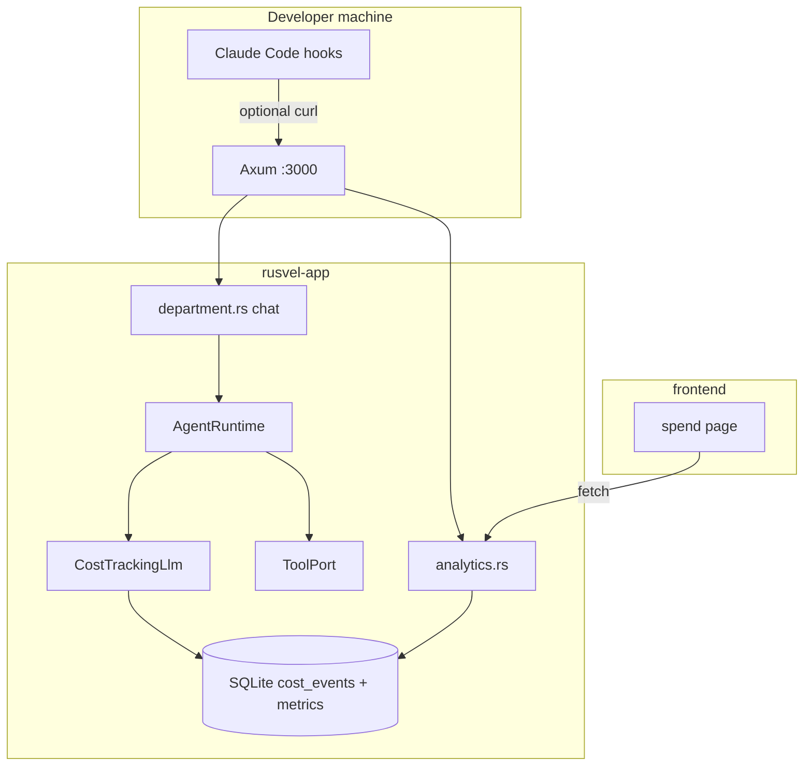

# Native app map: Claude tooling, tool permissions, flow templates, and cost analytics

> **Purpose:** Tie Claude Code hooks, `AgentConfig` tool policy, flow-engine MiniJinja, and structured cost events to **this** repository’s layout: single `rusvel-app` binary, Axum API on `:3000`, SQLite via `rusvel-db`, SvelteKit frontend (embedded or `pnpm dev`).
>
> **Status:** Most backend/FE items below are **implemented** (2026-03); gaps called out explicitly.

---

## 1. System context (what “native app” means here)

| Layer | Location | Role |
|--------|-----------|------|
| **Binary / composition root** | [`crates/rusvel-app/`](../../crates/rusvel-app/) | Boots DB, `CostTrackingLlm` + `MetricStore`, `AgentRuntime`, 14 departments, Axum router from `rusvel-api` |
| **HTTP API** | [`crates/rusvel-api/src/lib.rs`](../../crates/rusvel-api/src/lib.rs) | ~routes; analytics under `/api/analytics/*` |
| **Contract / domain** | [`crates/rusvel-core/`](../../crates/rusvel-core/) | `AgentConfig`, `ToolPermissionMode`, `CostEvent`, `MetricStore` trait |
| **Persistence** | [`crates/rusvel-db/`](../../crates/rusvel-db/) | `Database` implements `MetricStore`; migrations in [`migrations.rs`](../../crates/rusvel-db/src/migrations.rs) |
| **Agent runtime** | [`crates/rusvel-agent/`](../../crates/rusvel-agent/) | `AgentPort` impl; streaming + non-streaming tool loops |
| **LLM + cost decorator** | [`crates/rusvel-llm/src/cost_tracking.rs`](../../crates/rusvel-llm/src/cost_tracking.rs) | Wraps inner `LlmPort`; records `MetricPoint` + `CostEvent` when `metrics` is `Some` |
| **Flow execution** | [`crates/flow-engine/`](../../crates/flow-engine/) | DAG executor; node `parameters` resolved with MiniJinja before handlers run |
| **Department chat** | [`crates/rusvel-api/src/department.rs`](../../crates/rusvel-api/src/department.rs) | Builds `AgentConfig` from registry + stored `LayeredConfig` + rules/RAG |
| **God / global chat** | [`crates/rusvel-api/src/chat.rs`](../../crates/rusvel-api/src/chat.rs) | `AgentConfig` with `permission_mode: Auto` (default) |
| **Frontend** | [`frontend/`](../../frontend/) | Spend UI: [`settings/spend/+page.svelte`](../../frontend/src/routes/settings/spend/+page.svelte); API helpers [`lib/api.ts`](../../frontend/src/lib/api.ts) |
| **Claude Code (local dev)** | [`.claude/hooks/*.sh`](../../.claude/hooks/) | Shell scripts; **not** executed by the Rust binary until wired in Claude Code `settings.json` |



---

## 2. Claude Code hooks → repository map

| Hook script | Path | Native app interaction |
|-------------|------|-------------------------|
| `pre-commit-quality.sh` | [`.claude/hooks/pre-commit-quality.sh`](../../.claude/hooks/pre-commit-quality.sh) | Runs `cargo check --workspace` at repo root; **no** runtime coupling to `rusvel-app`. |
| `pre-edit-format.sh` | [`.claude/hooks/pre-edit-format.sh`](../../.claude/hooks/pre-edit-format.sh) | `rustfmt --check` on `.rs` paths from hook JSON stdin; warn-only. |
| `block-npm.sh` | [`.claude/hooks/block-npm.sh`](../../.claude/hooks/block-npm.sh) | Enforces **pnpm** policy aligned with [`CLAUDE.md`](../../CLAUDE.md) / [`frontend.md`](../../.claude/rules/frontend.md). |
| `session-save.sh` | [`.claude/hooks/session-save.sh`](../../.claude/hooks/session-save.sh) | `POST http://localhost:3000/api/system/session-snapshot` — **endpoint not implemented** in `rusvel-api` yet; safe no-op/404 until added (e.g. [`system.rs`](../../crates/rusvel-api/src/system.rs)). |
| `test-on-edit.sh` | [`.claude/hooks/test-on-edit.sh`](../../.claude/hooks/test-on-edit.sh) | `cargo test -p <crate>` for `crates/<name>/src/` paths; matches workspace members in root [`Cargo.toml`](../../Cargo.toml). |
| `line-count-check.sh` | [`.claude/hooks/line-count-check.sh`](../../.claude/hooks/line-count-check.sh) | Warns if crate `src/` &gt; 2000 lines; aligns with ADR / [`engines.md`](../../.claude/rules/engines.md) crate-size guidance. |

**Wiring:** Hooks do nothing until registered in Claude Code project `settings.json` (see [official hooks docs](https://code.claude.com/docs/en/hooks)). The **native app does not read** `.claude/hooks/` at boot.

---

## 3. Tool permission mode → native stack map

### 3.1 Domain and config (single enum, no duplicate)

| Concept | Type | Location |
|---------|------|----------|
| Tool policy enum | `ToolPermissionMode` (`Auto` / `Supervised` / `Locked`) | [`crates/rusvel-core/src/domain.rs`](../../crates/rusvel-core/src/domain.rs) |
| Per-run policy on agent | `AgentConfig.permission_mode` | Same file, `AgentConfig` struct |
| String → enum for dept UI/config | `tool_permission_mode_from_dept_config_str` | [`crates/rusvel-core/src/config.rs`](../../crates/rusvel-core/src/config.rs) |
| Stored dept overrides | `LayeredConfig.permission_mode: Option<String>` → `ResolvedConfig.permission_mode` | [`config.rs`](../../crates/rusvel-core/src/config.rs) persisted via [`department.rs`](../../crates/rusvel-api/src/department.rs) `CONFIG_STORE_KEY` + `ObjectStore` |

### 3.2 Enforcement point (native agent, not Claude CLI)

| Step | Component | File / symbol |
|------|-----------|----------------|
| Policy read from run | `RunState.config` | [`rusvel-agent/src/lib.rs`](../../crates/rusvel-agent/src/lib.rs) |
| Gate before `ToolPort::call` | `agent_permission_blocks_tool` | Same; used in **`run_streaming_loop`** and non-streaming `run` tool branch |
| Destructive signal | `ToolDefinition.metadata["destructive"] == true` | Registered tools (e.g. [`rusvel-builtin-tools`](../../crates/rusvel-builtin-tools/)) |
| Department chat wiring | Map `resolved.permission_mode` → `AgentConfig.permission_mode` | [`department.rs`](../../crates/rusvel-api/src/department.rs) |
| Global chat | Default `Auto` | [`chat.rs`](../../crates/rusvel-api/src/chat.rs) |

### 3.3 Interaction with `ToolRegistry` permission rules

[`crates/rusvel-tool/src/lib.rs`](../../crates/rusvel-tool/src/lib.rs) applies **separate** `ToolPermission` / `ToolPermissionMode` rules inside `ToolPort::call`. The agent loop adds a **second** layer based on `AgentConfig.permission_mode` and tool **metadata**. Document both when debugging “why didn’t this tool run?”.

### 3.4 Future native UI (not in initial scope)

| Need | Suggested placement |
|------|---------------------|
| Edit dept `permission_mode` string | Existing dept config UI / [`PUT /api/dept/{dept}/config`](../../crates/rusvel-api/src/lib.rs) flow |
| Visualize blocked vs allowed tools | Department settings or chat sidebar |

---

## 4. Flow-engine MiniJinja → native stack map

| Piece | Location |
|-------|----------|
| Dependency | `minijinja = "2"` in [`flow-engine/Cargo.toml`](../../crates/flow-engine/Cargo.toml) |
| Resolver | [`flow-engine/src/expressions.rs`](../../crates/flow-engine/src/expressions.rs) — `resolve_expressions`, `flow_parameter_context` |
| Module export | [`flow-engine/src/lib.rs`](../../crates/flow-engine/src/lib.rs) `pub mod expressions` |
| Execution hook | [`flow-engine/src/executor.rs`](../../crates/flow-engine/src/executor.rs) — clone node, replace **`parameters`** (domain field name on [`FlowNodeDef`](../../crates/rusvel-core/src/domain.rs)) |
| API surface | Flow CRUD + run under `/api/flows/*` in [`rusvel-api/src/lib.rs`](../../crates/rusvel-api/src/lib.rs) + [`flow_routes.rs`](../../crates/rusvel-api/src/flow_routes.rs) |
| Engine wiring | `FlowEngine` optional in [`AppState`](../../crates/rusvel-api/src/lib.rs); same pattern in [`rusvel-app`](../../crates/rusvel-app/src/main.rs) composition root |

**Template context shape:** Merged object: keys from trigger JSON (if object) else `trigger` key; plus upstream node outputs keyed by node id string — matches executor `inputs` map.

---

## 5. Cost events and analytics → native stack map

### 5.1 Domain and port

| Artifact | Location |
|----------|----------|
| Row type | `CostEvent` | [`rusvel-core/src/domain.rs`](../../crates/rusvel-core/src/domain.rs) |
| Trait methods | `record_cost`, `query_costs` (defaults for stubs) | [`rusvel-core/src/ports.rs`](../../crates/rusvel-core/src/ports.rs) `MetricStore` |

### 5.2 SQLite (same DB as metrics)

| Item | Location |
|------|----------|
| Migration `v2` | [`rusvel-db/src/migrations.rs`](../../crates/rusvel-db/src/migrations.rs) — `cost_events` table |
| Impl | [`rusvel-db/src/store.rs`](../../crates/rusvel-db/src/store.rs) `impl MetricStore for Database` |

### 5.3 Recording path (LLM calls only, today)

| Step | Detail |
|------|--------|
| Wrapper | `CostTrackingLlm` holds `metrics: Option<Arc<dyn MetricStore>>` |
| When | After each `generate` / stream `Done` / batch poll item |
| Dual write | `MetricPoint` (`llm.cost_usd`) **unchanged**; **plus** `CostEvent` via `record_cost`. [`get_spend`](../../crates/rusvel-api/src/analytics.rs) reads **`cost_events` first** (SQL rollups via [`Database::cost_events_spend_snapshot`](../../crates/rusvel-db/src/store.rs)); if the table is empty, it falls back to metric aggregation. |

Session/department attribution comes from request metadata keys already used elsewhere (`RUSVEL_META_SESSION_ID`, `RUSVEL_META_DEPARTMENT_ID`).

### 5.4 HTTP API (native app)

| Method / path | Handler | Purpose |
|---------------|---------|---------|
| `GET /api/analytics/costs` | `get_costs` in [`analytics.rs`](../../crates/rusvel-api/src/analytics.rs) | Optional filters: `session_id`, `department_id`, `from`, `to` (RFC3339) |
| `GET /api/analytics/costs/summary` | `get_costs_summary` | `group_by=department|model|operation` |

Router registration: [`rusvel-api/src/lib.rs`](../../crates/rusvel-api/src/lib.rs) next to existing `/api/analytics/spend`.

### 5.5 Frontend (native SvelteKit)

| Piece | Path |
|-------|------|
| Spend page (chart, totals, token tables) | [`frontend/src/routes/settings/spend/+page.svelte`](../../frontend/src/routes/settings/spend/+page.svelte) |
| Client API | `getAnalyticsSpend` in [`frontend/src/lib/api.ts`](../../frontend/src/lib/api.ts) — single fetch; optional `department_tokens` / `by_model` when the DB has `cost_events` rows |

**Note:** **`GET /api/analytics/spend`** is the canonical spend endpoint for the UI: **cost_events-first** rollups with **metric fallback** when `cost_events` is empty (same `by_department` / `total_usd` shape). **`/api/analytics/costs`** and **`/api/analytics/costs/summary`** stay available for row-level queries and other clients; `getCostSummaryByGroup` in `api.ts` remains for those callers.

### 5.6 Tests

| Test file | Role |
|-----------|------|
| [`crates/rusvel-api/tests/cost_analytics_smoke.rs`](../../crates/rusvel-api/tests/cost_analytics_smoke.rs) | Smoke `costs` + `costs/summary` |
| [`flow-engine` unit tests](../../crates/flow-engine/src/expressions.rs) | MiniJinja resolution |

---

## 6. Cross-cutting verification commands

From repo root (matches [`CLAUDE.md`](../../CLAUDE.md)):

```bash
cargo build
cargo test --workspace
cd frontend && pnpm check
```

Single-crate spot checks:

```bash
cargo test -p flow-engine
cargo test -p rusvel-api
```

---

## 7. Gap list (explicit backlog on native app)

| Gap | Suggested owner | Notes |
|-----|-----------------|-------|
| `POST /api/system/session-snapshot` | `rusvel-api` + optional `SessionPort` / object store | Satisfy [`session-save.sh`](../../.claude/hooks/session-save.sh); define payload (session id, transcript pointer, etc.) |
| UI for `permission_mode` | `frontend` dept settings | Map strings consistently with [`tool_permission_mode_from_dept_config_str`](../../crates/rusvel-core/src/config.rs) |
| Record `CostEvent` for non-LLM ops | `rusvel-embed`, flow executor, tool layer | [`decisions.md`](../design/decisions.md) / roadmap mention broader cost surface |
| Claude `settings.json` snippet | `.claude/settings.json` (repo or user) | Document which hook event runs which script |

---

## 8. One-page index (file → feature)

| Feature | Primary files |
|---------|----------------|
| Hooks (dev only) | `.claude/hooks/*.sh` |
| Tool policy type | `rusvel-core` `domain.rs` |
| Dept string mapping | `rusvel-core` `config.rs` |
| Agent enforcement | `rusvel-agent` `lib.rs` |
| Dept chat config | `rusvel-api` `department.rs` |
| Flow templates | `flow-engine` `expressions.rs`, `executor.rs` |
| Cost rows + SQL | `rusvel-core` domain + ports; `rusvel-db` migrations + store |
| LLM recording | `rusvel-llm` `cost_tracking.rs` |
| Cost REST | `rusvel-api` `analytics.rs`, `lib.rs` |
| Cost UI | `frontend` `api.ts`, `settings/spend/+page.svelte` |

This document is the **canonical map** from “Claude-side / plan-side” language to **this** repository’s modules and routes. Update it when you add `session-snapshot`, UI for permissions, or expanded `CostEvent` producers.
