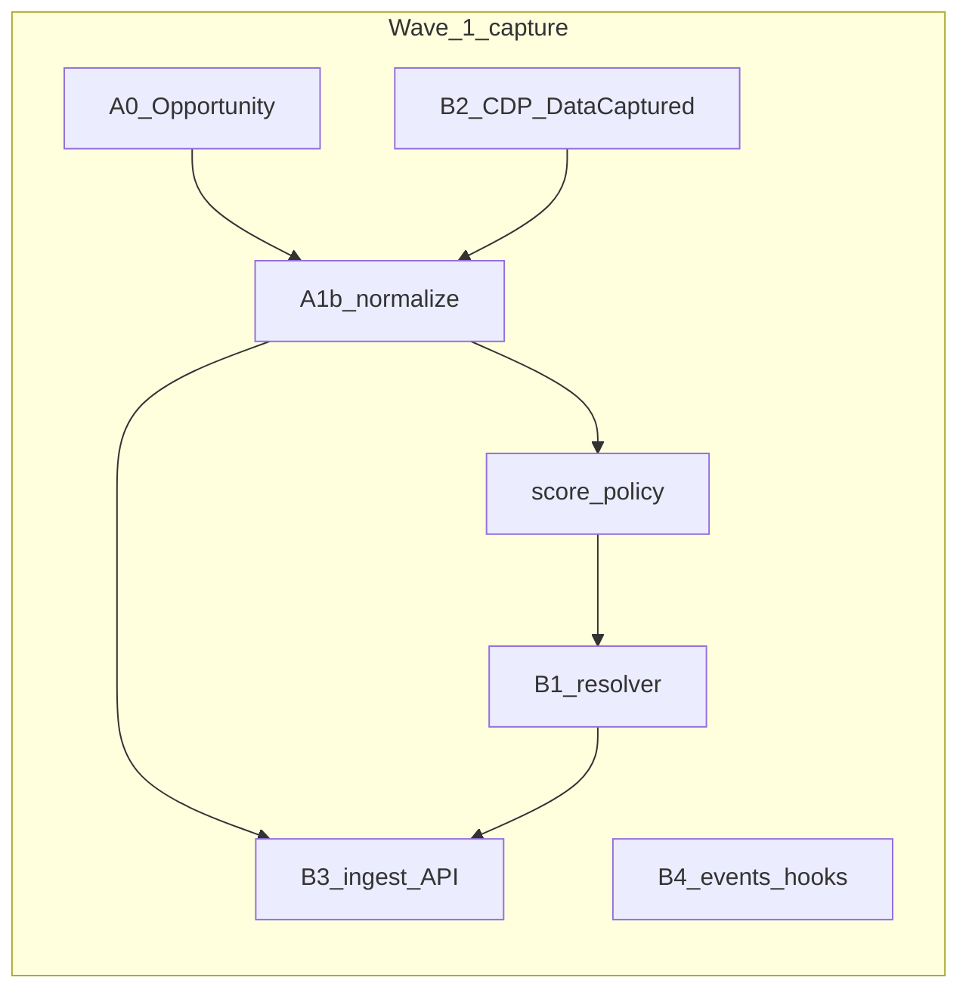

# Program: Native harvest and autonomous agency

> **Purpose:** Single program vocabulary (priority, wave, AG slice, cycle) and index for native RUSVEL harvest/agency work.  
> **Does not replace** [`sprints.md`](sprints.md) (core product Sprint 2–5). Runs **in parallel** as initiative **AG-***.  
> **Last updated:** 2026-03-30

---

## Canonical references

| Doc | Role |
|-----|------|
| [autonomous-freelance-agency.md](autonomous-freelance-agency.md) | Vision, phases, file impact; §13 Sprint A–G (see **supersedes** below) |
| [browser-fleet-and-capture-architecture.md](browser-fleet-and-capture-architecture.md) | Multi-profile CDP, capture mesh (Phase 2–3) |
| [native-app-tooling-permissions-cost-map.md](native-app-tooling-permissions-cost-map.md) | Hooks, tool policy, flow MiniJinja, cost pipeline, gaps (e.g. session snapshot) |
| [sprints.md](sprints.md) | Workspace sprint SSOT (agent intelligence, flows, channels) |
| [roadmap-consolidated.md](roadmap-consolidated.md) | Phased quick wins; **orthogonal** unless you explicitly pull items into AG-backlog |

**Cursor plan (machine-local, full code map + YAML todos):**  
`~/.cursor/plans/autonomous_agency_phase_1_ec44eed3.plan.md`  
*(Clone or paste the plan into `docs/plans/` if you need it in PRs.)*

---

## Glossary

| Term | Meaning | Example |
|------|---------|---------|
| **Wave** | Thematic milestone; outcome-oriented; spans multiple PRs. Aligns with Cursor phases 1a / 1b / 2 / 3 where noted. | Wave 0 = one real scan path across all entrypoints. |
| **Priority** | Order inside the current wave: **P0** (structural truth + demo unblockers), **P1** (automation and observability), **P2** (Phase 2+ and optional glue). | P0 = unified resolver after A0/A1b/score. |
| **AG slice** | Time-boxed execution unit (~3–5 dev days or one focused PR chain). Label **AG-1 … AG-7** so numbering does not collide with `sprints.md` Sprint 2, 3, … | AG-2 = resolver wired in worker, pipeline runner, harvest tool. |
| **Cycle** | End of each AG slice: **Plan → Ship → Verify → Update this doc** (date stamp + checklist). | After AG-2: job + pipeline + tool all use resolver. |

---

## Supersedes: autonomous doc §13 Sprint A (native runtime)

The **native program** assumes **one Rust binary** (`rusvel-app`) and **no Python/TS harvestor as a production runtime dependency**.

That **supersedes** these items from [autonomous-freelance-agency.md](autonomous-freelance-agency.md) §13 **Sprint A** as the primary approach:

- **A1** — MCP client → external harvestor connection as the main data path  
- **A2** — `McpBridgeSource` implementing `HarvestSource` against that external stack  

**Instead:** real capture flows through **Rust** (`harvest-engine`, `rusvel-cdp`, `POST …/ingest`, unified source resolver). The external harvestor repo may remain **reference** for extractors and scoring ideas, not a required service.

Other Sprint A ideas remain valid under new names: extended `Opportunity` (→ A0), ingest route (→ B3), cron-driven scan (→ AG-4 with unified resolver).

---

## Cursor todo → wave → priority → AG slice

Todos match the YAML `id` values in `autonomous_agency_phase_1_ec44eed3.plan.md`.

| Cursor `id` | Wave | Priority | AG slice |
|---------------|------|----------|----------|
| `extend-opportunity-model` | 0 | P0 | AG-1 |
| `field-mapping-layer` | 0 | P0 | AG-1 |
| `score-pipeline-config` | 0 | P0 | AG-1 |
| `unified-harvest-scan` | 0 | P0 | AG-2 |
| `api-harvest-ingest` | 1 | P1 | AG-3 |
| `harvest-events-hooks` | 1 | P1 | AG-4 |
| `cron-harvest-flows` | 1 | P1 | AG-4 |
| `cdp-continuous-capture` | 1 | P1 | AG-5 |
| `api-harvest-scan-multiprofile` | 2 | P2 | AG-6 |
| `phase2-cdp-sprint` | 2 | P2 | AG-6 |
| `capability-playbook-triggers` | — | P2 (optional) | AG-7 |

---

## Waves (high level)

- **Wave 0** — Structural truth (A0, A1b, score policy) then **single scan path** (B1: resolver; replace `MockSource` in app worker, `pipeline_runner`, `rusvel-engine-tools` harvest tool). Prefer not to defer A0/A1b for long even for a resolver spike; use a feature flag if needed.
- **Wave 1** — Ingest API (B3), harvest events + hooks + cron policy (B4), CDP → `DataCaptured` → shared mapper (B2).
- **Wave 2** — `CdpPool`, multiprofile harvest scan API extensions.
- **Wave 3+** — Browser fleet / mesh per [browser-fleet-and-capture-architecture.md](browser-fleet-and-capture-architecture.md).

**Parallel (non-blocking):** HTTP Claude / UX / connectors / `session-snapshot` and other items from the broader master roadmap—track separately or via [native-app-tooling-permissions-cost-map.md](native-app-tooling-permissions-cost-map.md) for shipped vs gap.

---

## Dependency graph (implementation order)

---

## AG sprint slices (execution units)

| Slice | Scope (Cursor todo ids) | Exit criteria |
|-------|-------------------------|---------------|
| **AG-1** | `extend-opportunity-model`, `field-mapping-layer`, `score-pipeline-config` | Tests/fixtures where applicable; scorer on all paths; `UserProfile` + `metadata.upstream_score` pattern documented in code |
| **AG-2** | `unified-harvest-scan` | Worker, `HarvestContentPipelineRunner`, `harvest_scan` tool use resolver; mock only for explicit tests |
| **AG-3** | `api-harvest-ingest` | `POST /api/dept/harvest/ingest` mirrors scan persist + score |
| **AG-4** | `harvest-events-hooks`, `cron-harvest-flows` | `harvest.*` event kinds documented; cron payload for `harvest.auto_scan`; hook or job enqueue path clear |
| **AG-5** | `cdp-continuous-capture` | `rusvel-cdp` emits `BrowserEvent::DataCaptured`; `on_data_captured` uses same normalization as ingest |
| **AG-6** | `phase2-cdp-sprint`, `api-harvest-scan-multiprofile` | Pool + scan API extensions for profiles/endpoints |
| **AG-7** (optional) | `capability-playbook-triggers` | High-score opportunity → hook/playbook/capability or notify |

---

## Progress cycle (end of each AG slice)

1. **Verify** — `cargo test` for touched workspace members; manual checks for new API routes if any.  
2. **Cross-check** — Cursor plan §6 verification checklist (in the `.plan.md` file) for the slice’s scope.  
3. **Update** — Bump **Last verified** below and note any scope drift in a one-line changelog at the bottom of this file.

**Last verified:** *(not yet run for program doc only)*

---

## Relation to roadmap-consolidated

[roadmap-consolidated.md](roadmap-consolidated.md) Phase 1–4 (e.g. `invoke_flow`, hooks, permissions, MiniJinja, cost API) is **orthogonal** to the AG track unless you explicitly add items (e.g. session snapshot API) to an AG-backlog row in the table above.

---

## Changelog

| Date | Note |
|------|------|
| 2026-03-30 | Initial program index: glossary, todo mapping, AG slices, Sprint A supersedes note. |
