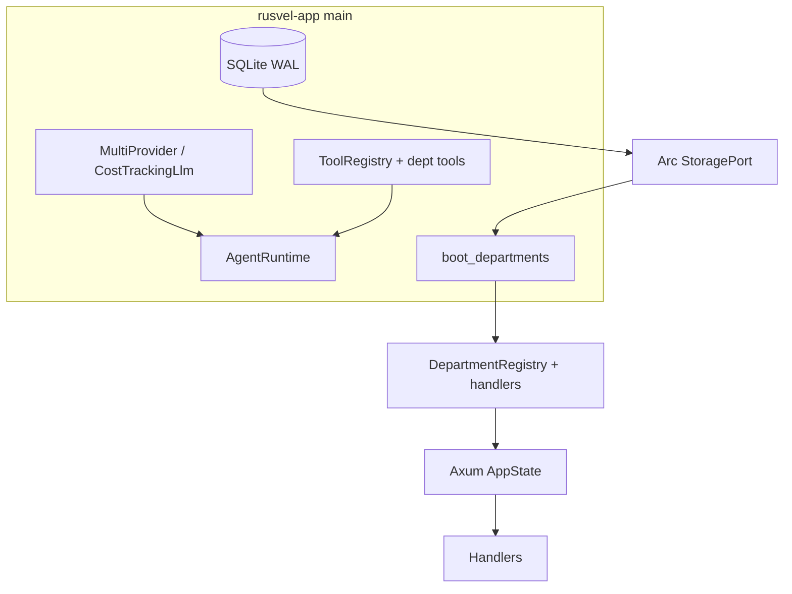
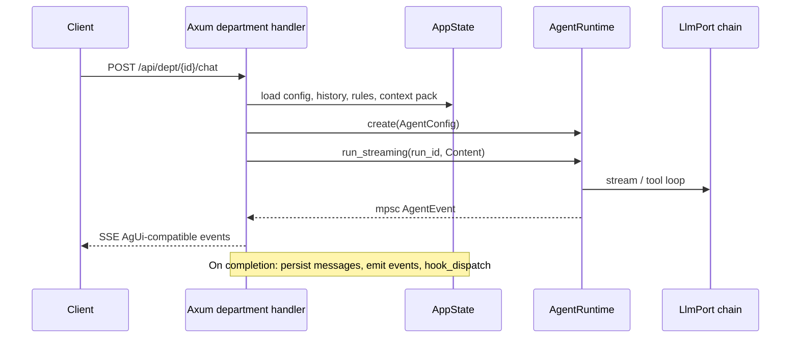
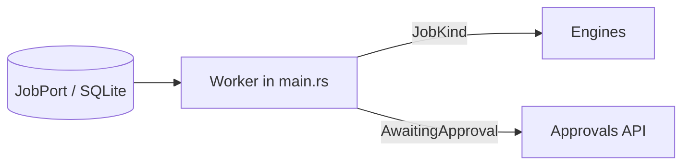

# RUSVEL — On-Disk Codebase Inspection Report

**Generated:** 2026-03-28  
**Scope:** Repository tree under `/Users/bm/rusvel` (Rust workspace + referenced surfaces).  
**Method:** Read critical modules (`rusvel-core`, `rusvel-app`, `rusvel-api`, `rusvel-agent`, `dept-*` boot path), count metrics via `find` / `rg` / `cargo metadata`, cross-check with `docs/design/architecture-v2.md`.

> **Note:** `cargo check -p rusvel-app` was attempted; sandboxed runs failed on `aws-lc-sys` file copy. An unrestricted build was started but not waited to completion here—run `cargo check` / `cargo test` locally for authoritative build health.

---

## 1. Executive summary

RUSVEL is a **hexagonal (ports & adapters)** Rust monorepo: **`rusvel-core`** defines domain types and **async port traits**; **domain engines** (`*-engine`) implement business logic against those traits only; **`dept-*` crates** wrap engines as **`DepartmentApp`** plugins (ADR-014); **`rusvel-app`** is the **composition root** that constructs SQLite-backed stores, LLM/agent stacks, optional embedding/vector/terminal/CDP, runs **department boot**, spawns a **job worker**, and starts **Axum** (`rusvel-api`) or CLI/MCP/TUI surfaces.

**Observed strengths:** Clear dependency direction (engines → core traits; no adapter imports in engines), centralized **`RusvelError`**, explicit **approval + job queue** story, **registry-driven** HTTP department routes, **SSE streaming** unified around **`AgentRuntime::run_streaming`**.

**Observed tradeoffs:** Very large composition and API modules (`main.rs`, `department.rs`, `lib.rs`), some **duplicated SSE prelude/mapping** between god chat and department chat, **permissive boot** (one failed `DepartmentApp::register` logs and continues).

---

## 2. Disk metrics (measured 2026-03-28)

| Metric | Value | How measured |
|--------|------:|--------------|
| **Workspace members** | **54** | `cargo metadata --no-deps` → `len(workspace_members)` |
| **Rust files (`crates/**/*.rs`)** | **258** | `find crates -name '*.rs' \| wc -l` |
| **Rust LOC (`crates/**/*.rs`)** | **62,485** | `wc -l` on those files |
| **Axum `.route(` lines** | **132** | `rg '\.route\(' crates/rusvel-api/src/lib.rs \| wc -l` |
| **`rusvel-api` `src/*.rs` modules** | **31** + `lib.rs` | directory listing (handler/feature modules) |

**Workspace growth vs. older docs:** Root `Cargo.toml` lists **54** members, including newer infrastructure crates such as **`rusvel-webhook`**, **`rusvel-cron`**, **`rusvel-channel`**, and **`dept-messaging`**—these explain the jump past historical “50 crates” figures in `docs/status/current-state.md`.

---

## 3. Architecture (as implemented on disk)

### 3.1 Layers

```text
Surfaces          CLI (rusvel-cli) · TUI (rusvel-tui) · MCP (rusvel-mcp) · HTTP (rusvel-api)
       │                    embedded Svelte build via rust-embed (rusvel-app)
       ▼
Composition       rusvel-app::main — builds Arc<dyn Port>, boot_departments(), job worker
       │
HTTP state        rusvel_api::AppState — engines + registry + runtime + DB + optional ports
       │
Plugins           dept-* — DepartmentApp::manifest + register → tools, events, jobs, registry
       │
Engines           *-engine — domain logic; depends only on rusvel-core (intended invariant)
       │
Core              rusvel-core — domain.rs, ports.rs, department/*, registry, errors
       │
Adapters          rusvel-db, rusvel-llm, rusvel-agent, rusvel-event, rusvel-jobs, …
```

### 3.2 Port inventory (`crates/rusvel-core/src/ports.rs`)

Top-level **cross-cutting** traits include: **`LlmPort`**, **`AgentPort`**, **`ToolPort`**, **`EventPort`**, **`StoragePort`** (facade over canonical stores), **`MemoryPort`**, **`JobPort`**, **`SessionPort`**, **`AuthPort`**, **`EmbeddingPort`**, **`VectorStorePort`**, **`ConfigPort`**, **`DeployPort`**, **`TerminalPort`**, **`BrowserPort`**, plus **`StoragePort`** sub-traits (**`EventStore`**, **`ObjectStore`**, **`SessionStore`**, **`JobStore`**, **`MetricStore`**) for the five-store split (ADR-004).

**ADR-009 in code:** `LlmPort`’s module docs state engines should use **`AgentPort`**; `rusvel-agent`’s crate docs explicitly implement **`AgentPort`** by composing LLM + tools + memory.

### 3.3 Department-as-App (ADR-014)

- **Contract:** `DepartmentApp` in `crates/rusvel-core/src/department/app.rs` — `manifest()`, `register(&mut RegistrationContext)`, optional `shutdown`.
- **Boot:** `crates/rusvel-app/src/boot.rs` — `installed_departments()` returns 13 boxed apps; `boot_departments` validates IDs, **topologically sorts** `depends_on`, then calls `register` in order; **`finalize()`** yields **`DepartmentRegistry`**, tool defs, event subscriptions, job handlers.
- **Example wrapper:** `dept-forge` constructs **`Arc<ForgeEngine>`** inside `register`, registers **namespaced tools** (`forge.*`) with JSON Schema closures calling engine methods.

### 3.4 HTTP API

- **Router:** `crates/rusvel-api/src/lib.rs` builds **`Router`** with CORS, static/`ServeDir`, and many modules (agents, chat, department, flows, knowledge, webhooks, cron, …).
- **Shared state:** `AppState` holds **`ForgeEngine`**, optional **`CodeEngine` / `ContentEngine` / `HarvestEngine` / `GtmEngine` / `FlowEngine`**, **`AgentRuntime`**, **`DepartmentRegistry`**, **`Database`**, jobs, storage, memory, embedding/vector, terminal, CDP, webhooks, cron, **`ContextPackCache`**, optional **`ChannelPort`**.

---

## 4. Design patterns (recurring)

| Pattern | Where it appears | Role |
|--------|------------------|------|
| **Hexagonal / ports** | `rusvel-core::ports`, engine crates | Swap DB/LLM without changing domain |
| **Plugin registry** | `DepartmentApp` + `RegistrationContext` | Extensible departments without editing core router for each tool |
| **Composition root** | `rusvel-app/src/main.rs` | Single place wiring `Arc<dyn …>` |
| **Strategy (dyn Trait)** | `Arc<dyn StoragePort>`, `Arc<dyn JobPort>`, … | Runtime polymorphism across adapters |
| **Object safety / interior mut** | `ToolPort` docs (`&self` + async register) | Shared registry behind `Arc` |
| **Facade** | `StoragePort` over sub-stores | One entry for persistence concerns |
| **SSE / event stream** | `department.rs`, `chat.rs`, `capability.rs` | Push incremental agent and capability output to clients |
| **Worker loop** | `main.rs` job match on `JobKind` | Single queue dispatches analyze/publish/scan/outreach/cron/custom |
| **Adapter** | `SessionAdapter` in `main.rs` | Bridges `StoragePort::sessions()` to `SessionPort` |

---

## 5. Data flow (sketches)

### 5.1 Boot → first request



### 5.2 Department chat (SSE)



### 5.3 Background jobs



**Observed `JobKind` branches in `main.rs` (non-exhaustive):** `CodeAnalyze`, `ContentPublish`, `HarvestScan`, `ProposalDraft`, `ScheduledCron`, `Custom("forge.pipeline")`, `OutreachSend`.

---

## 6. Core features → primary code locations

| Feature | Primary crates / modules |
|---------|---------------------------|
| **Department registry & manifests** | `rusvel-core/department/*`, `rusvel-app/boot.rs`, `dept-*/manifest.rs` |
| **Parameterized dept HTTP** | `rusvel-api/department.rs` (config cascade, chat SSE, events) |
| **God / global chat** | `rusvel-api/chat.rs` |
| **Agent loop + streaming** | `rusvel-agent` (`AgentRuntime`, `AgentEvent`, `run_streaming`) |
| **Tools (built-in + engine)** | `rusvel-builtin-tools`, `rusvel-engine-tools`, registration via boot |
| **Forge / mission / goals** | `forge-engine`, `dept-forge`, `rusvel-api` routes in `lib.rs` |
| **Code / content / harvest / flow engines** | `*-engine`, `engine_routes.rs`, `flow_routes.rs` |
| **Jobs + approvals** | `rusvel-jobs`, `rusvel-api/approvals.rs`, worker in `rusvel-app/main.rs` |
| **Events + hooks** | `rusvel-event`, `hook_dispatch.rs`, `hooks.rs` |
| **Knowledge / RAG** | `rusvel-api/knowledge.rs`, vector + embed ports |
| **RusvelBase / SQL UI** | `rusvel-api/db_routes.rs`, `rusvel-schema` |
| **Webhooks** | `rusvel-webhook`, `webhooks.rs` |
| **Cron** | `rusvel-cron`, `cron.rs` |
| **Outbound notify** | `rusvel-channel`, `AppState.channel` |
| **Capability / !build** | `rusvel-api/capability.rs`, `build_cmd.rs` |
| **Frontend** | `frontend/` (SvelteKit); embedded from `frontend/build/` |

---

## 7. Code quality assessment

### 7.1 Strengths

- **Clear architectural story** documented in-code (`ports.rs`, `department/app.rs`, `rusvel-agent` crate header) and aligned with `docs/design/architecture-v2.md`.
- **Typed error surface** in libraries: `RusvelError` + `thiserror` in `rusvel-core`; boundary crate uses `anyhow` where appropriate.
- **Async consistency:** widespread `async_trait` on ports; Tokio for runtime, channels, and spawned work.
- **Observability hooks:** `tracing` used in boot and event dispatch; structured context in several paths.
- **Extension without core edits:** new tools and handlers can be added via `dept-*` registration.

### 7.2 Risks and maintainability notes

- **File size / concentration:** `rusvel-app/src/main.rs` and `rusvel-api/src/department.rs` bundle many concerns (wiring, adapters, seed data, worker). This speeds shipping but raises **cognitive load** and merge conflict risk.
- **Boot resilience:** `boot_departments` **continues** after a failed `register` (logged error). Good for partial uptime; can hide **misconfiguration** until runtime.
- **Duplication:** SSE mapping for **`AgentEvent` → AgUi** appears in both **`chat.rs`** and **`department.rs`**—same prelude pattern (`RunStarted`) and completion persistence; a shared helper would reduce drift.
- **Dynamic typing at edges:** pervasive **`serde_json::Value`** for metadata and tool args (intentional per ADR-007) trades **schema guarantees** for flexibility—call sites must validate.
- **Test pyramid:** integration coverage is uneven across surfaces (`docs/status/current-state.md` notes thin tests on some `dept-*` and app binaries); rely on `cargo test` locally for regression signal.

### 7.3 Invariants worth preserving (from code + ADRs)

- Engines and `dept-*` crates should **not** depend on **`rusvel-db` / `rusvel-llm`** directly—only on **`rusvel-core`** ports.
- Prefer **`AgentPort`** over raw **`LlmPort`** for orchestrated work.
- **Single job queue** substrate for async work (no parallel scheduling DSLs in core).
- **`Event.kind` as `String`** and **metadata on domain objects** for forward compatibility.

---

## 8. Divergence from static documentation

| Topic | Docs snapshot | On-disk observation (2026-03-28) |
|--------|----------------|-------------------------------------|
| Workspace size | ~50 members | **54** members |
| Rust LOC | ~52,560 | **~62,485** |
| Rust file count | ~215 | **258** |
| API `.route(` count | ~105 | **132** |
| API handler modules | ~26 | **31** feature modules under `rusvel-api/src/` |

**Recommendation:** After the next release or large merge, refresh `docs/status/current-state.md` using the **§ How to re-verify** block there so published metrics match disk.

---

## 9. Suggested follow-ups (optional)

1. Run **`cargo test`** and **`cargo clippy --workspace`** on a full dev machine and attach results to a new dated verification log.
2. Extract **shared SSE + `AgentEvent` mapping** from `chat.rs` / `department.rs` into a small `rusvel-api` internal module if duplication grows.
3. Consider **fail-fast** or **explicit “degraded mode” flag** when a `DepartmentApp::register` fails, so operators notice boot issues immediately.

---

## 10. References (in-repo)

- `docs/design/architecture-v2.md` — narrative architecture
- `docs/design/decisions.md` — ADRs
- `docs/status/current-state.md` — historical metrics (partially stale vs. this report)
- `crates/rusvel-core/src/ports.rs` — port contracts
- `crates/rusvel-app/src/boot.rs` — department boot sequence
- `crates/rusvel-api/src/lib.rs` — `AppState` and router assembly
